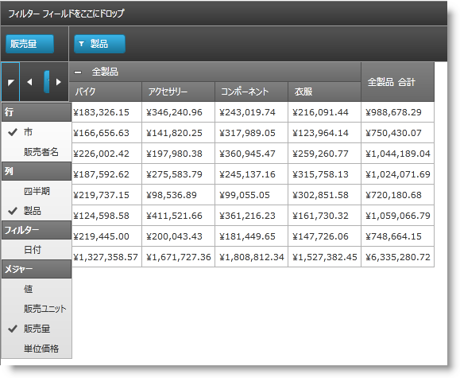

////

|metadata|
{
    "name": "xampivotgrid-field-chooser-implementing",
    "controlName": ["xamPivotGrid"],
    "tags": ["Drilldown","Grids","How Do I"],
    "guid": "971ff354-189a-4588-be9e-3773215cf267",  
    "buildFlags": [],
    "createdOn": "2016-05-25T18:21:58.1903276Z"
}
|metadata|
////

= フィールド選択の実装

== トピックの概要

=== 目的

このトピックでは、xamPivotGrid™ でフィールド選択コントロールを使用する方法について、順を追って説明します。

=== 前提条件

以下の表に、このトピックを理解するための前提条件として求められるトピックをリストします。

[options="header", cols="a,a"]
|====
|トピック|目的

| link:xampivotgrid-field-chooser-overview.html[フィールド選択の概要]
|このトピックでは、xamPivotGrid™ に含まれているフィールド選択コントロールの概要について説明しています。

|====

=== 本トピックの内容

このトピックには次のセクションがあります。

* <<_Ref320179850, フィールド選択の実装 >>

** <<_Ref320179855,概要>>
** <<_Ref320179858,プレビュー>>
** <<_Ref320179861,要件>>
** <<_Ref320179864,概要>>
** <<_Ref320179867,手順>>

* <<_Ref320179873, コード例: フィールド選択の実装 >>

** <<_Ref320179878,説明>>
** <<_Ref320179881,コード>>

* <<_Ref320179884, 関連コンテンツ >>

[[_Ref320179850]]
== フィールド選択の実装

[[_Ref320179855]]

=== 概要

以下の手順では、`FieldChooserItems` の `ObservableCollection` を作成し、それをフィールド選択の中で使用する方法について説明します。

.注:
[NOTE]
====
フィールド選択のグループの `ItemsSources` を、`I``Notify``CollectionChanged` を実装するコレクションに設定した場合と、このインターフェイスを実装しないコレクションにバインドした場合では、フィールド選択の動作に違いがあります。最初のケースでは、階層をグループ (たとえば列) に追加してチェックした場合、ユーザーが階層を他のグループに移動すると (たとえば、行にドラッグアンドドロップするなど)、この階層はそれぞれのグループ (この例では行) に移動されます。それ以外のケースでは、新しいコレクションに移動される代わりに、項目が無効になります。
====

[[_Ref320179858]]

=== プレビュー

以下のスクリーンショットは最終結果のプレビューです。

[[_Ref320179861]]

=== 要件

手順を完了するためには、xamPivotGrid コントロールを使用する {PlatformName} アプリケーションが必要です。この例では、 link:salesdatasample.html[SalesDataSample] がデータ ソースとして使用されていますが、各自のアプリケーションにロジックを適用できます。

[[_Ref320179864]]

=== 概要

このトピックでは、xamPivotGrid でフィールド選択コントロールを実装する方法について、順を追って説明します。以下に手順の概要を示します。

*<<step_1,1.FieldChooser を初期化します。>>*

*<<step_2,2.必要なコレクションの作成。>>*

*<<step_3,3.コレクションを FieldChooserItems で生成します。>>*

*<<step_4,4.フィールド選択グループの項目ソースとしてのコレクションの割り当て。>>*

*<<step_5,5.グループ ヘッダーの設定。>>*

[[_Ref320179867]]

=== 手順

[start=1]
. FieldChooser を初期化します。

link:{ApiPlatform}controls.grids.xampivotgrid{ApiVersion}~infragistics.controls.grids.fieldchooser_members.html[FieldChooser] は、 *ピボット グリッドをロードする前に* 初期化する必要があります。そのための 1 つの方法は、XAML でインラインで宣言することです。コードで初期化するには、ページの Loaded イベントのイベント ハンドラーで初期化することをお勧めします。以下の残りの手順のコードもこのイベント ハンドラーに記述できますが、後で実行することもできます。

[start=2]
. 必要なコレクションの作成。

link:{ApiPlatform}controls.grids.xampivotgrid{ApiVersion}~infragistics.controls.grids.fieldchooseritem_members.html[FieldChooserItem] の 4 つの `ObservableCollection` を作成します。

[start=3]
. コレクションを FieldChooserItemsで生成します 。

[start=4]
. `FieldChooserItems` を作成し、必要なプロパティを設定します。

各コレクションについて、それぞれのグループに配置する階層/メジャーに従って、`FieldChooserItem` インスタンスを作成して追加します。すべての `FieldChooserItem` について、以下のことを行う必要があります。

link:{ApiPlatform}controls.grids.xampivotgrid{ApiVersion}~infragistics.controls.grids.fieldchooseritem~fielduniquename.html[FieldUniqueName] プロパティを設定します。

このプロパティに、この項目が表す階層の一意の名前を設定します。つまり、`SalesDataSample` データ ソースの Seller 階層について、`FieldChooserItem` の `FieldUniqeName` プロパティを、階層の一意の名前である `[Seller].[Seller]` に設定する必要があります。

* メジャー グループの項目について、一意の名前が、データ ソースのそれぞれのメジャーの一意の名前に一致する必要があります。詳細は、<<_Code,以下のコード例>>を参照してください。

* Content プロパティを設定します。

* `Content` プロパティの値は、フィールド選択項目に対して実際に表示されます。その型はオブジェクトであるため、任意の種類の内容を自由に表示できます。ここで手順を進めるための最も簡単な方法は、階層/メジャーの名前を含む文字列を設定することです。

* link:{ApiPlatform}controls.grids.xampivotgrid{ApiVersion}~infragistics.controls.grids.fieldchooseritem~fieldordinal.html[FieldOrdinal] プロパティを設定します。

* フィールド選択の複数の項目を 1 つの領域 (たとえば列) に追加するようにチェックした場合、デフォルトでは、チェックした順序で追加されます。ただし、これらの項目に `FieldOrdinal` プロパティが設定されている場合、ターゲット領域の最後の要素は、最後にチェックされた項目ではなくなります。最後に追加されるのは、`FieldOrdinal` の値が最も大きいものになります。

* 作成した項目をそれぞれの `ObservableCollection` に追加します。

[start=4]
. フィールド選択グループの項目ソースとしてのコレクションの割り当て。

前の手順で作成したコレクションを、以下のプロパティの値として設定します。

* link:{ApiPlatform}controls.grids.xampivotgrid{ApiVersion}~infragistics.controls.grids.fieldchooser~columnsitemssource.html[ColumnsItemsSource]
* link:{ApiPlatform}controls.grids.xampivotgrid{ApiVersion}~infragistics.controls.grids.fieldchooser~rowsitemssource.html[RowsItemsSource]
* link:{ApiPlatform}controls.grids.xampivotgrid{ApiVersion}~infragistics.controls.grids.fieldchooser~filtersitemssource.html[FiltersItemsSource]
* link:{ApiPlatform}controls.grids.xampivotgrid{ApiVersion}~infragistics.controls.grids.fieldchooser~measuresitemssource.html[MeasuresItemsSource]

[start=5]
. グループ ヘッダーの設定。

以下のプロパティを設定することで、グループ ヘッダーを指定します。

* link:{ApiPlatform}controls.grids.xampivotgrid{ApiVersion}~infragistics.controls.grids.fieldchooser~columnsgroupheader.html[ColumnsGroupHeader]
* link:{ApiPlatform}controls.grids.xampivotgrid{ApiVersion}~infragistics.controls.grids.fieldchooser~rowsgroupheader.html[RowsGroupHeader]
* link:{ApiPlatform}controls.grids.xampivotgrid{ApiVersion}~infragistics.controls.grids.fieldchooser~filtersgroupheader.html[FiltersGroupHeader]
* link:{ApiPlatform}controls.grids.xampivotgrid{ApiVersion}~infragistics.controls.grids.fieldchooser~measuresgroupheader.html[MeasuresGroupHeader]

`FieldChooserItem` の `Content` プロパティと同様に、これらのプロパティの型は `object` であるため、ほぼすべての内容を設定できます。

[[_Ref320179873]]
== コード例: フィールド選択の実装

[[_Ref320179878]]

=== 説明

以下に上記の手順のコードを示します。前述のように、ページの Loaded イベントのイベント ハンドラーに記述する必要があります。

[[_Code]]

=== コード

*C# の場合:*

[source,csharp]
----
// 手順 1
pivotGrid.FieldChooser = new FieldChooser();
// 手順 2
var columnsItems = new ObservableCollection<FieldChooserItem>();
var rowsItems = new ObservableCollection<FieldChooserItem>();
var filtersItems = new ObservableCollection<FieldChooserItem>();
var measuresItems = new ObservableCollection<FieldChooserItem>();
// 手順 3
columnsItems.Add(new FieldChooserItem() { FieldUniqueName = "[City].[City]", Content = "City", FieldOrdinal = 0 });
columnsItems.Add(new FieldChooserItem() { FieldUniqueName = "[Product].[Product]", Content = "Product", FieldOrdinal = 1 });
rowsItems.Add(new FieldChooserItem() { FieldUniqueName = "[Seller].[Seller]", Content = "Seller", FieldOrdinal = 0 });
rowsItems.Add(new FieldChooserItem() { FieldUniqueName = "[Quarter].[Quarter]", Content = "Quarter", FieldOrdinal = 1 });
filtersItems.Add(new FieldChooserItem() { FieldUniqueName = "[Date].[Date]", Content = "Date" });
measuresItems.Add(new FieldChooserItem() { FieldUniqueName = "AmountOfSale", Content = "Amount of Sale", FieldOrdinal = 0 });
measuresItems.Add(new FieldChooserItem() { FieldUniqueName = "UnitPrice", Content = "Unit Price", FieldOrdinal = 1 });
// 手順 4
pivotGrid.FieldChooser.ColumnsItemsSource = columnsItems;
pivotGrid.FieldChooser.RowsItemsSource = rowsItems;
pivotGrid.FieldChooser.FiltersItemsSource = filtersItems;
pivotGrid.FieldChooser.MeasuresItemsSource = measuresItems;
// 手順 5
pivotGrid.FieldChooser.ColumnsGroupHeader = "Columns";
pivotGrid.FieldChooser.RowsGroupHeader = "Rows";
pivotGrid.FieldChooser.FiltersGroupHeader = "Filters";
pivotGrid.FieldChooser.MeasuresGroupHeader = "Measures";
----

*Visual Basic の場合:*

[source,vb]
----
' 手順 1
pivotGrid.FieldChooser = New FieldChooser()
' 手順 2
Dim columnsItems = New ObservableCollection(Of FieldChooserItem)()
Dim rowsItems = New ObservableCollection(Of FieldChooserItem)()
Dim filtersItems = New ObservableCollection(Of FieldChooserItem)()
Dim measuresItems = New ObservableCollection(Of FieldChooserItem)()
' 手順 3
columnsItems.Add(New FieldChooserItem() With { .FieldUniqueName = "[City].[City]", _
      .Content = "City", .FieldOrdinal = 0 })
columnsItems.Add(New FieldChooserItem() With { .FieldUniqueName = "[Product].[Product]", _
      .Content = "Product", .FieldOrdinal = 1 })
rowsItems.Add(New FieldChooserItem() With { .FieldUniqueName = "[Seller].[Seller]", _
      .Content = "Seller", .FieldOrdinal = 0 })
rowsItems.Add(New FieldChooserItem() With { .FieldUniqueName = "[Quarter].[Quarter]", _
      .Content = "Quarter", .FieldOrdinal = 1 })
filtersItems.Add(New FieldChooserItem() With { .FieldUniqueName = "[Date].[Date]", _
      .Content = "Date" })
measuresItems.Add(New FieldChooserItem() With { .FieldUniqueName = "AmountOfSale", _
      .Content = "Amount of Sale",       .FieldOrdinal = 0 })
measuresItems.Add(New FieldChooserItem() With { .FieldUniqueName = "UnitPrice", _
      .Content = "Unit Price", .FieldOrdinal = 1 })
' 手順 4
pivotGrid.FieldChooser.ColumnsItemsSource = columnsItems
pivotGrid.FieldChooser.RowsItemsSource = rowsItems
pivotGrid.FieldChooser.FiltersItemsSource = filtersItems
pivotGrid.FieldChooser.MeasuresItemsSource = measuresItems
' 手順 5
pivotGrid.FieldChooser.ColumnsGroupHeader = "Columns"
pivotGrid.FieldChooser.RowsGroupHeader = "Rows"
pivotGrid.FieldChooser.FiltersGroupHeader = "Filters"
pivotGrid.FieldChooser.MeasuresGroupHeader = "Measures"
----

[[_Ref320179884]]
== 関連コンテンツ

以下のトピックでは、このトピックに関連する情報を提供しています。

[options="header", cols="a,a"]
|====
|トピック|目的

| link:xampivotgrid-field-chooser-property-reference.html[フィールド選択プロパティ参照]
|これは Field Chooser コントロールに関係する最も重要な API メンバーのリストです。

| link:xampivotgrid-us-assigning-hierarchies-and-measures.html[階層およびメジャーの指定]
|データでキューブをロード後、計算するデータのスライスの基礎とする階層を選択する必要があります。

| link:xampivotgrid-dataselector.html[DataSelector]
|このトピックでは、xamPivotDataSelector™ コントロールの概要について説明しています。

|====
