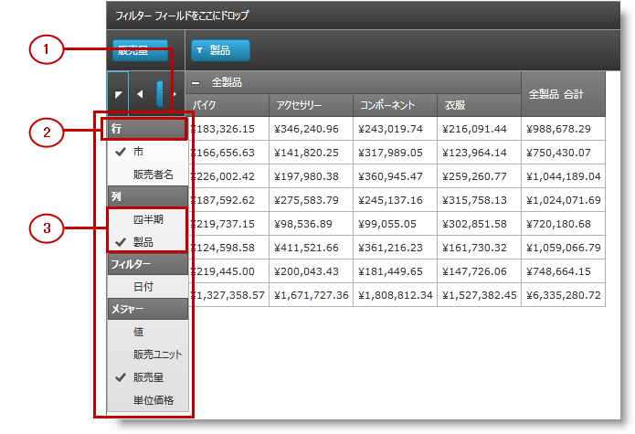

////
|metadata|
{
    "name": "xampivotgrid-field-chooser-overview",
    "controlName": ["xamPivotGrid"],
    "tags": ["Drilldown","Getting Started","Grids"],
    "guid": "9757ebdd-178e-4ac0-9cce-e8ce9815a287",
    "buildFlags": [],
    "createdOn": "2016-05-25T18:21:58.1732942Z"
}
|metadata|
////

= フィールド選択の概要

== トピックの概要

=== 目的

このトピックでは、xamPivotGrid™ に含まれているフィールド選択コントロールの概要について説明しています。

=== 前提条件

以下の表に、このトピックを理解するための前提条件として求められるトピックをリストします。

[options="header", cols="a,a"]
|====
|トピック|目的

| link:xampivotgrid-understanding-xampivotgrid.html[xamPivotGrid の概要]
|このセクションは xamPivotGrid コントロールの主要機能について説明します。ここに記載されているトピックでは、アプリケーションで xamPivotGrid コントロールを効果的に使用する方法が説明されています。

| link:xampivotgrid-getting-started-with-xampivotgrid.html[xamPivotGrid を使用した作業の開始]
|このトピックでは、xamPivotGrid コントロールを使用して作業を開始する方法について説明するため、このコントロールを {PlatformName} アプリケーションに追加するための手順を順を追って説明しています。

| link:xampivotgrid-us-assigning-hierarchies-and-measures.html[階層およびメジャーの指定]
|データでキューブをロード後、計算するデータのスライスの基礎とする階層を選択する必要があります。

|====

=== 本トピックの内容

このトピックには次のセクションがあります。

* <<_Ref320133128, フィールド選択コントロールの視覚要素と関連プロパティ >>

** <<_Ref320133132,視覚要素の要約>>
** <<_Ref320133134,視覚要素と関連プロパティ>>

* <<_Ref320133137, コントロールの構成の概要 >>
* <<_Ref320195328,フィールド選択グループへの FieldChooserItem クラスのインスタンスの設定>><<_Ref320133145,>>

** <<_Ref320133149,概要>>
** <<_Ref320133153,プロパティ設定>>

* <<_Ref320133158, カスタム型のオブジェクトを使用したフィールド選択グループの設定 >>

** <<_Ref320133162,概要>>
** <<_Ref320133164,プロパティ設定>>

* <<_Ref320133172, 関連コンテンツ >>

[[_Ref320133128]]
== フィールド選択コントロールの視覚要素と関連プロパティ

[[_Ref320133132]]

=== 視覚要素の要約

フィールド選択は xamPivotGrid の一部であり、ユーザーがピボット グリッドの行、列、フィルター、およびメジャーとして使用するために選択可能な項目を指定できます。フィールド選択は 4 つの `ItemsControls` からなり、行、列、フィルター、およびメジャーについて選択可能な項目を指定できます。フィールド選択の目的は、xamPivotDataSelector™ の目的に少し似ています。

以下のスクリーンショットは、フィールド選択コントロールの視覚要素を示しています。設定可能な要素を図の後に示します。

*構成可能な視覚要素:*

*1. FieldChooser ドロップダウン*

これは、ドロップダウンを表示したときのフィールド選択の外観です。ドロップダウンを表示するには、その上のボタンを押します。

*2. 行グループ ヘッダー*

4 つの項目グループそれぞれに、任意のオブジェクトを設定できるヘッダーがあります。上のスクリーンショットでは、各グループの対応するテキスト (Rows、Columns、Filters、および Measures) が指定された `TextBlocks` がヘッダーに設定されています。

*3. 列フィールドの選択グループ*

すべてのフィールド選択グループはオプションであり、グループに項目が追加されていない場合は表示されません。

[[_Ref320133134]]

=== 視覚要素と関連プロパティ

以下の表に、フィールド選択コントロールの視覚要素とそれを設定するプロパティのマッピングを示します。

[options="header", cols="a,a"]
|====
|視覚要素|プロパティ

|フィールド選択
| link:{ApiPlatform}controls.grids.xampivotgrid{ApiVersion}~infragistics.controls.grids.fieldchooser_members.html[XamPivotGrid.FieldChooser]

|グループ ヘッダー
|
* link:{ApiPlatform}controls.grids.xampivotgrid{ApiVersion}~infragistics.controls.grids.fieldchooser~columnsgroupheader.html[ColumnsGroupHeader] 

* link:{ApiPlatform}controls.grids.xampivotgrid{ApiVersion}~infragistics.controls.grids.fieldchooser~rowsgroupheader.html[RowsGroupHeader] 

* link:{ApiPlatform}controls.grids.xampivotgrid{ApiVersion}~infragistics.controls.grids.fieldchooser~filtersgroupheader.html[FiltersGroupHeader] 

* link:{ApiPlatform}controls.grids.xampivotgrid{ApiVersion}~infragistics.controls.grids.fieldchooser~measuresgroupheader.html[MeasuresGroupHeader] 

|項目グループ
|
* link:{ApiPlatform}controls.grids.xampivotgrid{ApiVersion}~infragistics.controls.grids.fieldchooser~columns.html[Columns] 

* link:{ApiPlatform}controls.grids.xampivotgrid{ApiVersion}~infragistics.controls.grids.fieldchooser~rows.html[Rows] 

* link:{ApiPlatform}controls.grids.xampivotgrid{ApiVersion}~infragistics.controls.grids.fieldchooser~filters.html[Filters] 

* link:{ApiPlatform}controls.grids.xampivotgrid{ApiVersion}~infragistics.controls.grids.fieldchooser~measures.html[Measures] 

|====

[[_Ref320133137]]
== コントロールの構成の要約

[[_Ref320133139]]

=== コントロールの構成の概要

以下の表に、フィールド選択コントロールを設定するための主な方法を示します。

[options="header", cols="a,a,a"]
|====
|構成可能な点|詳細|プロパティ

|フィールド選択グループへの `FieldChooserItem` クラスのインスタンスの設定。
|フィールドの選択で link:{ApiPlatform}controls.grids.xampivotgrid{ApiVersion}~infragistics.controls.grids.fieldchooseritem_members.html[FieldChooserItems] を使用
|
* link:{ApiPlatform}controls.grids.xampivotgrid{ApiVersion}~infragistics.controls.grids.fieldchooser~columns.html[Columns] / link:{ApiPlatform}controls.grids.xampivotgrid{ApiVersion}~infragistics.controls.grids.fieldchooser~columnsitemssource.html[ColumnsItemsSource] 

* link:{ApiPlatform}controls.grids.xampivotgrid{ApiVersion}~infragistics.controls.grids.fieldchooser~rows.html[Rows] / link:{ApiPlatform}controls.grids.xampivotgrid{ApiVersion}~infragistics.controls.grids.fieldchooser~rowsitemssource.html[RowsItemsSource] 

* link:{ApiPlatform}controls.grids.xampivotgrid{ApiVersion}~infragistics.controls.grids.fieldchooser~filters.html[Filters] / link:{ApiPlatform}controls.grids.xampivotgrid{ApiVersion}~infragistics.controls.grids.fieldchooser~filtersitemssource.html[FiltersItemsSource] 

* link:{ApiPlatform}controls.grids.xampivotgrid{ApiVersion}~infragistics.controls.grids.fieldchooser~measures.html[Measures] / link:{ApiPlatform}controls.grids.xampivotgrid{ApiVersion}~infragistics.controls.grids.fieldchooser~measuresitemssource.html[MeasuresItemsSource] 

|カスタム型のオブジェクトを使用したフィールド選択グループの設定。
|フィールド選択の項目に対するカスタム型の使用。
|
* link:{ApiPlatform}controls.grids.xampivotgrid{ApiVersion}~infragistics.controls.grids.fieldchooser~columns.html[Columns] / link:{ApiPlatform}controls.grids.xampivotgrid{ApiVersion}~infragistics.controls.grids.fieldchooser~columnsitemssource.html[ColumnsItemsSource] 

* link:{ApiPlatform}controls.grids.xampivotgrid{ApiVersion}~infragistics.controls.grids.fieldchooser~rows.html[Rows] / link:{ApiPlatform}controls.grids.xampivotgrid{ApiVersion}~infragistics.controls.grids.fieldchooser~rowsitemssource.html[RowsItemsSource] 

* link:{ApiPlatform}controls.grids.xampivotgrid{ApiVersion}~infragistics.controls.grids.fieldchooser~filters.html[Filters] / link:{ApiPlatform}controls.grids.xampivotgrid{ApiVersion}~infragistics.controls.grids.fieldchooser~filtersitemssource.html[FiltersItemsSource] 

* link:{ApiPlatform}controls.grids.xampivotgrid{ApiVersion}~infragistics.controls.grids.fieldchooser~measures.html[Measures] / link:{ApiPlatform}controls.grids.xampivotgrid{ApiVersion}~infragistics.controls.grids.fieldchooser~measuresitemssource.html[MeasuresItemsSource] 

* link:{ApiPlatform}controls.grids.xampivotgrid{ApiVersion}~infragistics.controls.grids.fieldchooser~fieldordinalmemberpath.html[FieldOrdinalMemberPath] 

* link:{ApiPlatform}controls.grids.xampivotgrid{ApiVersion}~infragistics.controls.grids.fieldchooser~fielduniquenamememberpath.html[FieldUniqueNameMemberPath] 

|====

[[_Ref320195328]]
== フィールド選択グループへの FieldChooserItem クラスのインスタンスの設定

[[_Ref320133149]]

=== 概要

link:{ApiPlatform}controls.grids.xampivotgrid{ApiVersion}~infragistics.controls.grids.fieldchooseritem_members.html[FieldChooserItem] は `ContentControl` であり、 link:{ApiPlatform}controls.grids.xampivotgrid{ApiVersion}~infragistics.controls.grids.fieldchoosergroup_members.html[FieldChooserGroups] の項目のデフォルトの型です。`FieldChooserItem` と `FieldChooserGroup` の関係は、`ComboBoxItem` と `ComboBox` の関係に似ています。カスタム型からフィールド選択グループに項目を追加すると、それぞれの項目は `FieldChooser``Item` に暗黙的にラップされます。

`FieldChooserItem` クラスでは、項目が対応する階層/メジャーを決定する link:{ApiPlatform}controls.grids.xampivotgrid{ApiVersion}~infragistics.controls.grids.fieldchooseritem~fielduniquename.html[FieldUniqueName] プロパティが公開されています。Measures 以外のすべてのグループについて、このプロパティに、対象とする `Hierarchy` の `UniqueName` を設定する必要があります。メジャーの場合、`FieldUniqueName` は、対象とする `Measure` の `UniqueName` プロパティに一致する必要があります。

[[_Ref320133153]]

=== プロパティ設定

以下の表では、目的の構成をプロパティ設定にマップしています。

[options="header", cols="a,a,a"]
|====
|目的|使用するプロパティ:|手順

|列コレクションに項目を追加する。
| link:{ApiPlatform}controls.grids.xampivotgrid{ApiVersion}~infragistics.controls.grids.fieldchooser~columns.html[Columns]
|その `Add` メソッドを使用して `FieldChooserItems` を追加します。

*または* 

XAML で、`FieldChooser` の `Columns` プロパティの中の項目を指定します。
|
| link:{ApiPlatform}controls.grids.xampivotgrid{ApiVersion}~infragistics.controls.grids.fieldchooser~columnsitemssource.html[ColumnsItemsSource]
|このプロパティに `FieldChooserItems` のコレクションを設定します。

|項目をフィルター コレクションに追加します。
| link:{ApiPlatform}controls.grids.xampivotgrid{ApiVersion}~infragistics.controls.grids.fieldchooser~filters.html[Filters]
|その `Add` メソッドを使用して `FieldChooserItems` を追加します。

*または* 

XAML で、`FieldChooser` の `Filters` プロパティの中の項目を指定します。
|
| link:{ApiPlatform}controls.grids.xampivotgrid{ApiVersion}~infragistics.controls.grids.fieldchooser~filtersitemssource.html[FiltersItemsSource]
|このプロパティに `FieldChooserItems` のコレクションを設定します。

|項目を行コレクションに追加します。
| link:{ApiPlatform}controls.grids.xampivotgrid{ApiVersion}~infragistics.controls.grids.fieldchooser~rows.html[Rows]
|その `Add` メソッドを使用して `FieldChooserItems` を追加します。

*または* 

XAML で、`FieldChooser` の `Rows` プロパティの中の項目を指定します。
|
| link:{ApiPlatform}controls.grids.xampivotgrid{ApiVersion}~infragistics.controls.grids.fieldchooser~rowsitemssource.html[RowsItemsSource]
|このプロパティに `FieldChooserItems` のコレクションを設定します。

|項目をメジャー コレクションに追加します。
| link:{ApiPlatform}controls.grids.xampivotgrid{ApiVersion}~infragistics.controls.grids.fieldchooser~measures.html[Measures]
|その `Add` メソッドを使用して `FieldChooserItems` を追加します。

*または* 

XAML で、`FieldChooser` の `Measures` プロパティの中の項目を指定します。
|
| link:{ApiPlatform}controls.grids.xampivotgrid{ApiVersion}~infragistics.controls.grids.fieldchooser~measuresitemssource.html[MeasuresItemsSource]
|このプロパティに `FieldChooserItems` のコレクションを設定します。

|====

[[_Ref320133158]]
== カスタム型のオブジェクトを使用したフィールド選択グループの設定

[[_Ref320133162]]

=== 概要

フィールド選択グループ中の項目でカスタム クラスを使用する場合、次の重要な要件があります。

* クラスには、一意の名前の文字列を格納する文字列プロパティが必要です。
* 一意の名前プロパティのマッピングを作成する必要があります。そのためには、`FieldChooser` の link:{ApiPlatform}controls.grids.xampivotgrid{ApiVersion}~infragistics.controls.grids.fieldchooser~fielduniquenamememberpath.html[FieldUniqueNameMemberPath] プロパティに、一意の名前文字列を保持しているクラスのプロパティ名を設定する必要があります。たとえば、`HierarchyName` という文字列プロパティを持つ `TestItem` クラスがあるとします。また、`UniqueName` `"[Seller].[Seller]"` を持つ `Hierarchy` があるとします。ユーザーがこのフィールド選択を通じて xamPivotGrid の Columns 領域にこの階層を追加/削除できるようにするには、フィールド選択の `FieldUniqueNameMemberPath` プロパティに `HierarchyName` を設定する必要があります。その後、`HierarchyName` に `[Seller].[Seller]` を指定して `TestItem` インスタンスを作成し、列フィールド グループに追加する必要があります。

[[_Ref320133164]]

=== プロパティ設定

以下の表では、目的の構成をプロパティ設定にマップしています。

[options="header", cols="a,a,a"]
|====
|目的|使用するプロパティ:|手順

|列コレクションに項目を追加する。
| link:{ApiPlatform}controls.grids.xampivotgrid{ApiVersion}~infragistics.controls.grids.fieldchooser~columns.html[Columns]
|その `Add` メソッドを使用して `FieldChooserItems` を追加します。

*または* 

XAML で、`FieldChooser` の `Columns` プロパティの中の項目を指定します。
|
| link:{ApiPlatform}controls.grids.xampivotgrid{ApiVersion}~infragistics.controls.grids.fieldchooser~columnsitemssource.html[ColumnsItemsSource]
|このプロパティに `FieldChooserItems` のコレクションを設定します。

|項目をフィルター コレクションに追加します。
| link:{ApiPlatform}controls.grids.xampivotgrid{ApiVersion}~infragistics.controls.grids.fieldchooser~filters.html[Filters]
|その `Add` メソッドを使用して `FieldChooserItems` を追加します。

*または*  

XAML で、`FieldChooser` の `Filters` プロパティの中の項目を指定します。
|
| link:{ApiPlatform}controls.grids.xampivotgrid{ApiVersion}~infragistics.controls.grids.fieldchooser~filtersitemssource.html[FiltersItemsSource]
|このプロパティに `FieldChooserItems` のコレクションを設定します。

|項目を行コレクションに追加します。
| link:{ApiPlatform}controls.grids.xampivotgrid{ApiVersion}~infragistics.controls.grids.fieldchooser~rows.html[Rows]
|その `Add` メソッドを使用して `FieldChooserItems` を追加します。

*または* 

XAML で、`FieldChooser` の `Rows` プロパティの中の項目を指定します。
|
| link:{ApiPlatform}controls.grids.xampivotgrid{ApiVersion}~infragistics.controls.grids.fieldchooser~rowsitemssource.html[RowsItemsSource]
|このプロパティに `FieldChooserItems` のコレクションを設定します。

|項目をメジャー コレクションに追加します。
| link:{ApiPlatform}controls.grids.xampivotgrid{ApiVersion}~infragistics.controls.grids.fieldchooser~measures.html[Measures]
|その `Add` メソッドを使用して `FieldChooserItems` を追加します。

*または* 

XAML で、`FieldChooser` の `Measures` プロパティの中の項目を指定します。
|
| link:{ApiPlatform}controls.grids.xampivotgrid{ApiVersion}~infragistics.controls.grids.fieldchooser~measuresitemssource.html[MeasuresItemsSource]
|このプロパティに `FieldChooserItems` のコレクションを設定します。

|フィールド選択に、一意の名前文字列を保持しているクラスのプロパティを指示します。
| link:{ApiPlatform}controls.grids.xampivotgrid{ApiVersion}~infragistics.controls.grids.fieldchooser~fielduniquenamememberpath.html[FieldUniqueNameMemberPath]
|クラスのプロパティ名を設定します。

|フィールド選択に、項目の表示名を保持しているクラスのプロパティを指示します。
| link:{ApiPlatform}controls.grids.xampivotgrid{ApiVersion}~infragistics.controls.grids.fieldchooser~displaymemberpath.html[DisplayMemberPath]
|クラスのプロパティ名を設定します。

|フィールド選択に、ターゲット コレクションに項目を追加する位置を決定するために使用する整数値を保持しているクラスのプロパティを指示します。
| link:{ApiPlatform}controls.grids.xampivotgrid{ApiVersion}~infragistics.controls.grids.fieldchooser~fieldordinalmemberpath.html[FieldOrdinalMemberPath]
|クラスのプロパティ名を設定します。

|====

[[_Ref320133172]]
== 関連コンテンツ

以下のトピックでは、このトピックに関連する情報を提供しています。

[options="header", cols="a,a"]
|====
|トピック|目的

| link:xampivotgrid-field-chooser-implementing.html[フィールド選択の実装]
|このトピックでは、xamPivotGrid でフィールド選択コントロールを使用する方法について、順を追って説明しています。

| link:xampivotgrid-field-chooser-property-reference.html[Field Chooser プロパティ参照]
|これは Field Chooser コントロールに関係する最も重要な API メンバーのリストです。

| link:xampivotgrid-dataselector.html[DataSelector]
|このトピックでは、xamPivotDataSelector™ コントロールの概要について説明しています。

|====
