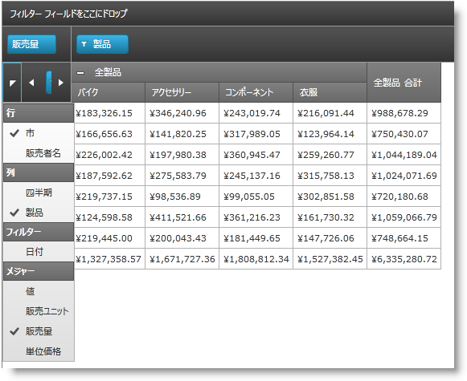

////

|metadata|
{
    "name": "xampivotgrid-field-chooser",
    "controlName": ["xamPivotGrid"],
    "tags": ["Getting Started","Grids"],
    "guid": "c4a64cce-25a8-48b4-9125-5f5f105ba6ca",  
    "buildFlags": [],
    "createdOn": "2016-05-25T18:21:58.1672927Z"
}
|metadata|
////

= フィールド選択

=== 概要

xamPivotGrid™ コントロールにはフィールド選択コントロールが含まれています。ユーザーはこのコントロールを使用して、行、列、フィルター、およびメジャーに追加する階層を素早く選択できます。このセクションのトピックでは、フィールド選択について詳しく説明します。

=== トピック

フィールド選択に関する詳しい情報は以下のトピックで扱われています。

[options="header", cols="a,a"]
|====
|トピック|目的

| link:xampivotgrid-field-chooser-overview.html[フィールド選択の概要]
|このトピックでは、xamPivotGrid™ に含まれているフィールド選択コントロールの概要について説明しています。

| link:xampivotgrid-field-chooser-implementing.html[フィールド選択の実装]
|このトピックでは、xamPivotGrid™ でフィールド選択コントロールを使用する方法について、順を追って説明します。

| link:xampivotgrid-field-chooser-property-reference.html[Field Chooser プロパティ参照]
|これは Field Chooser コントロールに関係する最も重要な API メンバーのリストです。

|====