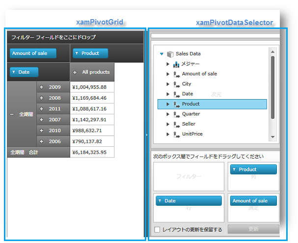

////

|metadata|
{
    "name": "xampivotgrid-getting-started-with-xampivotgrid",
    "controlName": ["xamPivotGrid"],
    "tags": ["Data Binding","Getting Started","How Do I"],
    "guid": "{F6A7249A-7274-4C95-B1A1-1235350651F6}",  
    "buildFlags": [],
    "createdOn": "2016-05-25T18:21:57.9433119Z"
}
|metadata|
////

= xamPivotGrid を使用した作業の開始

このトピックは、このコントロールを {PlatformName} アプリケーションに追加するためのステップごとの手順を示し、 link:{ApiPlatform}controls.grids.xampivotgrid{ApiVersion}~infragistics.controls.grids.xampivotgrid.html[xamPivotGrid] コントロールで作業を開始する方法を説明します。コード例には、XAML およびプロシージャ コードのリストが含まれます。

トピックは以下のとおりです。

* <<Introduction,概要>>
* <<Preview,プレビュー>>
* <<Requirements,要件>>
* <<Instructions,方法>>

** XAML コードの使用
** プロシージャ コードの使用

* <<RelatedTopics,関連トピック>>

** link:xampivotgrid-understanding-xampivotgrid.html[xamPivotGrid の概要]
** link:xampivotgrid-us-excel-spreadsheet-as-a-datasource.html[データ ソースとしての Excel スプレッドシート]
** link:xampivotgrid-binding-data-to-the-xampivotgrid.html[データを xamPivotGrid にバインド]

== 概要

以下のプロシージャは、 link:{ApiPlatform}controls.grids.xampivotgrid{ApiVersion}~infragistics.controls.grids.xampivotdataselector.html[xamPivotDataSelector] で xamPivotGrid コントロールをアプリケーションに追加し、これらのコントロールをデータ モデルのある FlatDataSource にバインドする方法を示します。データのバインドおよび xamPivotGrid に対する異なる データ ソースの利用に関する詳細は、 link:xampivotgrid-binding-data-to-the-xampivotgrid.html[「xamPivotGrid へのデータのバインド」]トピックを参照してください。

== プレビュー

以下は最終結果のプレビューです。

図 1: xamPivotDataSelector との xamPivotGrid コントロールの例

== 要件

[start=1]
. link:salesdatasample.html[営業データ サンプル リソース]から SalesDataSample クラスをダウンロードし、アプリケーションに追加します。このクラスは、xamPivotGrid コントロールの FlatDataSource 用項目ソースとして機能しますが、 link:http://msdn.microsoft.com/ja-jp/library/system.collections.ienumerable.aspx[IEnumerable] インターフェイス (`List`、`Collection`;、`Queue`、`Stack` など) を実装することにより独自のデータ モデルを作成できます。xamPivotGrid コントロールに異なるデータ ソースを提供するには、「データのバインド」トピックを参照してください。
[start=2]
. 以下の NuGet パッケージ参照をアプリケーションに追加します。

** Infragistics.WPF.Controls.Grids.XamPivotGrid
** Infragistics.WPF.Olap.FlatData

+
NuGet フィードのセットアップと NuGet パッケージの追加の詳細については、link:nuget-feeds.html[NuGet フィード] ドキュメントを参照してください。

[NOTE]
====
注: xamPivotGrid コントロールのデータ ソース タイプにより、必要な OLAP アセンブリ参照が決まります。xamPivotGrid コントロールのコンポーネントおよびそのデータ ソースによって使用される必要なアセンブリの完全なリストについては、 link:developers-guide-deploying-your-application.html[「アプリケーションの配備」]トピックを参照してください。
====

[start=3]
. 必要な名前空間の宣言を追加します。

*XAML の場合:*

----
xmlns:olap="http://schemas.infragistics.com/olap"
xmlns:ig="http://schemas.infragistics.com/xaml"
xmlns:models="clr-namespace:Infragistics.Samples.Data.Models"
----

*Visual Basic の場合:*

----
Imports Infragistics.Olap                 ' 共通の OLAP オブジェクト
Imports Infragistics.Olap.FlatData        ' FlatDataSource
Imports Infragistics.Controls.Grids       ' xamPivotGrid
Imports Infragistics.Samples.Data.Models  ' SalesDataSample
----

*C# の場合:*

----
using Infragistics.Olap;                 //共通の OLAP オブジェクト
using Infragistics.Olap.FlatData;        // FlatDataSource
using Infragistics.Controls.Grids;       // xamPivotGrid
using Infragistics.Samples.Data.Models;  // SalesDataSample
----

[NOTE]
====
*注:* Infragistics.Sample.Data.Models は、 link:salesdatasample.html[SalesDataSample] クラスが定義される名前空間です。この名前空間は、プロジェクトのどこに SalesDataSample クラスを追加するかにより異なります。
====

== 方法

このセクションは、xamPivotGrid コントロールをアプリケーションに追加し、FlatDataSource ビュー モデルを介して link:salesdatasample.html[SalesDataSample] データにバインドするための手順をステップごとに示します。

== XAML コードの使用

SalesDataSample データをリソースとして追加します。

*XAML の場合:*

----
xmlns:models="clr-namespace:Infragistics.Samples.Data.Models"
...
<models:SalesDataSample x:Key="dataSample"/>
----

FlatDataSource ビュー モデルをリソースとして追加し、SalesDataSample データにバインドします。

*XAML の場合:*

----
<olap:FlatDataSource x:Key="dataSource" ItemsSource="{StaticResource dataSample}" />
----

xamPivotGrid コントロールをレイアウト ルートに追加し、FlatDataSource ビュー モデルにバインドします。

*XAML の場合:*

----
<Grid x:Name="LayoutRoot" >
    <Grid.ColumnDefinitions>
            <ColumnDefinition Width="*" />
            <ColumnDefinition Width="Auto" />
    </Grid.ColumnDefinitions>
    <ig:XamPivotGrid x:Name="pivotGrid" DataSource="{StaticResource dataSource}" />
    <!-- TODO: xamPivotDataSelector  コントロールを追加します -->
</Grid>
----

xamPivotDataSelector コントロールをレイアウト ルートに追加し、FlatDataSource ビュー モデルにバインドします。

*XAML の場合:*

----
    <ig:Expander Grid.Column="1">
        <ig:XamPivotDataSelector x:Name="pivotDataSelector" 
                                 DataSource="{StaticResource dataSource}"  />
    </ig:Expander>
----

== プロシージャ コードの使用

SalesDataSample クラスのインスタンスを作成します。

*Visual Basic の場合:*

----
Imports Infragistics.Samples.Data.Models  ' SalesDataSamples  
...
Dim dataSample As New SalesDataSamples()
----

*C# の場合:*

----
using Infragistics.Samples.Data.Models;  // SalesDataSample  
...
SalesDataSamples dataSample = new SalesDataSamples();
----

FlatDataSource ビュー モデルのインスタンスを作成し、SalesDataSample データにバインドします。

*Visual Basic の場合:*

----
Dim dataSource As New FlatDataSource()
dataSource.ItemsSource = dataSample
----

*C# の場合:*

----
FlatDataSource dataSource = new FlatDataSource();
dataSource.ItemsSource = dataSample;
----

xamPivotGrid コントロールをレイアウト ルートに追加し、FlatDataSource ビュー モデルにバインドします。

*Visual Basic の場合:*

----
Dim pivotGrid As New XamPivotGrid()
pivotGrid.DataSource = dataSource
Me.LayoutRoot.Children.Add(pivotGrid)
----

*C# の場合:*

----
XamPivotGrid pivotGrid = new XamPivotGrid();
pivotGrid.DataSource = dataSource;
this.LayoutRoot.Children.Add(pivotGrid);
----

xamPivotDataSelector コントロールをレイアウト ルートに追加し、FlatDataSource ビュー モデルにバインドします。

*Visual Basic の場合:*

----
Dim pivotDataSelector As New XamPivotDataSelector ()
pivotDataSelector.DataSource = dataSource
Me.LayoutRoot.Children.Add(pivotDataSelector)
----

*C# の場合:*

----
XamPivotGrid pivotDataSelector = new XamPivotDataSelector ();
pivotDataSelector.DataSource = dataSource;
this.LayoutRoot.Children.Add(pivotDataSelector);
----

[[RelatedTopics]]
== 関連トピック

* link:xampivotgrid-understanding-xampivotgrid.html[xamPivotGrid の概要]
* link:xampivotgrid-us-excel-spreadsheet-as-a-datasource.html[データ ソースとしての Excel スプレッドシート]
* link:xampivotgrid-binding-data-to-the-xampivotgrid.html[データを xamPivotGrid にバインド]