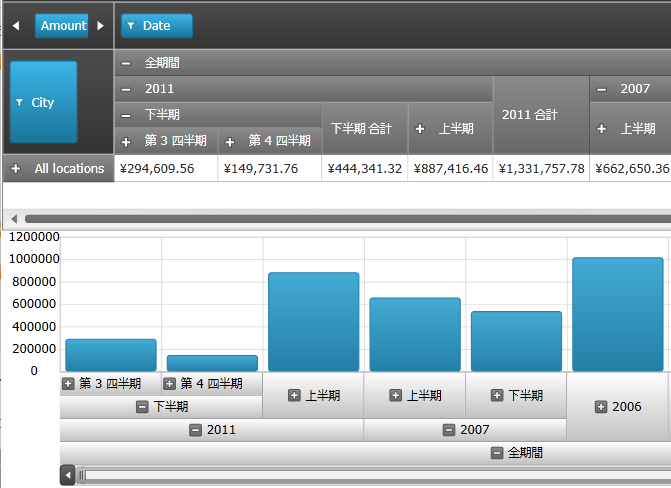

////

|metadata|
{
    "name": "xampivotgrid-integration-with-chart",
    "controlName": ["xamPivotGrid"],
    "tags": ["Charting","Grids","How Do I"],
    "guid": "34cda802-ee78-40a7-9e25-5f448e2a94e6",  
    "buildFlags": [],
    "createdOn": "2016-05-25T18:21:58.118284Z"
}
|metadata|
////

= DataChart との統合

== DataChart との統合

== 目的

このトピックは、 link:{ApiPlatform}controls.grids.xampivotgrid{ApiVersion}~infragistics.controls.grids.xampivotgrid.html[xamPivotGrid] と link:{ApiPlatform}controls.charts.xamdatachart{ApiVersion}~infragistics.controls.charts.xamdatachart.html[xamDataChart] コントロールの間のインタラクションの構築方法を説明します。

== プレビュー

以下は最終結果のプレビューです。OlapAxis のソースは列または行です。このスクリーンショットは列の階層的ビューを表示しています。列の階層の最上位レベルは「All Periods」ですが、これは年に続いて半年が含まれ、各半年に四半期が含まれるといった形になっています。PivotGrid と OlapAxis は同じデータ ソースにバインドされ、両者は同期されています。OlapAxis のレベルを拡張すると、PivotGrid の列階層が拡張され、その逆も同じようになります。

図: 最終結果のプレビュー

== 本トピックの内容

このトピックには次のセクションが含まれます:

* コントロールの構成の概要

** OlapAxis の DataSource の設定
** OlapAxisSource タイプの定義
** YAxis の定義
** Series の定義

== 前提条件

まず以下のトピックを読む必要があります。

* link:xampivotgrid-binding-data-to-the-xampivotgrid.html[データを xamPivotGrid にバインド]
* link:xampivotgrid-getting-started-with-xampivotgrid.html[xamPivotGrid を使用した作業の開始]

== コントロールの構成の概要

xamDataChart コントロールは OlapAxis と呼ばれる新しい軸タイプを公開します。新しい軸は統合機能の主要要素である DataSource プロパティを公開します。DataSource プロパティはピボット グリッド (XMLADataSource or FlatDataSource) として同じデータ ソースにバインドできます。

.注:
[NOTE]
====
ビューに表示するにはデータが大きすぎるため、データの特定のセクションにスクロールまたはズームできるズームバーを使うために DataChart 上のズームバーを有効化することを推奨します。
====

== コントロールの構成チャート

以下の表はピボット グリッドに統合されることが求められる OlapAxis プロパティの構成可能な要素を列挙したものです。

[options="header", cols="a,a,a"]
|====
|構成可能な要素|構成の詳細|構成プロパティ

|*OlapAxis の DataSource の設定*
|OlapAxis クラスのプロパティはピボット グリッドがバインドされている同じデータ ソースを設定します。
| link:{ApiPlatform}controls.grids.xampivotgrid{ApiVersion}~infragistics.controls.grids.xampivotgrid~datasource.html[DataSource]

|*OlapAxisSource タイプの定義*
|軸ソースタイプはデータの Columns または Rows です。
| link:{ApiPlatform}controls.charts.olap{ApiVersion}~infragistics.controls.charts.olapaxis~olapaxissource.html[OlapAxisSource]

|*Y 軸の定義*
|OlapAxis クラスの Y 軸にはデータの値タイプ (数値) が必要です。
| link:{ApiPlatform}controls.charts.xamdatachart{ApiVersion}~infragistics.controls.charts.verticalstackedseriesbase~yaxis.html[YAxis]

|*Series の定義*
|グリッド列を定義する方法が 2 つあります。 

* 自動生成 

* タイプ OlapColumnSeries のユーザー定義 Series から読み込み 

| link:{ApiPlatform}controls.charts.xamdatachart{ApiVersion}~infragistics.controls.charts.stackedseriesbase~autogenerateseries.html[AutoGenerateSeries]

|====

== OlapAxis の DataSource の設定

== プロパティ設定

以下の表は OlapAxi の DataSource プロパティに関する設定をマップします。ピボット グリッド データ バインディングについての詳細は XamPivotGrid のバインディング データを参照してください。

[options="header", cols="a,a"]
|====
|プロパティ|設定

| link:{ApiPlatform}controls.grids.xampivotgrid{ApiVersion}~infragistics.controls.grids.xampivotgrid~datasource.html[DataSource]
|ピボット グリッドと同じデータ ソースにバインドされます。

|====

== コード例

*XAML の場合:*

[source,xaml]
----
<ig:XamPivotGrid x:Name="pivotGrid" 
      DataSource="{StaticResource DataSource}" />
<ig:XamDataChart x:Name="xmOlapDataChart1" >
      <ig:XamDataChart.Axes>
            <igOlapAxis:OlapXAxis DataSource="{StaticResource DataSource}" />
      </ig:XamDataChart.Axes>
</ig:XamDataChart>
----

== OlapAxisSource タイプの定義

== プロパティ設定

以下の表は OlapAxisSource に対するソースにタイプの設定をマップします。

[options="header", cols="a,a"]
|====
|プロパティ|設定

| link:{ApiPlatform}controls.charts.olap{ApiVersion}~infragistics.controls.charts.olapaxis~olapaxissource.html[OlapAxisSource]
|Columns 

Rows

|====

== コード例

*XAML の場合:*

[source,xaml]
----
<ig:XamPivotGrid x:Name="pivotGrid" 
      DataSource="{StaticResource DataSource}" />
<ig:XamDataChart x:Name="xmOlapDataChart1">
      <ig:XamDataChart.Axes>
            <igOlapAxis:OlapXAxis 
                  DataSource="{StaticResource DataSource}"
                  OlapAxisSource="Rows"/>
      </ig:XamDataChart.Axes>
</ig:XamDataChart>
----

== YAxis の定義

== プロパティ設定

以下の表は Y 軸の設定をマップします。

[options="header", cols="a,a"]
|====
|プロパティ|設定

| link:{ApiPlatform}controls.charts.xamdatachart{ApiVersion}~infragistics.controls.charts.verticalstackedseriesbase~yaxis.html[YAxis]
|NumericYAxis オブジェクトへのバインド

|====

== コード例

*XAML の場合:*

[source,xaml]
----
<ig:XamPivotGrid x:Name="pivotGrid" 
      DataSource="{StaticResource DataSource}" />
<ig:XamDataChart x:Name="xmOlapDataChart1" >
      <ig:XamDataChart.Axes>
                <igOlapAxis:OlapXAxis 
                    DataSource="{StaticResource DataSource}"
                    OlapAxisSource="Rows"
                    YAxis="{Binding ElementName=yAxis}"/>
                <ig:NumericYAxis Name="yAxis"/>
       </ig:XamDataChart.Axes>
</ig:XamDataChart>
----

== Series の定義

== プロパティ設定

以下の表は両方の値 (True / False) に対する AutoGenerateSeries プロパティの設定をマップします。

[options="header", cols="a,a"]
|====
|プロパティ|設定

| link:{ApiPlatform}controls.charts.xamdatachart{ApiVersion}~infragistics.controls.charts.stackedseriesbase~autogenerateseries.html[AutoGenerateSeries]
|True 

False

|====

== コード例:

[start=1]
. 次の例ではシリーズを自動的に生成するためにモードを使用します。データは OlapAxisSource プロパティで示される Rows または Columns に基づいて生成されます。

*XAML の場合:*

[source,xaml]
----
<ig:XamPivotGrid x:Name="pivotGrid" 
      DataSource="{StaticResource DataSource}" />
<ig:XamDataChart x:Name="xmOlapDataChart1" >
      <ig:XamDataChart.Axes>
                <igOlapAxis:OlapXAxis 
                    DataSource="{StaticResource DataSource}"
                    OlapAxisSource="Rows"
                    YAxis="{Binding ElementName=yAxis}"
                    AutoGenerateSeries="True"/>
                <ig:NumericYAxis Name="yAxis"/>
      </ig:XamDataChart.Axes>
</ig:XamDataChart>
----

[start=2]
. 次の例では AutoGenerateSeries が False に設定されている間に特殊タイプ OlapColumnSeries のユーザー定義シリーズを使用します。

[NOTE]
====
*注:* シリーズの ValueMemberPath は OLAP データ ソースのメンバーのキャプションに一致しなければなりません。
====

*XAML の場合:*

[source,xaml]
----
<ig:XamPivotGrid x:Name="pivotGrid" 
      DataSource="{StaticResource DataSource}" />
<ig:XamDataChart x:Name="xmOlapDataChart1" >
      <ig:XamDataChart.Axes>
                <igOlapAxis:OlapXAxis 
                    DataSource="{StaticResource DataSource}"
                    OlapAxisSource="Rows"
                    YAxis="{Binding ElementName=yAxis}"
                    AutoGenerateSeries="False"/>
                <ig:NumericYAxis Name="yAxis"/>
      </ig:XamDataChart.Axes>
<ig:XamDataChart.Series>
     <ig:OlapColumnSeries 
           Title="Customized Title" 
           YAxis="{Binding ElementName=yAxis}" 
           OlapXAxis="{Binding ElementName=olapXAxis}" ValueMemberPath="Europe"/>
    </ig:XamDataChart.Series>
</ig:XamDataChart>
----

関連トピック

link:xampivotgrid-getting-started-with-xampivotgrid.html[xamPivotGrid を使用した作業の開始]