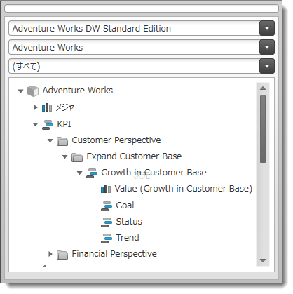
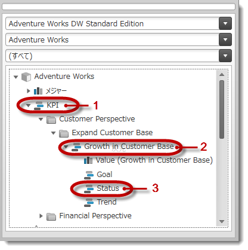
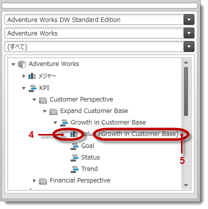

////
|metadata|
{
    "name": "xampivotgrid-kpis-visualization-overview",
    "tags": ["Application Scenarios","Data Binding","Grids","How Do I"],
    "controlName": ["xamPivotGrid"],
    "guid": "4e832a52-08c8-43dc-a71f-a4361766ca1f",
    "buildFlags": [],
    "createdOn": "2016-05-25T18:21:58.2943332Z"
}
|metadata|
////

= KPI (キー パフォーマンス インジケーター) 視覚エフェクトの概要 (xamPivotGrid, xamPivotDataSelector)

== トピックの概要

=== 目的

このトピックは、多次元 (OLAP) データ セットからの KPI データが {ProductName}® で視覚化される状態を概念的に説明します。KPI を視覚化する {ProductName} コントロールの  _xamPivotDataSelector_™ は、 _xamPivotGrid_™ に含まれています。

=== 前提条件

以下の表は、このトピックを理解するための前提条件として必要な記事を示しています。

[options="header", cols="a,a"]
|====

|記事|目的 

| link:https://ja.wikipedia.org/wiki/%E9%87%8D%E8%A6%81%E6%A5%AD%E7%B8%BE%E8%A9%95%E4%BE%A1%E6%8C%87%E6%A8%99[KPI] 

| キー パフォーマンス インジケーターを説明する Wikipedia 記事。

| link:http://technet.microsoft.com/ja-jp/library/ms174875.aspx[多次元モデルの KPI] 

|多次元モデルの KPI の概要を紹介する MSDN の記事です。 

|==== 

=== このトピックの内容

このトピックは、以下のセクションで構成されます。

* <<_Ref382419064,はじめに>>

** <<_Ref382419078,KPI 視覚エフェクトの概要>>
** <<_Ref382419114,KPI の技術的な実装の概要>>
** <<_Ref382419128,KPI の重要な用語>>

* <<_Ref382419152,KPI 視覚エフェクトの構成 - 概要>>

** <<_Ref380418739,KPI 視覚エフェクトの構成の概要>>
** <<_Ref377459969,KPI 視覚エフェクトの構成の概要表>>

* <<_Ref382419231,KPI 視覚エフェクトのデフォルト設定>>
* <<_Ref380419142,関連コンテンツ>>

[[_Ref382419064]]
== はじめに

[[_Ref382419078]]

=== KPI 視覚エフェクトの概要

KPI (Key Performance Indicator: キー パフォーマンス インジケーター) とは、パフォーマンス管理の特定のタイプを表す用語です。KPI は個別のニーズ (アプリケーションのフィールド) によって変化し、目標に対する進捗や時間軸での傾向など、組織の重要なメトリックスに関する情報を提供します。

OLAP サービスでは、KPI は特定のメジャー グループについて計算されたデータを使用します。データは、分析サービス データをホストする OLAP サーバーで定義されています。このデータは  _xamPivotDataSelector_   に表示され、 _xamPivotGrid_   コントロールでグラフィックとして視覚化できます。

_xamPivotDataSelector_   コントロールは、サーバーで計算された KPI のメンバーが格納された単独のフォルダーを表示します。

_xamPivotGrid_   コントロールは、KPI またはその実際の値をグラフィック表現で表示します。

image::images/xamPivotGrid_KPIs_Visualization_Overview_2.png[]

各 KPI は、メタデータ ツリーからピボット グリッドのメジャー領域にドラッグ アンド ドロップする、またはプログラムでメジャー コレクションに追加すると、 _xamPivotGrid_   で視覚化できます。

[[_Ref382419114]]

=== KPI の技術的な実装の概要

_xamPivotDataSelector/_   _xamPivotGrid_   の KPI のグラフィック表現および値としての表現で描画する機能は、 _XmlaDataSource_™ コンポーネントにより提供されます。(KPI 項目はグラフィック表現での描画および値のいずれでも表示できますが、同時に両方の表現で表示することはできません。これは、カスタム テンプレートに  _xamPivotGrid_   を適用すると可能になります。)

グラフィック表現では、アイコンのような画像で KPI 項目またはそのメタデータ項目の状態を象徴的に表現します。グラフィック表現のグループは、サーバーで定義されています。視覚化されている KPI についてはデフォルトのグラフィック表現 (サーバー上に設定) を使用でき、他のグラフィック表現や各自のカスタム グラフィック表現を持つカスタム テンプレートを、オプションで使用するように選択することもできます。詳細は、 link:xampivotgrid-configuring-kpis-visualization.html[KPI の構成]のトピックを参照してください。

コンポーネントへのデータのフィード時に、インジケーターはデフォルトで KPIs という名前のフォルダーの  _xamPivotDataSelector_   に表示されます。データ セレクターのツリーに表示される KPI サブフォルダーの階層は、サーバーから提供されたメタデータ情報により構築されます。

各 KPI 項目には、以下のメタデータ項目が含まれています。

* 値
* 目的
* 状態
* トレンド
* 重み

そのようなメタデータの情報は、 link:{ApiPlatform}olap{ApiVersion}~infragistics.olap.data.base.kpi~kpigoal.html[KpiGoal]、 link:{ApiPlatform}olap{ApiVersion}~infragistics.olap.data.base.kpi~kpitrend.html[KpiTrend]、 link:{ApiPlatform}olap{ApiVersion}~infragistics.olap.data.base.kpi~kpitrendgraphic.html[KpiTrendGraphic] など複数のプロパティ (すべてのプロパティについてのリストは、 link:{ApiPlatform}olap{ApiVersion}~infragistics.olap.data.base.kpi.html[クラスの API ドキュメント]を参照してください) で前述の目的のために設計された、 link:{ApiPlatform}olap{ApiVersion}~infragistics.olap.data.base.kpi.html[Kpi] クラスに保管されています。link:{ApiPlatform}controls.grids.xampivotgrid{ApiVersion}~infragistics.controls.grids.kpicelltemplate~indicator.html[Indicator] プロパティを設定すると、表示に使用する特定のインジケーターが識別されます。

グラフィック表現を有効にするには、事前定義された 13 の異なる形状のセット (link:{ApiPlatform}controls.grids.xampivotgrid{ApiVersion}~infragistics.controls.grids.kpicelltemplate~graphic.html[Graphic] プロパティで制御) に加え、 _xamPivotGrid_   の link:{ApiPlatform}controls.grids.xampivotgrid{ApiVersion}~infragistics.controls.grids.kpicelltemplate.html[KpiDataCellTemplate] オブジェクトの明示的にカスタマイズするオプションが使用できる必要があります。link:{ApiPlatform}controls.grids.xampivotgrid{ApiVersion}~infragistics.controls.grids.kpicelltemplate.html[KPICellTemplate] オブジェクトの link:{ApiPlatform}controls.grids.xampivotgrid{ApiVersion}~infragistics.controls.grids.kpicelltemplate~template.html[Template] プロパティをオーバーライドすることによって、ユーザーのシナリオに応じたカスタム テンプレートを定義し、KPI インジケーターを表示することができます。

視覚化仕様を調整するには、 _xamPivotGrid_   の link:{ApiPlatform}controls.grids.xampivotgrid{ApiVersion}~infragistics.controls.grids.xampivotgrid~kpicelltemplates.html[KpiCellTemplates] コレクションに追加される `KpiCellTemplate` オブジェクトの異なるプロパティを構成します。

詳細は、 link:xampivotgrid-configuring-kpis-visualization.html[KPI (キー パフォーマンス インジケーター) 視覚エフェクトの構成]のトピックを参照してください。

[[_Ref382419128]]

=== KPI の重要な用語

KPI は、 (以下の画像の 1) という名前のルート項目フォルダーおよび基本ディレクトリの下に一覧表示される各  *KPI 項目*  (2) の  _xamPivotGrid_   のデータ セレクターに表示されます。さまざまな  *KPI メンバー項目*  (3) は、それぞれの親 KPI 項目の下にあります。

*メジャー アイコン*  (以下の画像の 4) は、値または目標のための KPI メンバーを示すために使用されます (メンバーがメジャーのみで評価される場合)。 *メジャー名*  (5) は、項目タイプを示すラベルの後ろの括弧内に表示されます。

[[_Ref377366929]]

[[_Ref380418734]]
[[_Ref382419152]]
== KPI 視覚エフェクトの構成 - 概要

[[_Ref380418739]]

=== KPI 視覚エフェクトの構成の概要

各 KPI は、メタデータ ツリーからピボット グリッドのメジャー領域にドラッグ アンド ドロップする、またはプログラムでメジャー コレクションに追加すると、 _xamPivotGrid_  で視覚化できます。

KPI タイプに依存しますが適用できる場合は、KPI を値またはグラフィック表現として視覚化できます。

デフォルトの事前定義されたグラフィック表現 (形状) のセットが利用できます。この設定は `KpiCellTemplate` オブジェクトの `Graphic` プロパティで制御されています。

Graphic プロパティを  _「_  _ThreeStateImages_ 」に設定し、使用する画像ソースを提供すると、各 KPI の値 (-1、0 および 1) を表す画像を任意の画像にカスタマイズすることができます (詳細は、 link:xampivotgrid-configuring-kpis-visualization.html#_Ref377459969[KPI 視覚エフェクトの構成の概要表]を参照してください)。代わりに、カスタム テンプレートで、`KpiCellTemplate` インスタンスの `Template` プロパティをオーバーライドする方法もあります。

[[_Ref377459969]]

=== KPI 視覚エフェクトの構成の概要表

以下の表は、ピボット グリッド ( _xamPivotGrid_  と  _xamPivotDataSelector_  コントロール) の KPI 視覚エフェクトの構成可能な要素を簡単に説明し、それらを構成するプロパティにマップします。緑で強調表示された部分のタスクは、このヘルプの別の手順でさらに詳しく説明しています。

[options="header", cols="a,a,a,a"]
|====
|構成可能な項目|タスク|詳細|プロパティ/イベント

|メタデータ ツリーの KPI 視覚エフェクト
|KPI の表示の回避
|KPI はデフォルトで表示に設定されています。KPI データを非表示にする場合は、明示的に設定する必要があります。
|
* link:{ApiPlatform}olap.xmla{ApiVersion}~infragistics.olap.xmla.xmladatasource~metadatatreeitemadding_ev.html[MetadataTreeItemAdding] 

|[[_Hlk356484826]] 

ピボット グリッドの KPI 視覚エフェクト
|プログラムによるピボット グリッドでの KPI の表示
|`KpiMeasure` を `DataSourceBase` インスタンスの `Measures` コレクションに追加します。
|
* link:{ApiPlatform}olap{ApiVersion}~infragistics.olap.datasourcebase~measures.html[DataSourceBase.Measures] 

|グラフィック表現
|事前定義された視覚エフェクトの選択
|`KpiCellTemplate` の `Indicator` および `Graphic` プロパティを設定します。
|
* link:{ApiPlatform}controls.grids.xampivotgrid{ApiVersion}~infragistics.controls.grids.kpicelltemplate~indicator.html[KpiCellTemplate.Indicator] 

* link:{ApiPlatform}controls.grids.xampivotgrid{ApiVersion}~infragistics.controls.grids.kpicelltemplate~graphic.html[KpiCellTemplate.Graphic] 

|カスタム視覚エフェクトの構成
|プロパティの使用
|`KpiCellTemplate` の `Graphic` プロパティを _「_ _ThreeState_ Images」に設定し、各状態に対応する画像を各プロパティの値で提供します。
|
* link:{ApiPlatform}controls.grids.xampivotgrid{ApiVersion}~infragistics.controls.grids.kpicelltemplate~graphic.html[KpiCellTemplate.Graphic] 

* link:{ApiPlatform}controls.grids.xampivotgrid{ApiVersion}~infragistics.controls.grids.kpicelltemplate~negativeimagesource.html[KpiCellTemplate.NegativeImageSource] 

* link:{ApiPlatform}controls.grids.xampivotgrid{ApiVersion}~infragistics.controls.grids.kpicelltemplate~zeroimagesource.html[KpiCellTemplate.ZeroImageSource] 

* link:{ApiPlatform}controls.grids.xampivotgrid{ApiVersion}~infragistics.controls.grids.kpicelltemplate~positiveimagesource.html[KpiCellTemplate.PositiveImageSource] 

|カスタム テンプレートの使用
|カスタム テンプレートを KpiCellTemplate インスタンスの `Template` プロパティに指定します。
|
* link:{ApiPlatform}controls.grids.xampivotgrid{ApiVersion}~infragistics.controls.grids.kpicelltemplate~template.html[KpiCellTemplate.Template] 

|====

[[_Ref382419231]]
== KPI 視覚エフェクトのデフォルト設定

=== KPI 視覚エフェクトのデフォルト設定の概要

KPI は デフォルトで _xamPivotDataSelector_   コントロールの KPIs フォルダーに格納されています。_xamPivotGrid_   の KPI のデフォルト視覚エフェクトは、サーバーに定義されているデフォルトのグラフィック タイプによって異なります。

[[_Ref380419142]]
== 関連コンテンツ

このトピックの追加情報については、以下のトピックも合わせてご参照ください。

[options="header", cols="a,a"]
|====
|トピック|目的

| link:xampivotgrid-configuring-kpis-visualization.html[KPI 視覚エフェクトの構成 ( _xamPivotGrid_ 、 _xamPivotDataSelector_ )]
|このトピックでは、 _xamPivotGrid_ および _xamPivotDataSelector_ コントロールで KPI の視覚化をカスタマイズする方法を説明します。

|====
