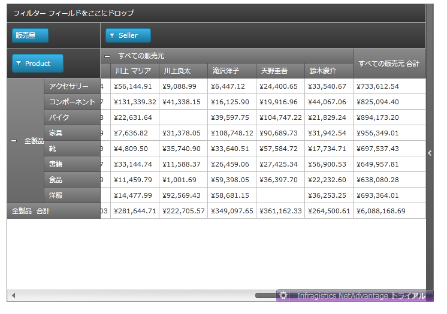

////

|metadata|
{
    "name": "xampivotgrid-sorting-rows-and-columns",
    "controlName": ["xamPivotGrid"],
    "tags": ["Extending","Grids","Sorting"],
    "guid": "61088192-227e-4b47-aa03-4cfa95dca76a",  
    "buildFlags": [],
    "createdOn": "2016-05-25T18:21:58.0343177Z"
}
|metadata|
////

= FlatDataSource で行と列の並べ替え

FlatDataSource を使用する場合、XamPivotGrid™ は列と行が表示する順序を並べ替える機能をユーザーに提供しています。このトピックでは、XamPivotGrid のこの機能について説明しています。

== カスタムの並べ替えロジックの実装

階層ごとにカスタムの並べ替えロジックを作成するには、FlatDataSource コンポーネントを使用します。これは、変更したい HierarchyLevelDescriptor ごとに OrderByKeyExpression を提供することで実行できます。顕著な例としては、名前 (デフォルト) ではなく、姓でセルを並べ替えるように、フルネーム (姓 + 名前) を含むセルの並べ替え順序を変更することが挙げられます。

以下の画像は、姓で並べ替えられた Seller グリッドの名前列を紹介します。

以下のコードを使用してこれを実装できます。

*C# の場合:* 

[source,csharp]
----
HierarchyDescriptor<Sale> sellerHierarchy = new HierarchyDescriptor<Sale>(p => p.Seller);
sellerHierarchy.AddLevel(p => "All sellers", "All sellers");
sellerHierarchy.AddLevel(p => p.Seller.Name, "Individual seller");
char[] separators = { ' ' };
Expression<Func<Sale, String>>  expression = 
        sale => sale.Seller.Name.Split(separators)[1];
sellerHierarchy.LevelDescriptors[1].OrderByKeyExpression = expression;
this.AddHierarchyDescriptor(sellerHierarchy);
----

*Visual Basic の場合:*

[source,vb]
----
Dim sellerHierarchy 
        As New HierarchyDescriptor(Of Sale)(Function(p) p.Seller)
sellerHierarchy.AddLevel(Function(p) "All sellers", "All sellers")
sellerHierarchy.AddLevel(Function(p) p.Seller.Name, "Individual seller")
Dim separators As Char() = {" "c}
Dim expression 
        As Expression(Of Func(Of Sale, [String])) = 
                Function(sale) sale.Seller.Name.Split(separators)(1)
sellerHierarchy.LevelDescriptors(1).OrderByKeyExpression = expression
Me.AddHierarchyDescriptor(sellerHierarchy)
----

このコードは、Sale クラスの Seller プロパティの階層記述子を定義します。プロパティのタイプは String で、すべての値は名前です (スペースで 2 つのワード文字列が区切られている。例 "John Smith")。2 番目と 3 番目の行で、階層の各レベルが定義されます。次に、次の 2 行は順序を評価するために使用される Lambda 式を定義します。関数は、 => 演算子の左側と右側のタイプを指定します。_sale_  はタイプ Sale で、 _sale.Seller.Name.Split(separators)[1]_  はタイプ String です。右側は、並べ替えの対象です。したがって、seller の各名前がセパレーター スペースで 2 つに分割され、2 番目の名前 (姓) が並べ替えに使用されます。

*関連トピック*

link:xampivotgrid-us-sorting-data.html[データの並べ替え]