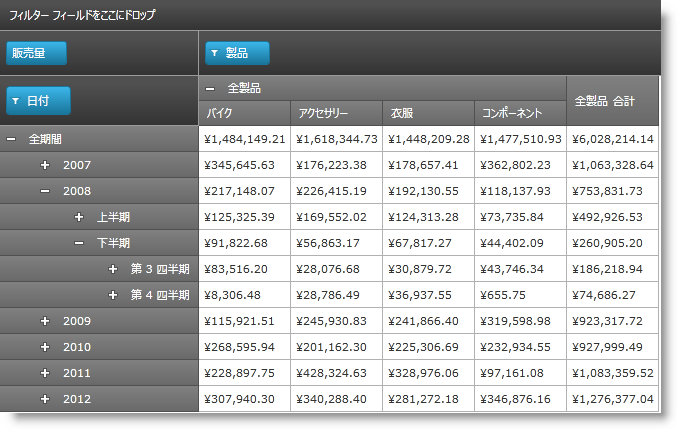
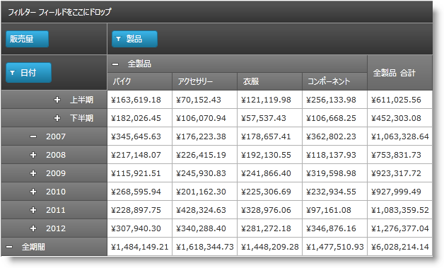

////

|metadata|
{
    "name": "xampivotgrid-super-compact-layout",
    "controlName": ["xamPivotGrid"],
    "tags": ["Drilldown","Grids","How Do I","Layouts","Templating"],
    "guid": "b60da199-8098-46ad-84a5-04379c1e468f",  
    "buildFlags": [],
    "createdOn": "2016-05-25T18:21:58.2762927Z"
}
|metadata|
////

= スーパー コンパクト レイアウト

== トピックの概要

=== 目的

このトピックでは、 _xamPivotGrid_™ のスーパー コンパクト レイアウト機能を紹介し、その構成方法をコード例を示して説明します。

=== 前提条件

このトピックを理解するためには、以下のトピックを理解しておく必要があります。

[options="header", cols="a,a"]
|====
|トピック|目的

| link:xampivotgrid-understanding-xampivotgrid.html[xamPivotGrid の概要]
|このセクションは、 _xamPivotGrid_ コントロールの主要機能について説明します。

| link:xampivotgrid-getting-started-with-xampivotgrid.html[xamPivotGrid を使用した作業の開始]
|このトピックでは、 _xamPivotGrid_ コントロールを使用して作業を開始する方法について説明するため、このコントロールを {PlatformName} アプリケーションに追加するための手順を順を追って説明しています。

|====

=== 本トピックの内容

このトピックには次のセクションがあります。

* <<_Ref333573827,概要>>
* <<_Ref333573834,スーパー コンパクト レイアウトを有効にする>>

** <<_Ref333573838,概要>>
** <<_Ref333573841,スーパー コンパクト レイアウト構成の概要>>
** <<_Ref330295239,スーパー コンパクト レイアウト構成の概要表>>
** <<_Ref330295257,プロパティ設定>>
** <<_Ref330295911,例 – 子の上の親>>
** <<_Ref333573862,例 – 子の下の親>>

* <<_Ref330295269,コード例: スーパー コンパクト レイアウト>>

** <<_Ref333573868,説明>>
** <<_Ref333573871,コード>>

* <<_Ref330295289,関連コンテンツ>>

[[_Ref333573827]]
[[_Ref330295234]]
== 概要

[[_Ref333573832]]

=== スーパー コンパクト レイアウトの概要

ピボット グリッドのスーパー コンパクト レイアウトは水平領域を保存するために設計された  _xamPivotGrid_   コントロールの代替えレイアウトです。親ヘッダー セルの右側に配置されたヘッダー セル (標準レイアウトの場合と同じように) に行の階層の各子レベルを表示する代わりに、子レベルのヘッダー セルがそれの上または下に配置されます。異なるレベルの階層を識別するには、それぞれを指定した距離で右にアウトセットします。

link:xampivotgrid-us-compact-layout.html[コンパクト レイアウト]はスーパー コンパクト レイアウトに似ているもう 1 つのオプションです。また、使用する水平領域を最小化するために行ヘッダーセルをノードとして表示します。子セルの前に展開/縮小トグルを置くだけです。コンパクト レイアウトでは子セルのインデントを制御できませんが、スーパー コンパクト レイアウトでは制御できます。したがって、水平領域の保存が必須の場合にスーパー コンパクト レイアウトはより多くのオプションを提供しますが、さらに行階層のツリーのような構造は視覚的に強調表示することができます。

[cols="a"]
|====
|[[_Hlk333591570]] *標準レイアウト* 

|image::images/xamPivotGrid_Super-Compact_Layout_01.png[]

|*コンパクト レイアウト (親の上に子)*

|image::images/xamPivotGrid_Super-Compact_Layout_02.png[]

|*スーパー コンパクト レイアウト (親の下に子)*

|image::images/xamPivotGrid_Super-Compact_Layout_03.png[]

|====

デフォルトで、 _xamPivotGrid_   は標準レイアウトでインスタンス化されます。このため使用したい場合にはスーパー コンパクト レイアウトを明示的に有効にする必要があります。

すべてのレイアウトと同様に、親ノードが子ノードの上に表示されるのか、それとも下に表示されるのかを指定して、レベルに水平インデントを設定できます。

[[_Ref333573834]]
== スーパー コンパクト レイアウトを有効にする

[[_Ref333573838]]

=== 概要

_xamPivotGrid_   の link:{ApiPlatform}controls.grids.xampivotgrid{ApiVersion}~infragistics.controls.grids.xampivotgrid~allowsupercompactlayout.html[AllowSuperCompactLayout] プロパティを  _True_   に設定することによって、スーパー コンパクト レイアウトを有効にします。<<_Ref333591732,スーパー コンパクト レイアウト構成の概要>>で説明されるように追加の構成が可能です。

[[_Ref333573841]]
[[_Ref333591732]]
== スーパー コンパクト レイアウト構成の概要

[[_Ref330295239]]

=== スーパー コンパクト レイアウト構成の概要表

以下の表は、スーパー コンパクト レイアウトに関する  _xamPivotGrid_   コントロールの構成可能な項目を示しています。

[options="header", cols="a,a,a"]
|====
|構成可能な項目|説明|プロパティ

|子ヘッダー セルのインデント
|レベルの行ヘッダー セルのインデントは構成可能です。
|
* link:{ApiPlatform}controls.grids.xampivotgrid{ApiVersion}~infragistics.controls.grids.xampivotgrid~supercompactlayoutindent.html[SuperCompactLayoutIndent] 

|親ノードの配置
|親セルは子の上または下に表示できます。
|
* link:{ApiPlatform}controls.grids.xampivotgrid{ApiVersion}~infragistics.controls.grids.xampivotgrid~parentinfrontforrows.html[ParentInFrontForRows] 

*その他の関連プロパティ:*

* link:{ApiPlatform}controls.grids.xampivotgrid{ApiVersion}~infragistics.controls.grids.xampivotgrid~parentinfrontforcolumns.html[ParentInFrontForColumns] 

|====

.注:
[NOTE]
====
link:{ApiPlatform}controls.grids.xampivotgrid{ApiVersion}~infragistics.controls.grids.xampivotgrid~allowsupercompactlayout.html[AllowSuperCompactLayout] を  _True_   に設定すると、 link:{ApiPlatform}controls.grids.xampivotgrid{ApiVersion}~infragistics.controls.grids.xampivotgrid~allowcompactlayout.html[AllowCompactLayout] ( _コンパクト レイアウト_  を有効にする) は  _False_   に設定されます。このプロパティが  _True_   に設定される前にコンパクト レイアウトが使用されている場合、コンパクト レイアウトは無効になります。
====

[[_Ref330295251]]

[[_Ref330295257]]

=== プロパティ設定

以下の表では、目的の構成をプロパティ設定にマップしています。

[options="header", cols="a,a,a"]
|====
|目的:|使用するプロパティ:|次に設定:

|スーパー コンパクト レイアウトを有効にする
| link:{ApiPlatform}controls.grids.xampivotgrid{ApiVersion}~infragistics.controls.grids.xampivotgrid~allowsupercompactlayout.html[AllowSuperCompactLayout]
|`True`

|子レベルのインデントを設定
| link:{ApiPlatform}controls.grids.xampivotgrid{ApiVersion}~infragistics.controls.grids.xampivotgrid~supercompactlayoutindent.html[SuperCompactLayoutIndent]
|選択する整数値。(負の数は _0_ として扱われます)

|子の上に親を表示
| link:{ApiPlatform}controls.grids.xampivotgrid{ApiVersion}~infragistics.controls.grids.xampivotgrid~parentinfrontforrows.html[ParentInFrontForRows]
|`True`

|====

[[_Ref330295261]]

=== 例 – 子の上の親

以下のスクリーンショットは、 _xamPivotGrid_   が以下の設定の結果どのように表示するのかを示しています。

[options="header", cols="a,a"]
|====
|プロパティ|値

| link:{ApiPlatform}controls.grids.xampivotgrid{ApiVersion}~infragistics.controls.grids.xampivotgrid~allowsupercompactlayout.html[AllowSuperCompactLayout]
|`True`

| link:{ApiPlatform}controls.grids.xampivotgrid{ApiVersion}~infragistics.controls.grids.xampivotgrid~supercompactlayoutindent.html[SuperCompactLayoutIndent]
|30

| link:{ApiPlatform}controls.grids.xampivotgrid{ApiVersion}~infragistics.controls.grids.xampivotgrid~parentinfrontforrows.html[ParentInFrontForRows]
|`True`

|====

[[_Ref330295263]]

=== 例 – 子の下の親

以下のスクリーンショットは、 _xamPivotGrid_   が以下の設定の結果どのように表示するのかを示しています。

[options="header", cols="a,a"]
|====
|プロパティ|値

| link:{ApiPlatform}controls.grids.xampivotgrid{ApiVersion}~infragistics.controls.grids.xampivotgrid~allowsupercompactlayout.html[AllowSuperCompactLayout]
|`True`

| link:{ApiPlatform}controls.grids.xampivotgrid{ApiVersion}~infragistics.controls.grids.xampivotgrid~supercompactlayoutindent.html[SuperCompactLayoutIndent]
|30

| link:{ApiPlatform}controls.grids.xampivotgrid{ApiVersion}~infragistics.controls.grids.xampivotgrid~parentinfrontforrows.html[ParentInFrontForRows]
|`False`

|====

[[_Ref330295269]]
== コード例: 30 ピクセル インデントして子の上に親を表示する、スーパー コンパクト レイアウト

[[_Ref333573868]]

=== 説明

以下のコードは、 _xamPivotGrid_   のスーパー コンパクト レイアウト機能を有効にして 30 ピクセル インデントして子の上に親行ヘッダー セルを表示するように構成する方法を示します。

[[_Ref333573871]]

=== コード

*XAML の場合:*

[source,xaml]
----
Code
<ig:XamPivotGrid x:Name="pivotGrid"
                         DataSource="{StaticResource DataSource}"
                         AllowSuperCompactLayout="True"
                         SuperCompactLayoutIndent="30"
                         ParentInFrontForColumns="
                         ParentInFrontForRows="True"/>
----

[[_Ref330295289]]
== 関連コンテンツ

このトピックについては、以下のトピックも参照してください。

[options="header", cols="a,a"]
|====
|トピック|目的

| link:xampivotgrid-us-compact-layout.html[コンパクト レイアウト]
|このトピックでは、 _xamPivotGrid_ のコンパクト レイアウト機能について説明しています。

| link:xampivotgrid-customizing-cells-with-templates.html[テンプレートを使用したセルのカスタマイズ]
|このトピックでは、 _xamPivotGrid_ のデータおよびヘッダー セルのためにカスタム テンプレートを作成する方法を説明します。

| link:xampivotgrid-us-conditional-formating.html[条件フォーマッティング]
|このトピックでは、 _xamPivotGrid_ コントロールを条件フォーマッティング (値ベース) を行う方法を説明し、コード例を提供します。

| link:xampivotgrid-us-column-resizing.html[列サイズの変更]
|このトピックでは、 _xamPivotGrid_ の列の幅をユーザーが変更できるようにする方法とサイズ変更ビヘイビアーをカスタマイズする方法を説明します。

|====
