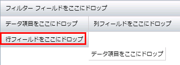
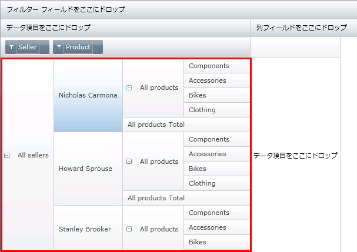
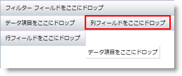
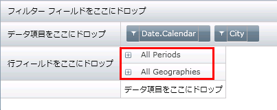
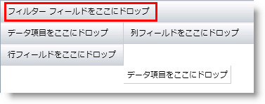
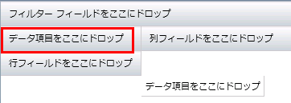
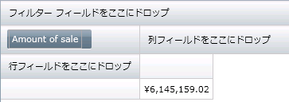
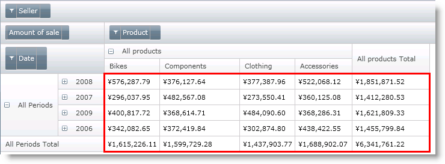

////

|metadata|
{
    "name": "xampivotgrid-understanding-xampivotgrid",
    "controlName": ["xamPivotGrid"],
    "tags": ["Data Presentation","Drilldown","Getting Started","Grids"],
    "guid": "{DDFE988E-239E-43B7-A274-004BD0B1E1E6}",  
    "buildFlags": [],
    "createdOn": "2016-05-25T18:21:57.9363116Z"
}
|metadata|
////

= xamPivotGrid の概要

このセクションは link:{ApiPlatform}controls.grids.xampivotgrid{ApiVersion}~infragistics.controls.grids.xampivotgrid.html[xamPivotGrid] コントロールの主要機能について説明します。以下のトピックでは、アプリケーションで xamPivotGrid コントロールを効果的に使用する方法を説明します。

* <<xamPivotGrid,xamPivotGrid について>>
* <<ControlElements,コントロール要素>>
* link:xampivotgrid-dataselector.html[DataSelector]

[[xamPivotGrid]]

== *xamPivotGrid について*

xamPivotGrid コントロールは複雑なビジネス分析アプリケーションを構築することができるデータ要約および情報ビジュアライゼーション ツールです。このコントロールは理解しやすい方法で多次元クエリの結果を提示するために OLAP (Online Analytical Processing) アプローチを使用します。xamPivotGrid は多数のデータ ソースを取得して、入力データに基づいて広範なレポートを構築できます。エンドユーザーはこれによって迅速に結果を調べてデータでより優れた角度を取得するために予測を瞬時に変更できます。これにより、最終的にデータをより効果的に使用できるようになります。

xamPivotGrid コントロールは、OLAP キューブから取得されたデータをスライス、ダイス、ドリルダウンまたはドリルアップ、ロールアップ、ピボットできます。フラット データも処理できます。コントロールで使用可能な機能を保有している xamPivotGrid によって高度なデータ主導のアプリケーションをビルドできます。このセクションのトピックは、xamPivotGrid とその機能を活用する方法について説明します。

[[ControlElements]]

== *コントロール要素*

xamPivotGrid コントロールにはランタイムに操作できる多数の UI コンポーネントがあります。データのスライスを作成するために行および列ヘッダー領域で多数のディメンション階層を追加できます。階層をフィルター領域に追加することによって関連する情報のみを抽出できますが、メジャー領域にメジャー (数値ディメンションから自動生成された) を追加すると現在のスライスの集計情報を変更することになります。以下は領域がどこにあるのか、またこれらを使用して何ができるのかを示します。

== 行および行ヘッダー

空グリッドの行ヘッダー領域は赤い丸で囲まれます。

階層をこの領域に追加すると (link:xampivotgrid-using-xampivotgrid.html[XamPivotGrid の使用]の下にある link:xampivotgrid-us-defining-hierarchies-and-providing-metadata-with-flatdata.html[階層を定義してフラットデータをメタデータに提供]でこれを実行する方法を参照してください)、現在の列を使用した新しいスライスが作成されます。同じ領域により多くの階層を追加することでデータを効果的にダイスできます。以下の図から分かるように行領域は現在のスライスの行の階層ツリーを表示します。(ツリーのデフォルトの状態は縮小です。)

== 列および列ヘッダー

空グリッドの列ヘッダー領域は赤い丸で囲まれます。

階層をこの領域に追加すると、現在の行を使用した新しいスライスが作成されます。同じ領域により多くの階層を追加することでデータをダイスできます。以下の図から分かるように列領域は現在のスライスの列の階層ツリーを表示します。各階層で展開インジケーターを使用することによってデータにドリルダウンまたはドリルアップすることができます。列項目を展開すると、行サンプルのひとつに似た階層ツリーを取得します。

== フィルター

空グリッドのフィルター領域はこのようになります。

階層をこの領域に追加すると、xamPivotGrid は特定のディメンションの選択されたメンバーに関連したデータのみを表示します。

== メジャー

空グリッドのメジャー領域は以下の画像で示すように配置されます。

メジャーは入力データの任意の数値ディメンションにすることができます。メジャーを追加すると、xamPivotGrid コントロールは特定のスライスの集計計算データを表示します。指定されている行または列がない場合、グリッドは入力データのすべての項目に属しているディメンション値の合計を表示します。以下の画像で、メジャーは「Amount of sale」であり、数はデータ ソース内の全製品、全販売員、全製品ラインのなどの全売上合計です。

== データ セル

データのスライスが基づく階層、結果を数値化するためのメジャー、表示される情報の範囲を狭めるフィルターを提供した場合、xamPivotGrid コントロールは以下の画像のように表示されます。

赤い丸で囲まれた領域はデータ セル領域です。この領域には要求したスライスの結果として計算されたデータが表示されます。つまり行と列にある階層によって特性が指定され、フィルター階層によってフィルタリングされ、メジャーに基づいて計算されたデータ ソースへのクエリです。各セルにデータの数値フォーマットを表示するために xamPivotGrid を設定する、あるいは特定のニーズに合わせて各セルごとにテンプレートまたはスタイルを提供することができます (詳細は link:xampivotgrid-using-xampivotgrid.html[「XamPivotGrid の使用」]の下の link:xampivotgrid-us-conditional-formating.html[条件付き書式設定]を参照してください)。

データ セル領域は raw データだけでなく、各展開された階層レベルごとに合計と小計を表示します。以下の画像は合計列と行を示します。

image::images/xamPG_totals.png[]

[[xamPivotDataSelector]]