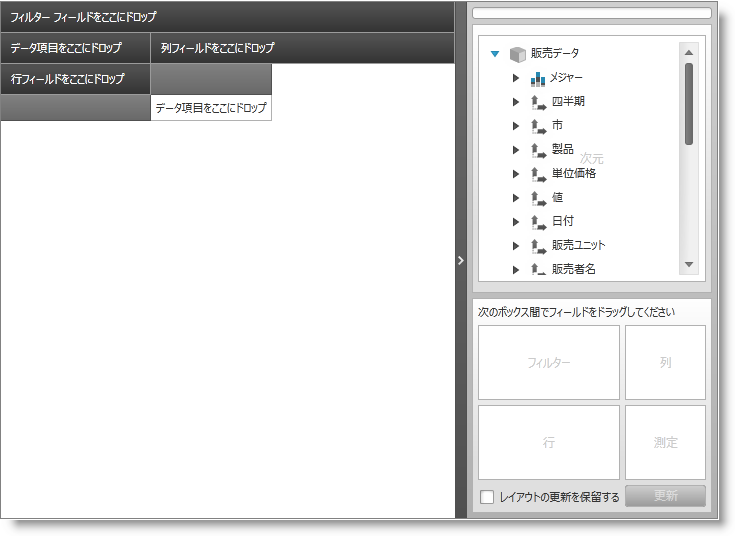
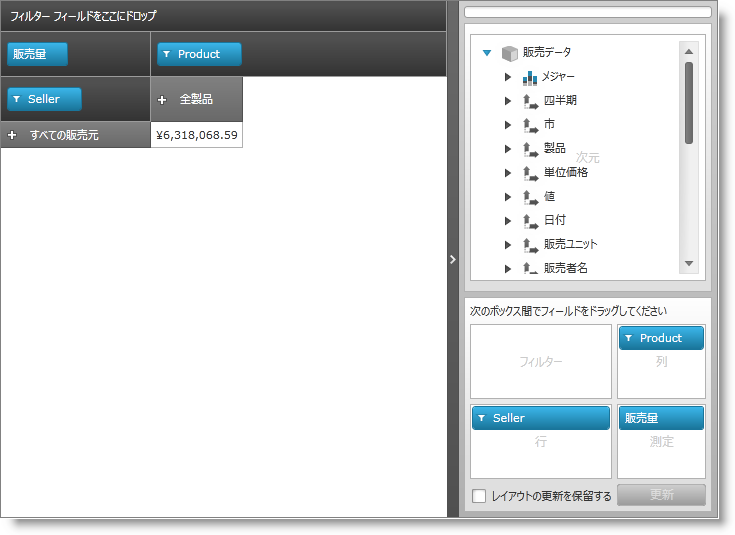

////

|metadata|
{
    "name": "xampivotgrid-us-assigning-hierarchies-and-measures",
    "controlName": ["xamPivotGrid"],
    "tags": ["How Do I"],
    "guid": "e048dc88-2ddb-4b9c-b0b2-968e2b719aa2",  
    "buildFlags": [],
    "createdOn": "2016-05-25T18:21:58.0652809Z"
}
|metadata|
////

= 階層およびメジャーの指定

データでキューブをロード後、計算するデータのスライスの基礎とする階層を選択する必要があります。データソースのタイプは、ここでは関係ありません。

階層を割り当てる前に:

階層を割り当てた後に:

行、列またはフィルターに階層を追加する、またメジャーを選択する方法がいくつかあります。

== 初期化中に XAML から

これは、おそらく領域項目にデフォルト値を選択するための最も便利な手段です。実行しなければならないのは、DataSource のそれぞれのプロパティに追加したい各階層の UniqueNames を提供することだけです。以下はサンプルのコードです。

*XAML の場合:*

----
         <igOlap:XmlaDataSource x:Key="DataSource"
                  ServerUri="http://server/olap/msmdpump.dll"
                  Database="Adventure Works DW Standard Edition"
                  Cube="Sale"
                  Columns="[Product].[Product]"
                  Rows="[Seller].[Seller]"
                  Measures="AmountOfSale" />
----

フィルター、列および行の階層レベルの一意の名前は括弧の中に入れる必要があることに注意してください。複数の領域項目を提供したい場合は、コンマで区切ります。Measures には括弧は不要です。FlatData を使用している場合、ServerUri および Database は不要です。

== 初期化中にコード ビハインドから

コード ビハインドから同じタスクを行う場合、UniqueName 文字列を書くほど簡単ではなく、AreaItem オブジェクトを生成する必要があります。

これらを初めて選択する場合、DataSourceBase から GenerateInitialCube()、GenerateInitialItems() そして XMLADataSource - GenerateInitialDatabase() の 2 つのヘルパー メソッドを使用できます。以下のコード例は、以前のコードから FlatDataSource に相当するものを作成する方法を示しています。

*C# の場合:*

----
     FlatDataSource flatDataSource = new FlatDataSource()
     {
         //データはソースとして使用される IEnumerable です
         ItemsSource = Data;                 Cube = DataSourceBase.GenerateInitalCube("Sale"),
         Rows = DataSourceBase.GenerateInitialItems("[Seller].[Seller]"),
         Columns = DataSourceBase.GenerateInitialItems("[Product].[Product]"),
         Measures = DataSourceBase.GenerateInitialItems("AmountOfSale")
     };
----

*Visual Basic の場合:*

----
     Dim flatDataSource As New FlatDataSource()
     'データはソースとして使用される IEnumerable です
     flatDataSource.ItemsSource = Data
     flatDataSource.Cube = _
             DataSourceBase.GenerateInitalCube("Sale")
     flatDataSource.Rows = _
             DataSourceBase.GenerateInitialItems("[Seller].[Seller]")
     flatDataSource.Columns = _
             DataSourceBase.GenerateInitialItems("[Product].[Product]")
     flatDataSource.Measures = _
             DataSourceBase.GenerateInitialItems("AmountOfSale")
----

== ランタイム中にコード ビハインドから

フォーム コードまたは XAML から最初の項目を作成した場合、項目でコレクションを置き換えることはできません。変更することだけが可能です。したがって、ランタイム中に階層またはメジャーを変更したい場合、個別の項目をクリア、削除、または既存のコレクションに追加する必要があります。固有の項目を生成する必要もあります。

*C# の場合:*

----
     var DataSource = this.pivotGrid.DataSource;
     IHierarchy hierarchy =             DataSource.Cube.Dimensions["Seller"].Hierarchies.First();
     IFilterViewModel filterViewModel =                 DataSource.CreateFilterViewModel(hierarchy);
     DataSource.Columns.Clear();
     DataSource.Columns.Add(filterViewModel);
----

*Visual Basic の場合:*

----
     Dim DataSource = Me.pivotGrid.DataSource
     Dim hierarchy As IHierarchy = _
             DataSource.Cube.Dimensions("Seller").Hierarchies.First()
     Dim filterViewModel As IFilterViewModel = _
             DataSource.CreateFilterViewModel(hierarchy)
     DataSource.Columns.Clear()
     DataSource.Columns.Add(filterViewModel)
----

このコードは、Seller ディメンションで最初に定義された階層を取得し、それをフィルター表示モデルに変換し、それをグリッドの Columns コレクションに指定します。Rows、Columns および Filters は、これらのクラスを使用します。メジャーは同様の手段で指定されますが、異なるタイプです。

*C# の場合:*

----
     var DataSource = this.pivotGrid.DataSource;
     IMeasure hierarchy = DataSource.Cube.Measures["AmountOfSale"];
     IMeasureViewModel filterViewModel =                DataSource.CreateMeasureViewModel(hierarchy);
     DataSource.Measures.Clear();
     DataSource.Measures.Add(filterViewModel);
----

*Visual Basic の場合:*

----
     Dim DataSource = Me.pivotGrid.DataSource
     Dim hierarchy As IMeasure = DataSource.Cube.Measures("AmountOfSale")
     Dim filterViewModel As IMeasureViewModel = _
             DataSource.CreateMeasureViewModel(hierarchy)
     DataSource.Measures.Clear()
     DataSource.Measures.Add(filterViewModel)
----

== xamPivotDataSelector から

ランタイムにフィルター、列、行またはメジャーを変更したいが、コードを使用したくない場合、 link:xampivotgrid-dataselector.html[「DataSelector」]のトピックで説明した xamPivotDataSelector™ を使用できます。ドラッグ アンド ドラッグと同程度に簡単です。行わなければならないのは、データベース、キューブおよびメジャー グループを XMLA データ ソースの 3 つのコンボ ボックスから、または FlatData のキューブを選択するだけです。これを実行すると、すべてのメジャーおよびディメンション階層を持つツリーがロードされ (ツリーを展開するためにクリックしてください。デフォルト値は縮小です)、グリッドのそれぞれの領域に階層とメジャーをドラッグするか、それらをデータ セレクターによって提供されるボックスの領域にドラッグできます。

関連トピック

link:xampivotgrid-us-defining-hierarchies-and-providing-metadata-with-flatdata.html[階層を定義して FlatData をメタデータに提供]

link:xampivotgrid-us-expanding-hierarchies-in-runtime-from-code.html[コードからランタイムに階層を展開]