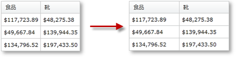

////

|metadata|
{
    "name": "xampivotgrid-us-column-resizing",
    "controlName": ["xamPivotGrid"],
    "tags": ["Application Scenarios","Grids","How Do I","Styling"],
    "guid": "92602863-f1e8-43ab-a793-585c30a77c32",  
    "buildFlags": [],
    "createdOn": "2016-05-25T18:21:57.9793147Z"
}
|metadata|
////

= 列サイズの変更

xamPivotGrid コントロールによって、ユーザーは列の幅を変更できます。このリサイズ動作は、多くのプロパティおよび一部のイベントで簡単にカスタマイズできます。

リサイズは、グリッドの幅および列単位の 2 つのレベルで有効にできます。デフォルトでは、リサイズはすべてのグリッド列に有効になります。ColumnResizingSettings プロパティは、変更可能なほとんどのカスタマイズ プロパティを含みます。このプロパティから最小列幅を設定したり、インジケーター スタイルを変更できます。セル領域でセルのリサイズを有効または無効することもできます。列のリサイズがどのように行われるかを変更できます。即座に行われるか、インジケーターを付けるか、または何も付けないかです。複数列のリサイズを有効または無効にすることもできます。いくつかの列を選択した時に行われる動作で、リサイズを一緒に行うことができます。ダブルクリックで自動リサイズを有効にしたいかどうかを指定することもできます。以下は xamPivotGrid のリサイズ設定をカスタマイズするコードです。

*C# の場合:*

----
     PivotColumnResizingSettings resizingSettings = 
         this.pivotGrid.ColumnResizingSettings;
     resizingSettings.AllowCellAreaResizing = true;
     resizingSettings.AllowColumnResizing = 
             PivotColumnResizingType.Indicator;
     resizingSettings.AllowDoubleClickToSize = true;
     resizingSettings.AllowMultipleColumnResize = false;
     resizingSettings.IndicatorStyle = 
         this.Resources["ResizingIndicatorStyle"] as Style; 
     resizingSettings.MinColumnWidth = 5;
----

*Visual Basic の場合:*

----
    Dim resizingSettings As PivotColumnResizingSettings = _
        Me.pivotGrid.ColumnResizingSettings
    resizingSettings.AllowCellAreaResizing = True
    resizingSettings.AllowColumnResizing = _
        PivotColumnResizingType.Indicator
    resizingSettings.AllowDoubleClickToSize = True
    resizingSettings.AllowMultipleColumnResize = False
    resizingSettings.IndicatorStyle = _
        TryCast(Me.Resources("ResizingIndicatorStyle"), Style)
    resizingSettings.MinColumnWidth = 5
----

*XAML の場合:*

----
        <igPivot:XamPivotGrid DataSource="{StaticResource DataSource}" >
            <igPivot:XamPivotGrid.ColumnResizingSettings>
                <igPivot:PivotColumnResizingSettings 
                    AllowCellAreaResizing="True"
                    AllowColumnResizing="Indicator"
                    AllowDoubleClickToSize="True"
                    AllowMultipleColumnResize="
                    IndicatorStyle="{StaticResource IndicatorStyle}"
                    MinColumnWidth="5">
                </igPivot:PivotColumnResizingSettings>
            </igPivot:XamPivotGrid.ColumnResizingSettings>
        </igPivot:XamPivotGrid>
----

フィルター、列および行の階層レベルの一意の名前は括弧の中に入れる必要があることに注意してください。

設定に加えて、ColumnResizing および ColumnResized という 2 つの役立つイベントへのアクセスがあります。これらの両方のイベントのイベント引数にはリサイズされる列のコレクションがあります。ColumnResizing イベントには Cancel プロパティもあり、True に設定される場合、リサイズを効果的に無効にできます。列についての情報については、各列に基づくカスタム リサイズ動作を作成できます。

以下のコードは 2 つのことを行います。最初に、リサイズされた列がひとつだけで特定の場合 (ColumnNotToResize キーで)、リサイズはキャンセルされます。そうでなければ、ヘッダー セル スタイルはリサイズの時に変更され、ドラッグが完了するともうひとつのスタイルに戻ります。

*C# の場合:*

----
    this.pivotGrid.ColumnResizing += (sender1, e1) =>
    {
        if (e1.Columns.Count == 1 && 
                    e1.Columns.First().Key == "ColumnNotToResize")
        {
            e1.Cancel = true;
        }
        foreach (PivotHeaderCell cell in 
        this.pivotGrid.GridLayout.VisibleColumnsHeaderCells)
        {
            foreach (PivotColumnBase column in e1.Columns)
            {
                if (cell.Column == column)
                {
                    cell.Style = 
                    this.Resources["hcResizingStyle"] as Style;
                }
            }
        }
    };
    this.pivotGrid.ColumnResized += (sender2, e2) =>
    {
        foreach (PivotHeaderCell cell in 
        this.pivotGrid.GridLayout.VisibleColumnsHeaderCells)
        {
            foreach (PivotColumnBase column in e2.Columns)
            {
                if (cell.Column == column)
                {
                    cell.Style = 
                    this.Resources["hcNotResizingStyle"] as Style;
                }
            }
        }
    };
----

*Visual Basic の場合:*

----
    AddHandler Me.pivotGrid.ColumnResizing, AddressOf ColumnResizing
    AddHandler Me.pivotGrid.ColumnResized, AddressOf ColumnResized
    Private Sub ColumnResizing(ByVal sender As Object, _
                              ByVal e As CancellableColumnResizingEventArgs)
        If e.Columns.Count = 1 AndAlso _
           e.Columns.First().Key = "ColumnNotToResize" Then
            e.Cancel = True
        End If
        For Each cell As PivotHeaderCell In _
            Me.pivotGrid.GridLayout.VisibleColumnsHeaderCells
            For Each column As PivotColumnBase In e.Columns
                If cell.Column = column Then
                    cell.Style = _
                        TryCast(Me.Resources("hcResizingStyle"), Style)
                End If
            Next
        Next
    End Sub
    Private Sub ColumnResized(ByVal sender As Object, _
                             ByVal e As PivotColumnResizedEventArgs)
        For Each cell As PivotHeaderCell In _
            Me.pivotGrid.GridLayout.VisibleColumnsHeaderCells
            For Each column As PivotColumnBase In e.Columns
                If cell.Column = column Then
                    cell.Style = _
                        TryCast(Me.Resources("hcNotResizingStyle"), Style)
                End If
            Next
        Next
    End Sub
----

xamPivotGrid がリサイズ動作で提供するコントロールに加えて、各列固有の IsResizable プロパティを変更することもできます。

*C# の場合:*

----
   this.pivotGrid.GridLayout.Columns[i].IsResizable = false;
----

*Visual Basic の場合:*

----
   Me.pivotGrid.GridLayout.Columns(i).IsResizable = False
----

関連トピック

link:xampivotgrid-using-xampivotgrid.html[XamPivotGrid の使用]

link:xampivotgrid-handlingevents.html[イベントの処理]