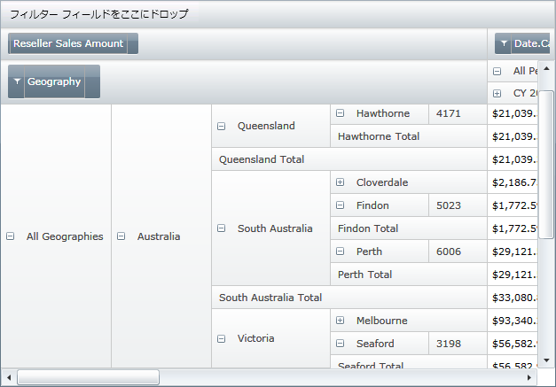
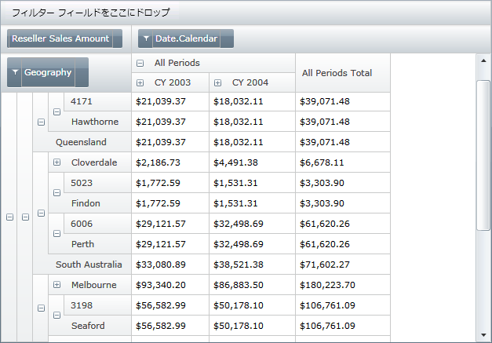
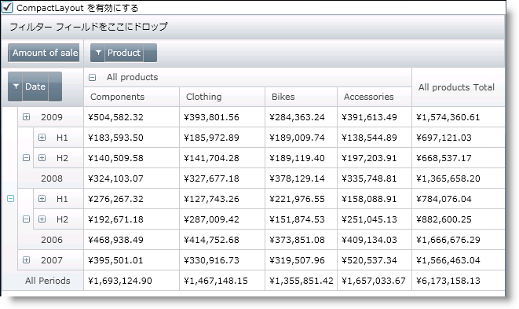
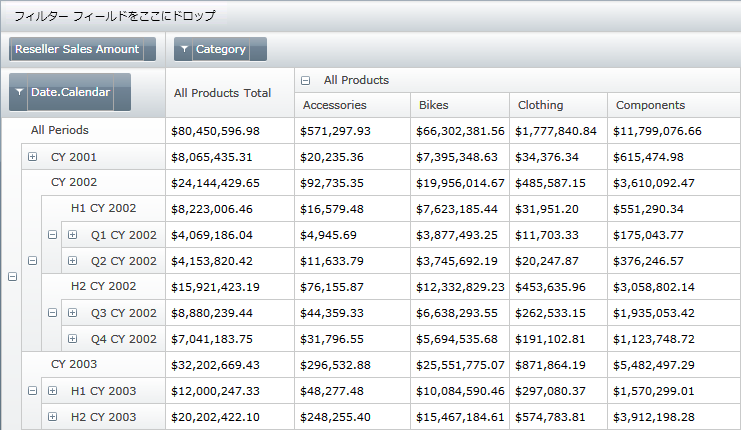

////

|metadata|
{
    "name": "xampivotgrid-us-compact-layout",
    "controlName": ["xamPivotGrid"],
    "tags": ["Data Presentation","Grids","How Do I","Layouts"],
    "guid": "980bc48a-8c05-4050-9d17-809bd2efa19b",  
    "buildFlags": [],
    "createdOn": "2016-05-25T18:21:58.0033157Z"
}
|metadata|
////

= コンパクト レイアウト

データに複数の階層レベルがあり、単一のディメンションの階層ツリーにドリルダウンする必要がある場合、ヘッダーは xamPivotGrid の表示可能な領域に負担をかける場合があります。このような状況では、コントロールが提供する情報をユーザーが効率的に使用することが難しくなります。

xamPivotGrid の CompactLayout 機能は、ヘッダーのツリー構造を効果的に切り取り、重要な情報が表示されるようにスペースを解放します。

CompactLayout モードで行階層ツリーを配置するには、グリッドの AllowCompactLayout プロパティを True に設定する必要があります。

*XAML の場合:*

----
        <igPivot:XamPivotGrid 
                AllowCompactLayout="True" 
                DataSource="{StaticResource Source}" />
----

このモードは、日付/時刻階層で特に役立ちます。

コンパクト レイアウト モードを許可することに加えて、一番上に合計ヘッダーを表示させるようにグリッドを強制することもできます。状況によっては、これによってユーザーは日付階層がより分かりやすくなります。

*XAML の場合:*

----
        <igPivot:XamPivotGrid DataSource="{StaticResource DataSource}"
                              AllowCompactLayout="True"
                              ParentInFront="True"/>
----