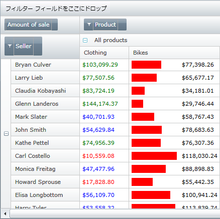

////

|metadata|
{
    "name": "xampivotgrid-us-conditional-formating",
    "controlName": ["xamPivotGrid"],
    "tags": [],
    "guid": "1f9bfbf0-0150-4ca2-a7aa-5eee36bf0218",  
    "buildFlags": [],
    "createdOn": "2016-05-25T18:21:57.991315Z"
}
|metadata|
////

= 条件フォーマッティング

XamPivotGrid では、いくつかの特別な特性を持つ CellControlAttached イベントによって値に基づいた(条件)フォーマッティングを実行することができます。CellControlAttached イベントは、xamPivotGrid のビジュアライゼーション エンジンの結果として現在表示されているセルに限って発生します。ビジュアライゼーション エンジンは、表示していないオブジェクトでグリッドが CPU サイクルとメモリを浪費しないようにします。この結果、10,000 レコードまたは 10,000,000 にバインドされた時でも同程度の速さで実行するグリッドができます。

CellControlAttached イベントは、セルが表示された時だけでなく、データソースでの基本的な変更によりセル バインディングが更新された時にも発生します。基本的なビジネス オブジェクトが INotifyPropertyChanged イベントを適切に発生させることが重要になるのはこのときです。

イベント ハンドラーを CellControlAttached に添付すると、引数からのプロパティ Cell を使用してセルがどの行または列にあるのかやどのような値などかという重要な情報を見つけ出すことができます。その情報に基づいて、スタイルとテンプレートを簡単に修正してニーズに合わせて UI を変えることができます。

セルの行または列のインデックスを見つけ出すには、以下のコードを使用できます。

*C# の場合:*

----
    this.pivotGrid.CellControlAttached += pivotGrid_CellControlAttached;
    void pivotGrid_CellControlAttached(object sender, 
                               PivotCellControlAttachedEventArgs e)
    {
           var rowIndex = 
           this.pivotGrid.DataRows.IndexOf(e.Cell.DataRow);
           var columnIndex = 
           this.pivotGrid.DataColumns.IndexOf(e.Cell.DataColumn);
    }
----

*Visual Basic の場合:*

----
    AddHandler Me.pivotGrid.CellControlAttached, _
        AddressOf pivotGrid_CellControlAttached
...
    Private Sub pivotGrid_CellControlAttached( _
            ByVal sender As Object, _
            ByVal e As PivotCellControlAttachedEventArgs)
        Dim rowIndex = Me.pivotGrid.DataRows.IndexOf(e.Cell.DataRow)
        Dim columnIndex = Me.pivotGrid.DataColumns.IndexOf(e.Cell.DataColumn)
    End Sub
----

セルの行および列インデックスが分かったら、この方法を使用してその値を取得できます。

*C# の場合:*

----
    ICell cellData = 
        this.pivotGrid.DataSource.Result.Cells[rowIndex, columnIndex];
    string valFormatted = cellData.FormattedValue;
    object valObject = cellData.Value;
----

*Visual Basic の場合:*

----
    Dim cellData As ICell = _
        Me.pivotGrid.DataSource.Result.Cells(rowIndex, columnIndex)
    Dim valFormatted As String = cellData.FormattedValue
    Dim valObject As Object = cellData.Value
----

最後にいくつかの条件に基づいてスタイルをセル コントロールに適用できます。

*C# の場合:*

----
    e.Cell.Style = this.Resources["StyledCell"] as Style;
----

*Visual Basic の場合:*

----
    e.Cell.Style = TryCast(Me.Resources("StyledCell"), Style)
----

以下のコードは、これらの 3 つのコードにわずかなコードを追加して何ができるのかを示します。

これがどのように実行されるのかを知るための全コードは SamplesBrowser をご覧ください。

関連トピック

link:xampivotgrid-us-selection-and-cell-interaction.html[フィルタリング]