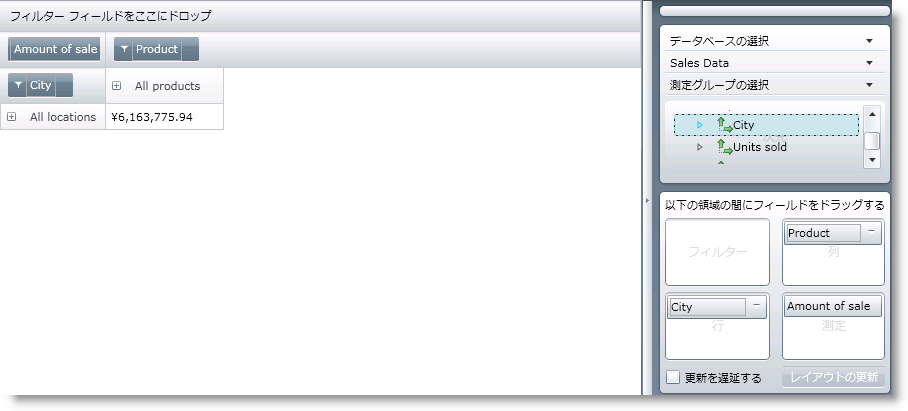
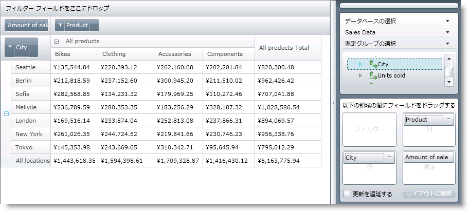

////

|metadata|
{
    "name": "xampivotgrid-us-expanding-hierarchies-in-runtime-from-code",
    "controlName": ["xamPivotGrid"],
    "tags": ["Drilldown","How Do I","Navigation","Tips and Tricks"],
    "guid": "2557000f-5e11-4fb6-8fe1-e3bca187a2c8",  
    "buildFlags": [],
    "createdOn": "2016-05-25T18:21:58.0093156Z"
}
|metadata|
////

= コードからランタイムに階層を展開

xamPivotGrid でデータをロードした後で、アプリケーションを開始した時に階層の特定のメンバーをデフォルトで展開したい場合があります。この方法により、アプリケーションがロードするとすぐにエンドユーザーに関連データが提示されます。

link:{ApiPlatform}olap{ApiVersion}~infragistics.olap.datasourcebase~hierarchyexpansionmode.html[HierarchyExpansionMode] プロパティに関するクイック ノート: このプロパティは、別の階層が同じ軸に追加された場合の、階層の展開状態に関係します。たとえば、列に 1 つの階層が含まれている場合、その最初のレベルを展開してから、最初のレベルの前に新しい階層を追加します。デフォルトの動作では、最初の階層を折り畳みます。HierarchyExpansionMode を DrillDown (link:{ApiPlatform}olap{ApiVersion}~infragistics.olap.datasourcebase~hierarchyexpansionmode.html[HierarchyExpansionMode Enumeration]) に設定すると、階層の展開された状態が保存されます。

以下の画像は、展開していない xamPivotGrid のデフォルト画面を示しています。

展開されたデフォルト画面:

xamPivotGrid を使用して階層を展開する方法は 2 通りあります (コードを使用する方法です。そしてマウスで各 PivotHeaderCell の展開インジケーターをクリックして展開する方法です)。最初の方法では、GridLayout から PivotHeaderCell コントロールへの参照を取得し、IsExpanded プロパティを True に設定します。2 番目の方法では、DataSource の SwitchAxisMember メソッドを使用します。

xamPivotGrid のデータ セル領域でデータを持つランダム セルをクリックするとします。クリックしたセルが属している列階層を展開したいとします。展開するには、アプリケーションの body に以下のコードを置きます。

*C# の場合:*

[source]
----
   this.pivotGrid.SelectionSettings.CellSelection = 
                                           PivotSelectionType.Single;
   this.pivotGrid.SelectedCellsCollectionChanged += (sender, e) =>
   {
       foreach (PivotHeaderCell headerCell in 
       this.pivotGrid.GridLayout.VisibleColumnsHeaderCells)
       {
           if (e.NewSelectedItems.Count != 0 && headerCell.Column == 
                   e.NewSelectedItems.First().Column)
           {
               headerCell.IsExpanded = true;
               return;
           }
       }
   };
----

*Visual Basic の場合:*

[source]
----
    Me.pivotGrid.SelectionSettings.CellSelection = _
        PivotSelectionType.[Single]
    AddHandler Me.pivotGrid.SelectedCellsCollectionChanged, _
        AddressOf pivotGrid_SelectedCellsCollectionChanged
...
    Private Sub pivotGrid_SelectedCellsCollectionChanged( _
            ByVal sender As Object, _
            ByVal e As PivotSelectionCollectionChangedEventArgs)
        For Each headerCell As PivotHeaderCell In _
            Me.pivotGrid.GridLayout.VisibleColumnsHeaderCells
            If e.NewSelectedItems.Count <> 0 And
                headerCell.Column = _
                e.NewSelectedItems.First().Column Then
                headerCell.IsExpanded = True
                Return
            End If
        Next
    End Sub
----

何らかの理由から UI がロードされる前に展開状態を設定したい場合には、2 番目のアプローチを使用する必要があります。SwitchAxisMember メソッドに提供する必要がある引数はタイプ IMember です。以下のコードは、そのメンバーを取得し、UI がロードされる前に階層を展開するように xamPivotGrid に指示する方法を示します。

*C# の場合:*

----
    IResult result = this.pivotGrid.DataSource.Result;
    IMember member = result.ColumnAxis.Tuples.First().Members.First();
    this.pivotGrid.DataSource.SwitchAxisMember(member);
----

*Visual Basic の場合:*

----
    Dim result As IResult = Me.pivotGrid.DataSource.Result
    Dim member As IMember = _
        result.ColumnAxis.Tuples.First().Members.First()
    Me.pivotGrid.DataSource.SwitchAxisMember(member)
----

これにより列データの最初のタプルの最初のメンバーを取得します。ColumnAxis、Tuples および Members コレクションは null の場合があることに注意してください。このためこれらにアクセスする前に当てはまるかどうかを確認するのが賢明です。最初のメンバーを取得した後で、UI が更新される前に SwitchAxisMember はそのメンバーに対応する階層を展開します。

関連トピック

link:xampivotgrid-us-assigning-hierarchies-and-measures.html[階層およびメジャーの指定]

link:xampivotgrid-us-defining-hierarchies-and-providing-metadata-with-flatdata.html[階層を定義して FlatData をメタデータに提供]