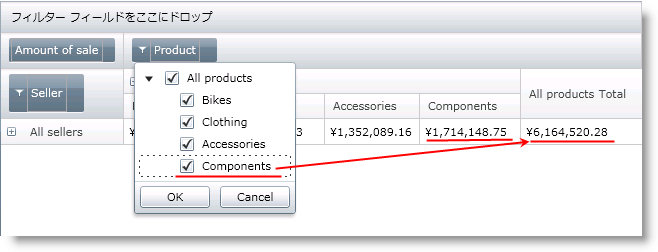
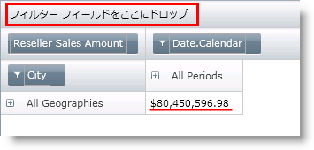
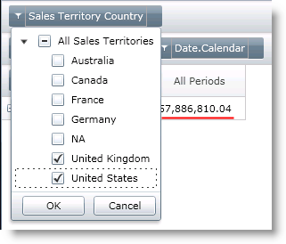
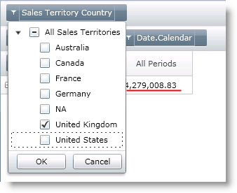

////

|metadata|
{
    "name": "xampivotgrid-us-filtering",
    "controlName": ["xamPivotGrid"],
    "tags": ["Filtering","Grids","How Do I"],
    "guid": "fb328249-75c3-4dd5-ac7c-990ec8811a30",  
    "buildFlags": [],
    "createdOn": "2016-05-25T18:21:57.9852762Z"
}
|metadata|
////

= フィルタリング

表示されたデータのフィルタリングは、データ解析のプロセスに不可欠な非常に便利な機能です。xamPivotGrid コントロールで、グリッドのデータの範囲を狭めるためにユーザーが利用できる複数のオプションがあります。コードから、または UI フィルター メニューを使用してこれを実行することができます。

== XAML コードのカギ括弧付きシンタックス

xamPivotGrid は SQL のカギ括弧表現を認識します。行、列、フィルターおよびメジャーを指定する時に、入力データを変更するためにこれらの表現を使用できます。たとえば、列に国の階層を追加したいが、スライスでイギリスのみを対象としたい場合、DataSource の XAML 宣言で以下のコードを使用できます。

*XAML の場合:*

----
Columns="[Territory]{[Territory].[Country].&[United Kingdom]}"
----

カギ括弧でリストする項目名は、データ ソースに存在する名前です。たとえば、[Territory].[Country].&[United Kingdom] は、データベースの United Kingdom メンバーの UniqueName であるためアンパサンドおよび括弧を含みます。括弧に複数の項目を含めたい場合は、コンマで区切ります。このシンタックスは、GenerateInitialItems() で動作し、コード ビハインドでも使用できます。

== ランタイムでの UI メニュー

xamPivotGrid 領域のひとつに階層を追加したい場合、その領域に追加されるコントロールは、フィルター インジケーターを持ちます。フィルター インジケーターを押すと、メニューが開いてその階層のすべてのレベルとメンバーが含まれるツリーが表示されます。ツリーからそれらをチェックをしたりチェックを解除でき、これによってフィルタリングに含まれるものが変更されます。

フィルタリング前:

フィルタリング後:

image::images/xamPG_6-8-2010_11-20-58_AM.png[]

メニューの使用に加えて、フィルター領域に階層をドロップでき、データが特定の階層に関連付けられると、スライスが更新されます。結果は、提供されたフィルターを満たすすべてのデータとなります。この便利な点は、追加された階層は、行および列に既に追加されたものとは異なることです。

以下の画像は、フィルター領域でフィルターなしの合計を示しています。

第三の異なる、ただし関連する階層でフィルターを作成した後の結果であることに注意してください。

カギ括弧のシンタックスは、メニューから項目を選択するのと同じです。括弧内にリストするものは何でも選択され、他の項目は選択が解除されます。唯一の違いは、コードを使用する場合、フィルタリングはアプリケーションの開始で定義され、エンドユーザーは適用されるフィルターに対して何も行う必要はないことです。既存のフィルターは、さらにコードを追加しなくともランタイムで変更することもできます。

関連トピック

link:xampivotgrid-using-xampivotgrid.html[フィルタリング]