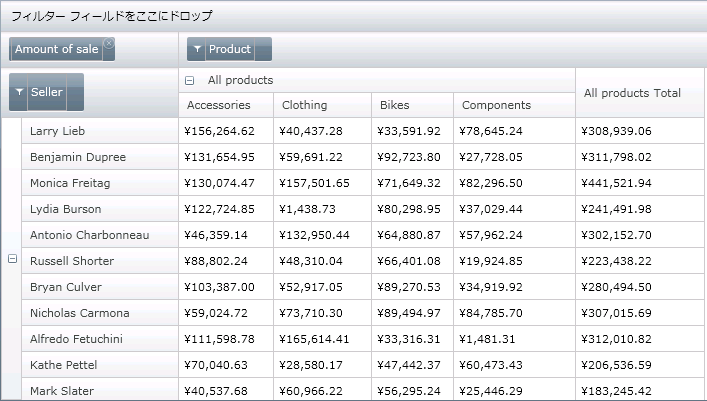
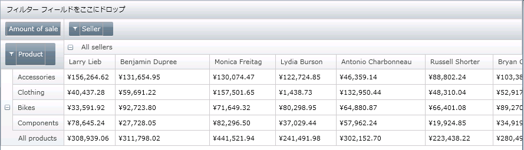

////

|metadata|
{
    "name": "xampivotgrid-us-pivotdata-command",
    "controlName": ["xamPivotGrid"],
    "tags": ["How Do I","Tips and Tricks"],
    "guid": "bf7fafbc-18cd-4a22-b98e-ddc8f5f1f4eb",  
    "buildFlags": [],
    "createdOn": "2016-05-25T18:21:58.0253164Z"
}
|metadata|
////

= データのピボット

グリッドでデータをピボットするというのは、行領域にすべての列階層、列領域にすべての行階層を移動し、次にグリッドのコンテンツを更新するために結果を再計算するという意味です。

*オリジナル データ*

*ピボットされたデータ*

これを行うために PivotGrid コマンドを使用できます。以下のコードに示すように、ボタンに添付してクリック イベントを関連付けます。

*XAML の場合:*

----
        <Button Content="Pivot Data">
            <igPivot:Commanding.Command>
                <igPivot:XamPivotGridCommandSource 
                        EventName="Click" 
                        CommandType="PivotGrid" 
                        TargetName="pivotGrid"/>
            </igPivot:Commanding.Command>
        </Button>
----

関連トピック

link:xampivotgrid-using-xampivotgrid.html[階層およびメジャーの指定]