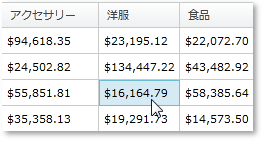
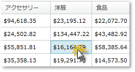

////

|metadata|
{
    "name": "xampivotgrid-us-selection-and-cell-interaction",
    "controlName": ["xamPivotGrid"],
    "tags": ["Grids","How Do I","Selection","Styling"],
    "guid": "31ef4275-7a80-4c9a-b2d6-96f8a3579e09",  
    "buildFlags": [],
    "createdOn": "2016-05-25T18:21:57.9673133Z"
}
|metadata|
////

= セル選択および操作

== セル選択

セル、列、行の選択に加えて、グリッドはセルをアクティブとしてマーキングすることをサポートします。これはセルのみに適用され、列または行には適用されないことに注意してください。セルをアクティブとしてマーキングすることは選択することとほぼ同じです。通常セルを選択すると、アクティブになります。

さらに、キーボードによってセルをアクティブとしてマーキングすることができます。セルがアクティブで Up キーを押すと、先頭のセルがアクティブになります。ActiveCellChanging と ActiveCellChanged を使用することによって、xamPivotGrid のこの機能を使用するキーボード ナビゲーション ロジックを簡単に実装できます。

以下のコードはさまざまなスタイルをアクティブなセルに適用する方法を示します。

*C# の場合:*

----
     this.pivotGrid.ActiveCellChanged += (sender, e) =>
     {
         //非アクティブ セルのスタイルを設定します。
         foreach (PivotDataRow row in this.pivotGrid.DataRows)
         {
             foreach (PivotCell cell in row.Cells)
             {
                 cell.Style = 
                     this.Resources["InactiveCellStyle"] as Style;
             }
         }
         // アクティブ セルのスタイルを設定します。
         (sender as xamPivotGrid).ActiveCell.Style = 
             this.Resources["ActiveCellStyle"] as Style;
     };
----

*Visual Basic の場合:*

----
    AddHandler Me.pivotGrid.ActiveCellChanged, AddressOf ActiveCellChanged
...
    Private Sub ActiveCellChanged( _
            ByVal sender As Object, _
            ByVal e As EventArgs)
        'アクティブでないセルのスタイルを設定します
        For Each row As PivotDataRow In Me.pivotGrid.DataRows
            For Each cell As PivotCell In row.Cells
                cell.Style = _
                    TryCast(Me.Resources("InactiveCellStyle"), Style)
            Next
        Next
        'アクティブ セルのスタイルを設定します
        TryCast(sender, xamPivotGrid).ActiveCell.Style = _
            TryCast(Me.Resources("ActiveCellStyle"), Style)
    End Sub
----

以下は 2000 より大きい値のセルのアクティブ化を否定する方法を示します。

*C# の場合:*

----
     this.pivotGrid.ActiveCellChanging += (sender, e) =>
     {
         var doubleVal = Convert.ToDouble(
                       (e.NewActiveCell.Data as ICell).Value);
         if (doubleVal > 2000)
             e.Cancel = true;
     };
----

*Visual Basic の場合:*

----
    AddHandler Me.pivotGrid.ActiveCellChanging, _
            AddressOf ActiveCellChanging
...
    Private Sub ActiveCellChanging( _
            ByVal sender As Object, _
            ByVal e As PivotActiveCellChangingEventArgs)
        Dim doubleVal = Convert.ToDouble( _
            TryCast(e.NewActiveCell.Data, ICell).Value)
        If doubleVal > 2000 Then
            e.Cancel = True
        End If
    End Sub
----

== セルの操作

エンドユーザーのデータ操作はデータ解析アプリケーションで大変重要です。xamPivotGrid はエンド ユーザーがカスタマイズできる多数の機能を提供します。セル、行、列の選択とクリック アクションに対する応答は、この柔軟性を提供するツールの中にあります。このトピックはこれらの機能の使用方法について説明します。

xamPivotGrid は SelectionSettings プロパティで設定をカスタマイズできます。セル、列、行の選択タイプを修正できます。セル クリック アクションも変更できます。次のコードはこれを実行する方法を示します。

*C# の場合:*

----
    this.pivotGrid.SelectionSettings.CellSelectionAction = 
          PivotCellSelectionAction.SelectCell;
    this.pivotGrid.SelectionSettings.CellSelection = 
          PivotSelectionType.Multiple;
    this.pivotGrid.SelectionSettings.ColumnSelection = 
          PivotSelectionType.Single;
    this.pivotGrid.SelectionSettings.RowSelection = 
          PivotSelectionType.None;
----

*Visual Basic の場合:*

----
    Me.pivotGrid.SelectionSettings.CellSelectionAction = _
          PivotCellSelectionAction.SelectCell
    Me.pivotGrid.SelectionSettings.CellSelection = _
          PivotSelectionType.Multiple
    Me.pivotGrid.SelectionSettings.ColumnSelection = _
          PivotSelectionType.[Single]
    Me.pivotGrid.SelectionSettings.RowSelection = _
          PivotSelectionType.None
----

ランタイムに SelectionSettings オブジェクトに配置されている 3 つのコレクションから選択されたセル、行または列を取得できます。以下のコードはこれを実行する方法を示します。

*C# の場合:*

----
    var cells = this.pivotGrid.SelectionSettings.SelectedCells;
    var columns = this.pivotGrid.SelectionSettings.SelectedColumns;
    var rows = this.pivotGrid.SelectionSettings.SelectedRows;
----

*Visual Basic の場合:*

----
    Dim cells = Me.pivotGrid.SelectionSettings.SelectedCells
    Dim columns = Me.pivotGrid.SelectionSettings.SelectedColumns
    Dim rows = Me.pivotGrid.SelectionSettings.SelectedRows
----

操作は上記のコレクションの変更をマークする 3 つのイベント、SelectedCellsCollectionChanged、SelectedRowsCollectionChanged および SelectedColumnsCollectionChanged に基づいて行うことができます。CellClicked イベントと CellDoubleClicked イベントによってセル クリック アクションを検出できます。

以下のコードは行の全セルを選択し、クリックされたセルの列の全セルを選択します。列のセルのスタイル、行のセルのスタイル、クリックされたセルのスタイルを変更し、その他すべてのセルをニュートラルなスタイルにリセットします。セルがダブル クリックされると、その値を含むメッセージが表示されます。

*C# の場合:*

----
         this.pivotGrid.SelectionSettings.CellSelectionAction =                PivotCellSelectionAction.SelectCell;
         this.pivotGrid.SelectionSettings.ColumnSelection =              PivotSelectionType.Single;
         this.pivotGrid.SelectionSettings.RowSelection =                 PivotSelectionType.Single;
         this.pivotGrid.CellClicked += (sender1, e1) =>
         {
             this.pivotGrid.SelectionSettings.SelectedColumns.Add(                                               e1.Cell.DataColumn);
             this.pivotGrid.SelectionSettings.SelectedRows.Add(                                          e1.Cell.DataRow);
             foreach (PivotDataRow row in this.pivotGrid.DataRows)
             {
                 if (row != e1.Cell.DataRow)
                 {
                     foreach (PivotCell cell in row.Cells)
                     {                   var selectionSettings =                                 this.pivotGrid.SelectionSettings;
                         if (selectionSettings.SelectedColumns.Contains(                                 cell.Column as DataColumn))
                         {
                             cell.Style =               this.Resources["CellOnSelectedColumnStyle"] as Style;
                         }
                         else
                         {
                             cell.Style =               this.Resources["NotSelectedCellStyle"] as Style;
                         }
                     }
                 }
                 else
                 {
                     foreach (PivotCell cell in row.Cells)
                     {
                         if (this.pivotGrid.SelectionSettings.SelectedRows.Contains(cell.Row as DataRow))
                         {
                             cell.Style =               this.Resources["CellClickedStyle"] as Style;
                         }
                         else
                         {
                             cell.Style =               this.Resources["CellOnSelectedRowStyle"] as Style;
                         }
                     }
                 }
             }
         };
         this.pivotGrid.CellDoubleClicked += (sender2, e2) =>
         {
             MessageBox.Show(e2.Cell.Data.ToString());
         };
----

*Visual Basic の場合:*

----
    Me.pivotGrid.SelectionSettings.CellSelectionAction = _
        PivotCellSelectionAction.SelectCell
    Me.pivotGrid.SelectionSettings.ColumnSelection = _
        PivotSelectionType.[Single]
    Me.pivotGrid.SelectionSettings.RowSelection = _
        PivotSelectionType.[Single]
    AddHandler Me.pivotGrid.CellClicked, AddressOf CellClicked
    AddHandler Me.pivotGrid.CellDoubleClicked, AddressOf CellDoubleClicked
...
    Private Sub CellClicked( _
                ByVal sender As Object,
                ByVal e As PivotCellClickedEventArgs)
        Me.pivotGrid.SelectionSettings.SelectedColumns.Add( _
            e.Cell.DataColumn)
        Me.pivotGrid.SelectionSettings.SelectedRows.Add( _
            e.Cell.DataRow)
        For Each row As PivotDataRow In Me.pivotGrid.DataRows
            If row <> e.Cell.DataRow Then
                For Each cell As PivotCell In row.Cells
                    Dim selectionSettings = _
                        Me.pivotGrid.SelectionSettings
                    If selectionSettings.SelectedColumns.Contains( _
                        TryCast(cell.Column, DataColumn)) Then
                        cell.Style = TryCast( _
                            Me.Resources("CellOnSelectedColumnStyle"), _
                            Style)
                    Else
                        cell.Style = TryCast( _
                            Me.Resources("NotSelectedCellStyle"), _
                            Style)
                    End If
                Next
            Else
                For Each cell As PivotCell In row.Cells
                    If Me.pivotGrid.SelectionSettings.SelectedRows.Contains( _
                        TryCast(cell.Row, DataRow)) Then
                        cell.Style = TryCast( _
                            Me.Resources("CellClickedStyle"), _
                            Style)
                    Else
                        cell.Style = TryCast( _
                            Me.Resources("CellOnSelectedRowStyle"), _
                            Style)
                    End If
                Next
            End If
        Next
    End Sub
    Private Sub CellDoubleClicked( _
            ByVal sender As Object,
            ByVal e As PivotCellClickedEventArgs)
        MessageBox.Show(e.Cell.Data.ToString())
    End Sub
----

関連トピック

link:xampivotgrid-us-sorting-data.html[並べ替え]

link:xampivotgrid-us-column-resizing.html[列サイズの変更]

link:xampivotgrid-us-filtering.html[フィルタリング]

link:xampivotgrid-us-conditional-formating.html[条件フォーマッティング]

link:xampivotgrid-us-expanding-hierarchies-in-runtime-from-code.html[コードからランタイムに階層を展開]

link:xampivotgrid-us-pivotdata-command.html[階層およびメジャーの指定]