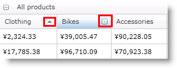

////

|metadata|
{
    "name": "xampivotgrid-us-sorting-data",
    "controlName": ["xamPivotGrid"],
    "tags": ["How Do I","Sorting"],
    "guid": "2a757279-5100-4a66-b6a2-e70b1e082775",  
    "buildFlags": [],
    "createdOn": "2016-05-25T18:21:57.9733132Z"
}
|metadata|
////

= 並べ替え

列のリサイズと非常に似ていますが、xamPivotGrid コントロールでの並べ替えは、グリッドと列の 2 つのレベルで構成できます。デフォルトで並べ替えはすべての列に有効に設定されています。各ヘッダー セルには、昇順、降順、並べ替えないという 3 つの状態を示した並べ替えインジケーターが付いています。エンドユーザーはこのインジケーターをクリックして並べ替えを起動できます。

xamPivotGrid は 2 つのイベント (ColumnSorting と ColumnSorted) を公開しており、これによって開発者は並べ替えを制御し、エンドユーザーが並べ替えを起動した時のカスタム アクションを作成できます。列のリサイズに似ていますが、イベント引数には並べ替え中の列への参照があり、また ColumnSorting イベント引数には Cancel プロパティもあります。

以下のサンプルは並べ替えられた列でセルのスタイルを変更し、別の列が並べ替えられた時にオリジナルに復元します。二番目の列データの並べ替えは無効です。

*C# の場合:*

----
    this.pivotGrid.ColumnSorting += (sender, e) =>
    {
        if (this.pivotGrid.DataColumns.IndexOf(e.Column) == 1)
        {
           e.Cancel = true;
        }
    };
    this.pivotGrid.ColumnSorted += (sender, e) =>
    {
        foreach (PivotDataRow row in this.pivotGrid.GridLayout.Rows)
        {
            foreach (PivotCell cell in row.Cells)
            {
                if (cell.Column != e.Column)
                {
                    cell.Style = 
                        this.Resources["NotSortedCellStyle"] as Style;
                }
            }
            row.Cells[e.Column].Style = 
                this.Resources["SortedCellStyle"] as Style;
        }
    };
----

*Visual Basic の場合:*

----
    AddHandler Me.pivotGrid.ColumnSorted, AddressOf ColumnSorting
    AddHandler Me.pivotGrid.ColumnSorted, AddressOf ColumnSorted
    ...
    Private Sub ColumnSorting(ByVal sender As Object, _
                              ByVal e As PivotSortingCancellableEventArgs)
        If Me.pivotGrid.DataColumns.IndexOf(e.Column) = 1 Then
            e.Cancel = True
        End If
    End Sub
    Private Sub ColumnSorted(ByVal sender As Object, _
                             ByVal e As PivotSortedColumnEventArgs)
        For Each row As PivotDataRow In Me.pivotGrid.GridLayout.Rows
            For Each cell As PivotCell In row.Cells
                If cell.Column <> e.Column Then
                    cell.Style = _
                        TryCast(Me.Resources("NotSortedCellStyle"), Style)
                End If
            Next
            row.Cells(e.Column).Style = _
                TryCast(Me.Resources("SortedCellStyle"), Style)
        Next
    End Sub
----

並べ替えはコードからも起動できます。並べ替えを起動するように列の IsSorted プロパティを設定する必要があります。以下のコードは、セルをクリックした時に列を昇順で並べ替える方法を示します。

*C# の場合:*

----
     this.pivotGrid.SelectionSettings.CellSelectionAction = 
         PivotCellSelectionAction.SelectCell;
     this.pivotGrid.SelectedCellsCollectionChanged += (sender, e) =>
     {
         PivotDataColumn dataCol = 
             (e.NewSelectedItems.First().Column as PivotDataColumn)
         dataCol.IsSorted = PivotSortDirection.Ascending;
     };
----

*Visual Basic の場合:*

----
    Me.pivotGrid.SelectionSettings.CellSelectionAction = _
        PivotCellSelectionAction.SelectCell
    AddHandler Me.pivotGrid.SelectedCellsCollectionChanged, _
        AddressOf SelectedCellsCollectionChanged
    ...
    Private Sub SelectedCellsCollectionChanged( _
                ByVal sender As Object, _
                ByVal e As PivotSelectionCollectionChangedEventArgs)
        Dim dataCol As PivotDataColumn = _
            TryCast(e.NewSelectedItems.First().Column, PivotDataColumn)
        dataCol.IsSorted = PivotSortDirection.Ascending
    End Sub
----

並べ替えはデータ ソース自体からも実行できます。XamPivotGrid UI を使用しないが raw データでしか作業しない時にこれは役に立ちます。以下に実行方法を示します。

*C# の場合:*

----
    ISortableOlapDatasource ss = 
       this.pivotGrid.DataSource as ISortableOlapDatasource;
    if (ss != null)
    {
       ss.Sort(
       this.pivotGrid.DataSource.Result.ColumnAxis.Tuples[0],
           SortDirection.ASC, true);
    }
----

*Visual Basic の場合:*

----
    Dim ss As ISortableOlapDatasource = _
        TryCast(Me.pivotGrid.DataSource, ISortableOlapDatasource)
    If ss IsNot Nothing Then
        ss.Sort(Me.pivotGrid.DataSource.Result.ColumnAxis.Tuples(0), _
        SortDirection.ASC, True)
    End If
----

Sort メソッドはツリー パラメーターを受け付けます。最初が並べ替えたい組です。2 番目が SortDirection (昇順と降順) です。最後のパラメーターは以前の SortDescriptors をクリアするか、保持するかを設定します。True を渡すと、特定の組ですべての以前の並べ替えが削除されます。

各データ列には IsSortable プロパティがあります。列を並べ替えることができるかどうかを制御します。False に設定されると、それぞれのヘッダー セルの並べ替えインジケーターは非表示になります。

関連トピック

link:xampivotgrid-us-selection-and-cell-interaction.html[選択およびセルの操作]

link:xampivotgrid-us-filtering.html[フィルタリング]