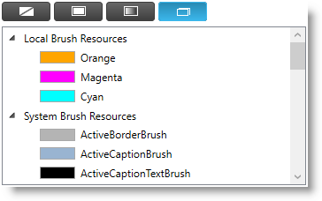

////
|metadata|
{
    "name": "xampropertygrid-conf-brush-resources",
    "tags": ["How Do I","Layouts"],
    "controlName": ["xamPropertyGrid"],
    "guid": "",
    "buildFlags": [],
    "createdOn": "2016-11-23T10:40:36.3648458Z"
}
|metadata|
////

= ブラシ リソースの構成 (xamPropertyGrid)

=== 目的

このトピックでは、ブラシ エディターのブラシ リソース パネルを構成する方法を説明します。

=== 前提条件

本トピックの理解を深めるために、以下のトピックを参照することをお勧めします。

[options="header", cols="a,a"]
|====
|トピック|目的

| link:xampropertygrid-features-overview.html[機能の概要 (xamPropertyGrid)]
|このトピックでは、このコントロールでサポートする機能を開発者の観点から説明します。

| link:xampropertygrid-visual-elements.html[視覚要素 (xamPropertyGrid)]
|このトピックでは、コントロールの視覚要素についての概要を紹介します。

|====

=== このトピックの内容

このトピックは、以下のセクションで構成されます。

* <<_RefLink01, 概要 >>
* <<_RefLink02, ブラシ リソースのカスタマイズ化 >>
* <<_RefLink03, ブラシの選択で通知を送信 >>
* <<_RefLink04, 関連コンテンツ >>

[[_RefLink01]]
=== 概要

プロパティ リストをスクロールすると、プロパティ エディターがビューに入り、ビューから出ます。ブラシ型プロパティ エディターがビューに入ると、link:{ApiPlatform}controls.editors.xampropertygrid{ApiVersion}~infragistics.controls.editors.xampropertygrid~brushresourcesloading_ev.html[BrushResourcesLoading] イベントが発生されます。イベント ハンドラーで、link:{ApiPlatform}controls.editors.xampropertygrid{ApiVersion}~infragistics.controls.editors.brushresourceseventargs.html[BrushResourcesEventArgs] 型のイベント引数オブジェクトを使用すると、ブラシ エディターのユーザー インターフェイスをカスタマイズできます。この引数オブジェクトもビューに入るブラシ プロパティと関連する link:{ApiPlatform}controls.editors.xampropertygrid{ApiVersion}~infragistics.controls.editors.propertygridpropertyitem.html[PropertyGridPropertyItem] への参照を含みます。

[[_RefLink02]]
=== ブラシ リソースのカスタマイズ化

 +

上の画像で表示されるように、ブラシ リソース パネルはブラシを「ローカル ブラシ リソース」および「システム ブラシ リソース」の 2 つのグループに分割します。このグループのブラシ項目にカスタム ブラシ定義を追加するか、システム ブラシを含むことによりカスタマイズできます。

システム ブラシを含むには、link:{ApiPlatform}controls.editors.xampropertygrid{ApiVersion}~infragistics.controls.editors.brushresourceseventargs~automaticallyincludesystembrushresources.html[AutomaticallyIncludeSystemBrushResources] ブール プロパティを true に設定します。これは、現在の Windows テーマのすべての色を「システム ブラシ リソース」グループに追加します。 

カスタム ブラシをこのグループに追加するには、link:{ApiPlatform}controls.editors.xampropertygrid{ApiVersion}~infragistics.controls.editors.brushresourceseventargs~brushresources.html[BrushResources] プロパティに link:{ApiPlatform}controls.editors.xampropertygrid{ApiVersion}~infragistics.controls.editors.primitives.propertygridbrushresourceitem.html[PropertyGridBrushResourceItem] 型のオブジェクトを追加します。この型は、ブラシ、ブラシ名、ブラシ グループ、およびその他の情報を保存するためのオブジェクト型の Tag プロパティのブラシ リソース項目に関連する情報をすべて含みます。

.注:
[NOTE]
====
`BrushResources` プロパティにブラシ リソース項目を追加せずに、`AutomaticallyIncludeSystemBrushResources` プロパティを true に設定しない場合、ブラシ リソース パネルを表示するボタンは表示されていません。
====

[[_RefLink03]]
=== ブラシの選択で通知を送信

ユーザーがブラシ リソース リストからブラシ項目を選択すると link:{ApiPlatform}controls.editors.xampropertygrid{ApiVersion}~infragistics.controls.editors.xampropertygrid~BrushResourceSelected_EV.html[BrushResourceSelected] イベントが発生されます。このイベントのイベント引数オブジェクトは以下のプロパティを提供します:

* link:{ApiPlatform}controls.editors.xampropertygrid{ApiVersion}~infragistics.controls.editors.BrushResourceEventArgs~PropertyItem.html[PropertyItem] – このプロパティは `PropertyGridPropertyItem` 型で、ブラシが変更されたブラシ プロパティと関連付けられます。

* link:{ApiPlatform}controls.editors.xampropertygrid{ApiVersion}~infragistics.controls.editors.BrushResourceEventArgs~BrushResource.html[BrushResource] – このプロパティは `PropertyGridBrushResourceItem` 型で、選択したブラシ項目に関連するすべての情報を含みます。

[[_RefLink04]]
== 関連コンテンツ

=== トピック

このトピックに関連する追加情報については、以下のトピックを参照してください。

[options="header", cols="a,a"]
|====
|トピック|目的

| link:xampropertygrid-conf-editors.html[エディター定義の構成 (xamPropertyGrid)]
|このトピックでは、プロパティの値の編集に使用されるエディターをカスタマイズする方法を説明します。

| link:xampropertygrid-conf-properties-filtering.html[プロパティ リストのフィルタリング (xamPropertyGrid)]
|このトピックでは、コントロールのプロパティ リストのフィルタリングを構成する方法を説明します。

| link:xampropertygrid-conf-properties-sorting.html[プロパティ リストの並べ替え (xamPropertyGrid)]
|このトピックでは、プロパティ リストのカスタム並べ替えのロジックを設定する方法を紹介します。

| link:xampropertygrid-conf-templateselector.html[エディター定義のテンプレート セレクターの構成 (xamPropertyGrid)]
|このトピックは、エディター定義で編集テンプレートを割り当てるためのカスタム ロジックを作成する方法を紹介します。

|====