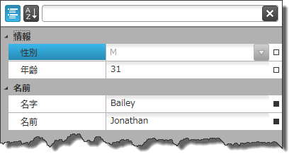
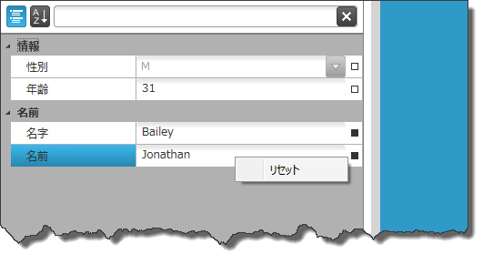

////

|metadata|
{
    "name": "xampropertygrid-resetting-property-value",
    "tags": ["How Do I"],
    "controlName": ["xamPropertyGrid"],
    "guid": "5398c4b0-2305-4c4d-8df1-2de13d729d34",  
    "buildFlags": [],
    "createdOn": "2014-08-28T11:05:06.3990392Z"
}
|metadata|
////

= プロパティ値のリセット (xamPropertyGrid)

== トピックの概要

=== 目的

このトピックでは、プロパティの既定値を定義する方法と、オプション メニューをカスタマイズする方法を説明します。

=== 前提条件

このトピックをより理解するために、以下のトピックを参照することをお勧めします。

[options="header", cols="a,a"]
|====
|トピック|目的

| link:xampropertygrid-features-overview.html[機能の概要 (xamPropertyGrid)]
|このトピックでは、このコントロールでサポートする機能を開発者の観点から説明します。

| link:xampropertygrid-visual-elements.html[視覚要素 (xamPropertyGrid)]
|このトピックでは、コントロールの視覚要素についての概要を紹介します。

| link:xampropertygrid-adding-to-your-page.html[xamPropertyGrid をページに追加]
|このトピックでは、 _xamPropertyGrid_ を短時間で起動、実行するために役立つ詳細な操作方法を紹介します。

|====

=== このトピックの内容

このトピックは、以下のセクションで構成されます。

* <<_Ref395170996, プロパティ値のリセットの概要 >>
* <<_Ref395175215, プロパティの既定値の定義の概要 >>
* <<_Ref395171726, 属性を使用したプロパティの既定値の定義 >>
* <<_Ref395171744, メソッドを使用したプロパティの既定値の定義 >>
* <<_Ref395188115, オプション メニューのカスタマイズ >>
* <<_Ref395175260, 関連コンテンツ >>

[[_Ref395170996]]
== プロパティ値のリセットの概要

=== プロパティ値のリセットの概要

link:{ApiPlatform}controls.editors.xampropertygrid{ApiVersion}~infragistics.controls.editors.xampropertygrid_members.html[ _xamPropertyGrid_  ] コントロールのプロパティ値のリセット機能では、既定値が定義されている場合、ユーザーは各プロパティを既定値とは独立させリセットすることができます。各プロパティの値の右側には、小さなグリフがあります。以下のスクリーンショットは、リセット値のグリフの状態を示しています。

[cols="a,a"]
|====
|中抜きの四角
|プロパティ値はリセットできません (現在の値が既定値、またはプロパティに既定値が定義されていない)。

|塗りつぶされた四角
|現在のプロパティ値はリセットできます。

|====

注:

[NOTE]
====
マウスをグリフの上に置くと、ツールチップが表示されます。中抜きの四角として描画されるグリフの場合、「*既定値*」がツールチップのテキストとして表示されます。塗りつぶされた四角として描画されるグリフの場合、「*ローカル* 」 (つまり、既定値以外のローカルな値が設定されています) がツールチップのテキストとして表示されます。
====

リセット グリフをクリックすると、オプション メニューが表示されます。既定では、このメニューにプロパティ値をリセットするためのオプションが 1 つのみ存在します。ただし、 _xamPropertyGrid_   の link:{ApiPlatform}controls.editors.xampropertygrid{ApiVersion}~infragistics.controls.editors.xampropertygrid~optionsmenu.html[OptionsMenu] プロパティを任意の `ContextMenu` に設定すると、カスタム オプション メニューを指定できます。カスタムな `ContextMenu` の `DataContext` は、現在のプロパティに関連付けられた link:{ApiPlatform}controls.editors.xampropertygrid{ApiVersion}~infragistics.controls.editors.propertygridpropertyitem_members.html[PropertyGridPropertyItem] に自動的に設定されます。

以下のスクリーンショットは、「塗りつぶされた四角」のリセット プロパティ値のグリフをクリックしたときに表示される既定のオプションのメニューを示しています。

[[_Ref395175215]]
== プロパティの既定値の定義の概要

=== プロパティの既定値の定義の概要表

以下の表では、プロパティの既定値を定義する方法を簡単に説明しています。詳細は、表の後に記載されています。

[options="header", cols="a,a"]
|====
|構成可能な項目|詳細

|<<_Ref395171726,属性を使用したプロパティの既定値の定義>>
|「DefaultValue」属性を使用したプロパティの既定値の定義

|<<_Ref395171744,メソッドを使用したプロパティの既定値の定義>>
|メソッドを使用したプロパティの既定値の定義

|====

[[_Ref395171726]]
== 属性を使用したプロパティの既定値の定義

[[_Hlk368069110]]

=== 概要

「DefaultValue」属性を使用して、プロパティの既定値をコードで定義することができます。

[[_Hlk337817761]]

=== 例

以下のコードは、「DefaultValue」属性を使用して、プロパティの既定値を定義する方法を示します。

*C# の場合:*

[source,csharp]
----
public class Person
{
  [DefaultValue("first-name-default-value")]
  public string FirstName { get; set; }
  …
  }
----

*Visual Basic の場合:*

[source,vb]
----
Public Class Person
  <DefaultValue("first-name-default-value")> _
  Public Property FirstName() As String
    Get
      Return m_FirstName
    End Get
    Set
      m_FirstName = Value
    End Set
  End Property
  Private m_FirstName As String
End Class
----

[[_Ref395171744]]
== メソッドを使用したプロパティの既定値の定義

=== 概要

プロパティに「DefaultValue」属性で表すことができない既定値がある場合は、Reset と ShouldSerialize を使用してプロパティの既定値をコードで設定することができます。

[start=1]
. プレフィックスが「Reset」で戻り型が void のプロパティと同じ名前にリセットする各プロパティに対して、reset メソッドを定義します。このメソッドを使用して、プロパティの値を既定値に設定します。
[start=2]
. プレフィックスが「ShouldSerialize」で戻り型が `bool` のプロパティと同じ名前にリセットする各プロパティに対して、ShoudSerialize メソッドを定義します。このメソッドは、プロパティ値がリセットできる場合、`true` を返します。

=== 例

以下のコードは、メソッドを使用してプロパティの既定値を定義する方法を示します。

*C# の場合:*

[source,csharp]
----
public class Person : INotifyPropertyChanged
{
  private string firstNameDefault = "first-name-default-value";
  public string FirstName { get; set; }
  public void ResetFirstName()
  {
    this.FirstName = this.firstNameDefault;
    this.PropertyChange("FirstName");
  }
  public bool ShouldSerializeFirstName()
  {
    return !this.firstNameDefault.Equals(this.FirstName);
  }
  …
  public event PropertyChangedEventHandler PropertyChanged;
  private void PropertyChange(string propertyName)
  {
    if (this.PropertyChanged != null)
    {
      this.PropertyChanged(this, new PropertyChangedEventArgs(propertyName));
    }
  }
}
----

*Visual Basic の場合:*

[source,vb]
----
Public Class Person Implements INotifyPropertyChanged
 Private firstNameDefault As String = "first-name-default-value"
  Public Property FirstName() As String
    Get
      Return m_FirstName
    End Get
    Set
      m_FirstName = Value
    End Set
  End Property
  Private m_FirstName As String
  Public Sub ResetFirstName()
    Me.FirstName = Me.firstNameDefault
    Me.PropertyChange("FirstName")
  End Sub
  Public Function ShouldSerializeFirstName() As Boolean
    Return Not Me.firstNameDefault.Equals(Me.FirstName)
  End Function
  …
  Public Event PropertyChanged As PropertyChangedEventHandler
  Private Sub PropertyChange(propertyName As String)
    RaiseEvent PropertyChanged(Me, New PropertyChangedEventArgs(propertyName))
  End Sub
End Class
----

[[_Ref395188115]]
== オプション メニューのカスタマイズ

=== 概要

既定のオプション メニューは、各プロパティ値の右側にあるグリフをクリックすると表示されます。このメニューのオプションは、「リセット」 (プロパティを既定値にリセット) のみです。_xamPropertyGrid_   の link:{ApiPlatform}controls.editors.xampropertygrid{ApiVersion}~infragistics.controls.editors.xampropertygrid~optionsmenu.html[OptionsMenu] プロパティを変更すると、このメニューをカスタマイズできます。`ContextMenu` 型の新しいインスタンスを設定することもできます。カスタムな ContextMenu の DataContext は、現在のプロパティに関連付けられた PropertyGridPropertyItem に自動的に設定されます。

=== 例

以下のコード例は、既定の「リセット」オプションを使用してオプション メニューを定義する方法を示します。また、現在のプロパティ名とプロパティ値を表示する複数のオプションも示します。

*XAML の場合:*

[source,xaml]
----
<ig:XamPropertyGrid x:Name="xamPropertyGrid1">
  <ig:XamPropertyGrid.OptionsMenu>
	<ContextMenu>
      <MenuItem Header="Custom Reset Value">
        <ig:Commanding.Command>
          <igPrim:PropertyGridPropertyItemCommandSource
          EventName="Click"
          CommandType="ResetPropertyValue"
          ParameterBinding="{Binding}" />
        </ig:Commanding.Command>
      </MenuItem>
      <MenuItem Header="Obtain Property Name" Click="MenuItemName_Click" />
      <MenuItem Header="Obtain Property Value" Click="MenuItemValue_Click" />
    </ContextMenu>
  </ig:XamPropertyGrid.OptionsMenu>
</ig:XamPropertyGrid>
----

*C# の場合:*

[source,csharp]
----
private void MenuItemName_Click(object sender, RoutedEventArgs e)
{
  MenuItem mi = sender as MenuItem;
  PropertyGridPropertyItem pgpi = mi.DataContext as PropertyGridPropertyItem;
  MessageBox.Show(pgpi.PropertyName, "Property Name");
}
private void MenuItemValue_Click(object sender, RoutedEventArgs e)
{
  MenuItem mi = sender as MenuItem;
  PropertyGridPropertyItem pgpi = mi.DataContext as PropertyGridPropertyItem;
  MessageBox.Show(pgpi.Value.ToString(), "Property Value");
}
----

*Visual Basic の場合:*

[source,vb]
----
Private Sub MenuItemName_Click(sender As Object, e As RoutedEventArgs)
  Dim mi As MenuItem = TryCast(sender, MenuItem)
  Dim pgpi As PropertyGridPropertyItem = TryCast(mi.DataContext, PropertyGridPropertyItem)
  MessageBox.Show(pgpi.PropertyName, "Property Name")
End Sub
Private Sub MenuItemValue_Click(sender As Object, e As RoutedEventArgs)
  Dim mi As MenuItem = TryCast(sender, MenuItem)
  Dim pgpi As PropertyGridPropertyItem = TryCast(mi.DataContext, PropertyGridPropertyItem)
  MessageBox.Show(pgpi.Value.ToString(), "Property Value")
End Sub
----

[[_Ref395175260]]
== 関連コンテンツ

=== トピック

このトピックの追加情報については、以下のトピックも合わせてご参照ください。

[options="header", cols="a,a"]
|====
|トピック|目的

| link:xampropertygrid-work-expandable-properties.html[展開可能なプロパティのサポート (xamPropertyGrid)]
|このトピックでは、コントロールが展開可能なプロパティを識別し表示する方法を説明します。

| link:xampropertygrid-property-item-generators.html[プロパティ項目ジェネレーター (xamPropertyGrid)]
|このトピックでは、コントロールが選択されたオブジェクトのプロパティを検出する方法、プロパティ項目のリストを作成する方法、およびプロセスを構成しカスタマイズする方法を説明します。

| link:xampropertygrid-commands.html[コマンドの操作 (xamPropertyGrid)]
|このトピックでは、コマンドによりコントロールを使用してさまざまな操作を実行する方法を説明します。

|====