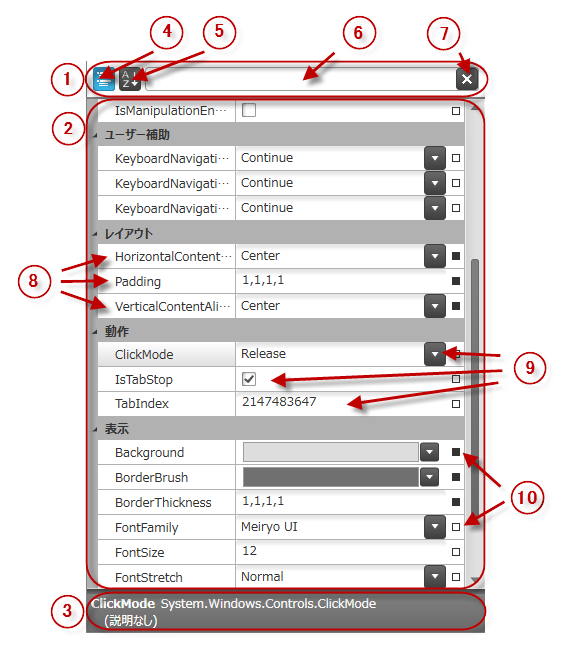

////

|metadata|
{
    "name": "xampropertygrid-visual-elements",
    "tags": ["Getting Started","Layouts"],
    "controlName": ["xamPropertyGrid"],
    "guid": "3ec70f59-1f0e-420b-a0a3-5b82b13365ed",  
    "buildFlags": [],
    "createdOn": "2014-08-28T08:44:33.907903Z"
}
|metadata|
////

= 視覚要素 (xamPropertyGrid)

== トピックの概要

=== 目的

このトピックでは、コントロールの視覚要素についての概要を紹介します。

=== 前提条件

このトピックを理解するために、以下のトピックを参照することをお勧めします。

[options="header", cols="a,a"]
|====
|トピック|目的

| link:xampropertygrid-features-overview.html[機能の概要 (xamPropertyGrid)]
|このトピックでは、 _xamPropertyGrid_ コントロールの機能を開発者の観点から詳しく説明します。

|====

=== このトピックの内容

このトピックは、以下のセクションで構成されます。

* <<_Ref394320297, xamPropertyGrid コントロールのビジュアル要素 >>
* <<_Ref394320304, 関連コンテンツ >>

[[_Ref394320297]]
== xamPropertyGrid コントロールのビジュアル要素

=== 視覚要素の概要

以下のスクリーンショットは、 link:{ApiPlatform}controls.editors.xampropertygrid{ApiVersion}~infragistics.controls.editors.xampropertygrid_members.html[ _xamPropertyGrid_  ] コントロールの視覚要素を示しています。設定可能な要素を図の後に示します。

=== 視覚要素と関連プロパティ

以下の表は、 _xamPropertyGrid_   コントロールとそれらを構成するプロパティの視覚要素をマップします。

[options="header", cols="a,a"]
|====
|視覚要素|プロパティ / トピック

|
[start=1] 

. フィルター領域 

| link:xampropertygrid-conf-visuals.html[表示外観の構成 (xamPropertyGrid)]

|
[start=2] 

. プロパティ編集領域 

| link:xampropertygrid-conf-visuals.html[表示外観の構成 (xamPropertyGrid)]

|
[start=3] 

. 説明領域 

| link:xampropertygrid-conf-visuals.html[表示外観の構成 (xamPropertyGrid)]

|
[start=4] 

. カテゴリ リスト ボタン 

| link:{ApiPlatform}controls.editors.xampropertygrid{ApiVersion}~infragistics.controls.editors.xampropertygrid~iscategorized.html[IsCategorized]

|
[start=5] 

. アルファベット順のプロパティ リスト ボタン 

|`IsCategorized`

|
[start=6] 

. プロパティ フィルター テスト ボックス 

| link:{ApiPlatform}controls.editors.xampropertygrid{ApiVersion}~infragistics.controls.editors.xampropertygrid~filtertext.html[FilterText]

|
[start=7] 

. プロパティ フィルター テスト ボックスのクリア ボタン 

|`FilterText`

|
[start=8] 

. プロパティ名 

| link:xampropertygrid-property-item-generators.html[プロパティ項目ジェネレーター (xamPropertyGrid)]

|
[start=9] 

. プロパティ値エディター 

| link:xampropertygrid-conf-editors.html[エディター定義の構成 (xamPropertyGrid)]

|
[start=10] 

. プロパティ値のリセット グリフ 

| link:xampropertygrid-resetting-property-value.html[プロパティ値のリセット (xamPropertyGrid)]

|====

[[_Ref394320304]]
== 関連コンテンツ

=== トピック

このトピックの追加情報については、以下のトピックも合わせてご参照ください。

[options="header", cols="a,a"]
|====
|トピック|目的

| link:xampropertygrid-user-interactions.html[ユーザー インタラクションと操作性 (xamPropertyGrid)]
|このトピックでは、ユーザーが実行できる操作を紹介します。

| link:xampropertygrid-list-of-attributes.html[サポートされる属性のリスト (xamPropertyGrid)]
|このトピックでは、オブジェクトからプロパティのリストを取得する場合に、コントロールで使用される属性の一覧を示します。

|====