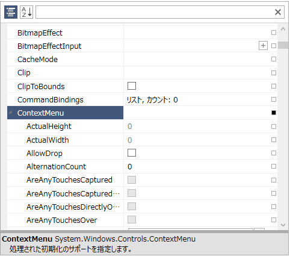
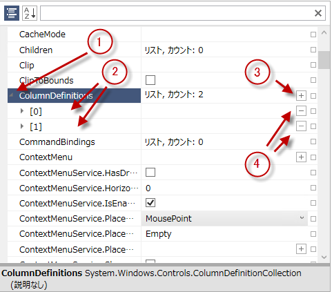
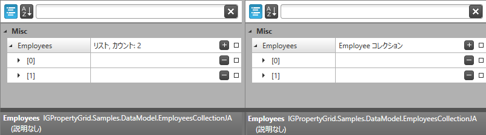
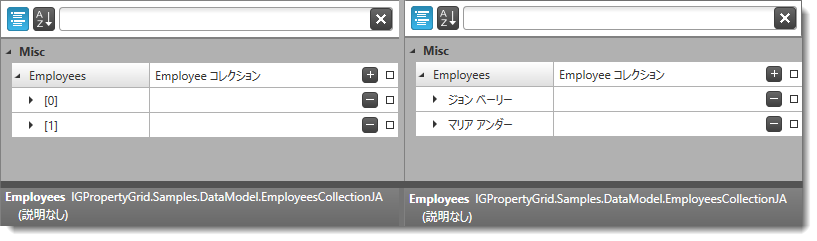

////

|metadata|
{
    "name": "xampropertygrid-work-expandable-properties",
    "tags": ["Drilldown","Editing"],
    "controlName": ["xamPropertyGrid"],
    "guid": "536a6799-c8ab-4404-a9be-4c0aec695ec4",  
    "buildFlags": [],
    "createdOn": "2014-08-28T10:52:56.2863729Z"
}
|metadata|
////

= 展開可能なプロパティのサポート (xamPropertyGrid)

== トピックの概要

=== 目的

このトピックでは、コントロールが展開可能なプロパティを識別し表示する方法を説明します。

=== 前提条件

本トピックの理解を深めるために、以下のトピックを参照することをお勧めします。

[options="header", cols="a,a"]
|====
|トピック|目的

| link:xampropertygrid-features-overview.html[機能の概要 (xamPropertyGrid)]
|このトピックでは、このコントロールでサポートする機能を開発者の観点から説明します。

| link:xampropertygrid-visual-elements.html[視覚要素 (xamPropertyGrid)]
|このトピックでは、コントロールの視覚要素についての概要を紹介します。

|====

=== このトピックの内容

このトピックは、以下のセクションで構成されます。

* <<_Ref424308539,展開可能なプロパティの概要>>
* <<_Ref424308609,パブリック プロパティを持つ型>>
* <<_Ref424308656,コレクションの型>>
* <<_Ref424308689,コレクション タイプの描画のカスタマイズ>>
* <<_Ref424308746,展開可能なプロパティの外部エディターの提供>>
* <<_Ref424308800,関連コンテンツ>>

[[_Ref424308539]]
== 展開可能なプロパティの概要

=== 概要

link:{ApiPlatform}controls.editors.xampropertygrid{ApiVersion}~infragistics.controls.editors.xampropertygrid_members.html[ _xamPropertyGrid_  ] コントロールは展開可能なプロパティの表示をサポートします。このプロパティは、展開可能なプロパティ項目の左端のエキスパンダー グリフをクリックすると表示される、兄弟項目/要素を含みます。プロパティは一定の条件を満たせば展開可能なプロパティとみなされます。左記で詳細を説明します。

[[_Ref424308609]]
== パブリック プロパティを持つ型

*パブリック プロパティを持つ型*  － 1 つ以上のパブリック プロパティ (`Button` インスタンスの `Style` プロパティなど) を公開する、または `ExpandableObjectConverter` 属性を持つ型。展開されると、 _xamPropertyGrid_   は型のプロパティの項目の下位リストを表示します。

型にパラメータなしのパブリック コンストラクタが設定され、現在のプロパティ値が null の場合、 _xamPropertyGrid_   はプロパティ項目の右端にプラス記号の付いたボタンを表示します。このボタンをクリックすると、型のインスタンスが作成されます。

次のスクリーンショットは、 _xamPropertyGrid_   で描画されたパブリック プロパティ (ContextMenu) を持つ型を示しています。

[[_Ref424308656]]
== コレクションの型

*コレクション型*  - `ICollection`、`IList` または `IEnumerable` を実装する型です。展開されると、 _xamPropertyGrid_   は要素の下位リストを表示します。

リストが `ICollection<T>` で `T` にパラメータなしのパブリックコンストラクタが設定され、リストが変更可能な場合、 _xamPropertyGrid_   はリストの右端にプラス記号の付いたボタンを表示します。このボタンをクリックすると、型 `T` のエントリがリストに追加されます。

リストが変更可能な場合、 _xamPropertyGrid_   は各リスト要素の右端にマイナス記号の付いたボタンを表示します。このボタンをクリックすると、当該要素が削除されます。

次のスクリーンショットは、 _xamPropertyGrid_   で描画されたリスト型のプロパティ (ColumnDefinitions) を示しています。

[start=1]
. 展開可能なプロパティ/コレクションの展開/縮小ハンドル
[start=2]
. 展開可能なプロパティ/コレクションのプロパティ/要素
[start=3]
. 要素をリストに追加するためのプラス ボタン
[start=4]
. 特定の要素をリストから削除するためのマイナス ボタン

[[_Ref424308689]]
== コレクション タイプの描画のカスタマイズ

=== コレクションの説明の変更

デフォルトでは、 _xamPropertyGrid_   コントロールはコレクションの型および要素のカウントを値の列に描画します。以下の手順を実行して、値を変更します:

* `System.ComponentModel.TypeConverter` から派生するクラスを作成します。
* `ConvertTo` メソッドをオーバーライドして使用する文字列値を返します。
* コレクション プロパティを `TypeConverter` 属性で装飾して、手順 1 で作成したクラスの型を引数として追加します。

以下のスクリーンショットは、左にデフォルトのコレクション描画、右にカスタマイズされた描画を示しています:

以下のコード スニペットは、上記の結果になるためのコードを示します。

*Visual Basic の場合:*

[source,vb]
----
Public Class CustomTypeConverter
  Inherits TypeConverter
  Public Overrides Function ConvertTo( _
    context As ITypeDescriptorContext, _
    culture As CultureInfo, _
    value As [Object], _
    destinationType As Type) As Object
    Return "Employee's Collection"
  End Function
End Class
…
<TypeConverter(GetType(CustomTypeConverter))> _
Public Property Customers() As List(Of Customer)
  Get
    Return m_Customers
  End Get
  Set
    m_Customers = Value
  End Set
End Property
Private m_Customers As List(Of Customer)
----

*C# の場合:*

[source,csharp]
----
public class CustomTypeConverter : TypeConverter
{
  public override object ConvertTo(
    ITypeDescriptorContext context,
    CultureInfo culture,
    Object value,
    Type destinationType)
  {
    return "Employee's Collection";
  }
}
…
[TypeConverter(typeof(CustomTypeConverter))]
public List<Customer> Customers
{
  get; set;
}
----

=== コレクションの表示名を変更します。

デフォルトでは、 _xamPropertyGrid_   コントロールはコレクションの要素を角括弧のインデックスとして描画します ([0]、[1]、[2]…)。以下の手順を実行して、それをカスタマイズします:

* コレクションが `System.ComponentModel.ICustomTypeDescriptor` インターフェースを実装するようにします。
* このインターフェースから実装する中心的なメソッドは `GetProperties()` メソッドです。このメソッドは、`System.ComponentModel.PropertyDescriptor` 型から拡張されるオブジェクトのコレクションを返します。
* `PropertyDescriptor` の `DisplayName` 文字列プロパティをオーバーライドして、コレクションの各要素にカスタムの表示名を与えます。

注:

[NOTE]
====
さらに、プロパティ値の設定および獲得のロジックには、抽象の `Setvalue()`/`GetValue()` メソッドの実装が必要となります。
====

注:

[NOTE]
====
_xamPropertyGrid_   が描画したコレクション項目は、データ オブジェクトで `ToString()` メソッドをオーバーライドしてカスタマイズできます。
====

以下のスクリーンショットの左は、デフォルトのコレクション要素の描画、右はカスタマイズされた要素の描画を示しています:

以下のコード スニペットは、上記の結果になるためのコードを示します。

*Visual Basic の場合:*

[source,vb]
----
Public Class Employee
  Public Property FirstName() As String
    Get
      Return m_FirstName
    End Get
    Set
      m_FirstName = Value
    End Set
  End Property
  Private m_FirstName As String
  Public Property LastName() As String
    Get
      Return m_LastName
    End Get
    Set
      m_LastName = Value
    End Set
  End Property
  Private m_LastName As String
End Class
Public Class EmployeePropertyDescriptor
  Inherits PropertyDescriptor
  Private collection As EmployeeCollection
  Private index As Integer
  Public Sub New(col As EmployeeCollection, i As Integer)
    Me.collection = col
    Me.index = i
  End Sub
  Public Overrides ReadOnly Property DisplayName() As String
    Get
      Dim emp As Employee = Me.collection(index)
      Return emp.FirstName & " " & Convert.ToString(emp.LeftName)
    End Get
  End Property
End Class
Public Class EmployeeCollection
  Inherits List(Of Employee)
  Implements ICustomTypeDescriptor
  Public Function GetProperties() As PropertyDescriptorCollection
    Dim pds As New PropertyDescriptorCollection(Nothing)
    For i As Integer = 0 To Me.Count - 1
      Dim pd As New EmployeePropertyDescriptor(Me, i)
      pds.Add(pd)
    Next
    Return pds
  End Function
End Class
----

*C# の場合:*

[source,csharp]
----
public class Employee
{
  public string FirstName { get; set; }
  public string LastName { get; set; }
}
public class EmployeePropertyDescriptor : PropertyDescriptor
{
  private EmployeeCollection collection;
  private int index;
  public EmployeePropertyDescriptor(EmployeeCollection col, int i)
  {
    this.collection = col;
    this.index = i;
  }
  public override string DisplayName
  {
    get
    {
      Employee emp = this.collection[index];
      return emp.FirstName + " " + emp.LeftName;
    }
  }
}
public class EmployeeCollection : List<Employee>, ICustomTypeDescriptor
{
  public PropertyDescriptorCollection GetProperties()
  {
    PropertyDescriptorCollection pds = new PropertyDescriptorCollection(null);
    for (int i = 0; i < this.Count; i++)
    {
      EmployeePropertyDescriptor pd = new EmployeePropertyDescriptor(this, i);
      pds.Add(pd);
    }
    return pds;
  }
}
----

[[_Ref424308746]]
== 展開可能なプロパティの外部エディターの提供

=== 概要

コレクションの型にも、パブリック プロパティを持つ型にも外部エディターを提供できます。外部エディターを提供すると、 _xamPropertyGrid_   はプロパティ/コレクションの下位リストを描画しません。代わりに、外部のエディターが展開可能なプロパティ、またはコレクションのデータを描画します。

外部エディターのデータ テンプレートを作成する場合、データ テンプレートのデータ コンテキストが展開可能なプロパティに関連付けられた link:{ApiPlatform}controls.editors.xampropertygrid{ApiVersion}~infragistics.controls.editors.propertygridpropertyitem.html[PropertyGridPropertyItem] に設定されます。すなわち、`PropertyGridPropertyItem` の link:{ApiPlatform}controls.editors.xampropertygrid{ApiVersion}~infragistics.controls.editors.propertygridpropertyitem~value.html[Value] プロパティにバインドして、元になるプロパティ値が得られます。

外部エディター提供の詳細について、 link:xampropertygrid-conf-editors.html[エディター定義の構成]を参照してください。

[[_Ref424308800]]
== 関連コンテンツ

=== トピック

このトピックの追加情報については、以下のトピックも合わせてご参照ください。

[options="header", cols="a,a"]
|====
|トピック|目的

| link:xampropertygrid-conf-editors.html[エディター定義の構成 (xamPropertyGrid)]
|このトピックでは、プロパティの値の編集に使用されるエディターをカスタマイズする方法を説明します。

| link:xampropertygrid-property-item-generators.html[プロパティ項目ジェネレーター (xamPropertyGrid)]
|このトピックでは、コントロールが選択されたオブジェクトのプロパティを検出する方法、プロパティ項目のリストを作成する方法、およびプロセスを構成しカスタマイズする方法を説明します。

| link:xampropertygrid-resetting-property-value.html[プロパティ値のリセット (xamPropertyGrid)]
|このトピックでは、プロパティの既定値を定義する方法と、オプション メニューをカスタマイズする方法を説明します。

| link:xampropertygrid-commands.html[コマンドの操作 (xamPropertyGrid)]
|このトピックでは、コマンドによりコントロールを使用してさまざまな操作を実行する方法を説明します。

|====