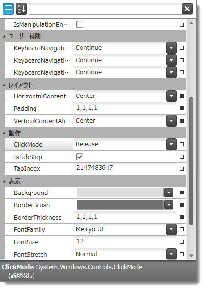

////

|metadata|
{
    "name": "xampropertygrid",
    "tags": [],
    "controlName": ["xamPropertyGrid"],
    "guid": "c6d53517-05bc-4686-92d0-5adcf727612c",  
    "buildFlags": [],
    "createdOn": "2014-07-11T11:57:44.1059022Z"
}
|metadata|
////

= xamPropertyGrid

== このグループのトピックについて

=== 概要

link:{ApiPlatform}controls.editors.xampropertygrid{ApiVersion}~infragistics.controls.editors.xampropertygrid_members.html[ _xamPropertyGrid_  ] コントロールでは、単一のオブジェクトまたは複数のオブジェクトを簡単に編集できます。

以下のスクリーンショットは、カテゴリによりグループ化された多数のオブジェクトのプロパティを表示 / 編集する際の  _xamPropertyGrid_   を示しています。

=== トピック

[options="header", cols="a,a"]
|====
|トピック|目的

| link:xampropertygrid-overview.html[概要 (xamPropertyGrid)]
|このトピックのグループでは、 _xamPropertyGrid_ コントロールの機能、視覚要素およびユーザー インタラクションの概要を説明します。

| link:xampropertygrid-adding-to-your-page.html[xamPropertyGrid をページに追加]
|このトピックでは、 _xamPropertyGrid_ を短時間で起動、実行するために役立つ詳細な操作方法を紹介します。

| link:xampropertygrid-configuring.html[xamPropertyGrid の構成]
|このセクションのトピックでは、コントロールの構成についての情報を提供します。

| link:xampropertygrid-working.html[xamPropertyGrid の操作]
|このセクションのトピックでは、コントロールをプログラムによって管理する詳しい方法を説明します。

| link:xampropertygrid-api-reference.html[API リファレンス (xamPropertyGrid)]
|このトピックでは、xamPropertyGrid コントロールに関連した名前空間およびクラスに関する参考情報を提供します。

|====