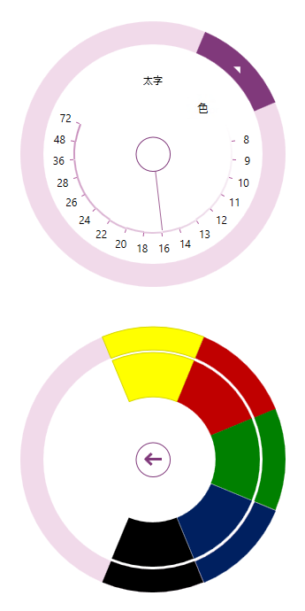

////
|metadata|
{
    "name": "xamradialmenu-adding-to-your-page",
    "tags": ["Getting Started"],
    "controlName": ["xamRadialMenu"],
    "guid": "af9c38ec-28cd-4780-af60-bbacb2b2b739",
    "buildFlags": [],
    "createdOn": "2016-05-25T18:21:57.838306Z"
}
|metadata|
////

= xamRadialMenu をページに追加

== トピックの概要

=== 目的

このトピックでは、 link:{ApiPlatform}controls.menus.xamradialmenu{ApiVersion}~infragistics.controls.menus.xamradialmenu.html[ _xamRadialMenu_  ]™ を短時間で起動、実行するために役立つ詳細な操作方法を紹介します。

=== 前提条件

このトピックをより理解するために、以下のトピックを参照することをお勧めします。

[options="header", cols="a,a"]
|====
|トピック|目的

| link:xamradialmenu-features.html[xamRadialMenu の機能]
|このトピックでは、コントロールでサポートする機能を開発者の観点から説明します。

| link:xamradialmenu-visual-elements.html[xamRadialMenu の視覚要素]
|このトピックでは、コントロールの視覚要素の概要を紹介します。

|====

=== このトピックの内容

このトピックは、以下のセクションで構成されます。

* <<_Ref378751700,xamRadialMenu をページに追加>>
* <<_Ref378751704,関連コンテンツ>>

[[_Ref378751700]]
== _xamRadialMenu_  をページに追加

=== はじめに

以下の手順では、 _xamRadialMenu_   コントロールを追加する方法、および異なるタイプのメニュー項目を追加する任意のステップについて説明します。

=== プレビュー

以下のスクリーンショットは、すべての任意のステップを含む最終結果のプレビューです。

=== 手順

以下のステップでは、xamRadialMenu をページに追加する方法を示します。

=== 1.NuGet パッケージ参照

以下の NuGet パッケージ参照をプロジェクトに追加します。

** Infragistics.WPF.RadialMenu

NuGet フィードのセットアップと NuGet パッケージの追加の詳細については、link:nuget-feeds.html[NuGet フィード] ドキュメントを参照してください。

=== 2.名前空間

以下の名前空間を追加します。

以下のコードはこの例を実装します。

*XAML の場合:*

[source,xaml]
----
xmlns:ig="http://schemas.infragistics.com/xaml"
----

以下のコードはこの例を実装します。

*C# の場合:*

[source,csharp]
----
using Infragistics.Controls.Menus;
----

以下のコードはこの例を実装します。

*Visual Basic の場合:*

[source,vb]
----
Imports Infragistics.Controls.Menus
----

=== 3.xamRadialMenu のインスタンスの作成

_xamRadialMenu_   を作成してページに追加します。

以下のコードはこの例を実装します。

*XAML の場合:*

[source,xaml]
----
<ig:XamRadialMenu
 x:Name="rMenu" Width="300" Height="300">
<!-- ここにメニュー項目を追加します -->
</ig:XamRadialMenu>
----

=== 4.ボタン項目の追加 (オプション)

_xamRadialMenu_   でボタン項目を定義します。

以下のコードはこの例を実装します。

*XAML の場合:*

[source,xaml]
----
<ig:RadialMenuItem
 Header="Bold"
 Click="RadialMenuBold_Click" />
----

以下のコードはこの例を実装します。

*C# の場合:*

[source,csharp]
----
public void RadialMenuBold_Click(object sender, EventArgs e)
{
    // ボタン項目のクリック イベント処理のためのコード
}
----

以下のコードはこの例を実装します。

*Visual Basic の場合:*

[source,vb]
----
Public Sub RadialMenuBold_Click(sender As Object, e As EventArgs)
    ' ボタン項目のクリック イベント処理のためのコード
End Sub
----

=== 5.色項目の追加 (オプション)

_xamRadialMenu_   で色項目および子のカラーウェル項目を定義します。

*XAML の場合:*

[source,xaml]
----
<ig:RadialMenuColorItem Header="Color">
    <ig:RadialMenuColorWell Color="#FFFF00" />
    <ig:RadialMenuColorWell Color="#C00000" />
    <ig:RadialMenuColorWell Color="#008000" />
    <ig:RadialMenuColorWell Color="#002060" />
    <ig:RadialMenuColorWell Color="#000000" />
</ig:RadialMenuColorItem>
----

=== 6.数値ゲージ項目の追加 (オプション)

以下のコードはこの例を実装します。

*XAML の場合:*

[source,xaml]
----
<ig:RadialMenuNumericGauge
 WedgeSpan="5" Value="16"
    Ticks="8 9 10 11 12 13 14 16 18 20 22 24 26 28 36 48 72" />
----

[[_Ref378751704]]
== 関連コンテンツ

=== トピック

以下のトピックでは、このトピックに関連する追加情報を提供しています。

[options="header", cols="a,a"]
|====
|トピック|目的

| link:xamradialmenu-configuration-overview.html[xamRadialMenu 構成の概要]
|このトピックでは、 _xamRadialMenu_ コントロールを構成する方法を説明します。

|====