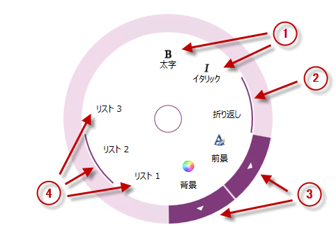

////

|metadata|
{
    "name": "xamradialmenu-configuring-button-items",
    "tags": ["How Do I","Layouts"],
    "controlName": ["xamRadialMenu"],
    "guid": "38f383c9-6255-4d66-b27c-8233e109bb85",  
    "buildFlags": [],
    "createdOn": "2016-05-25T18:21:57.8933112Z"
}
|metadata|
////

= ボタン項目の構成 (xamRadialMenu)

== トピックの概要

=== 目的

このトピックでは、 link:{ApiPlatform}controls.menus.xamradialmenu{ApiVersion}~infragistics.controls.menus.xamradialmenu.html[ _xamRadialMenu_  ]™ のボタン項目について説明します。

=== 前提条件

このトピックをより理解するために、以下のトピックを参照することをお勧めします。

[options="header", cols="a,a"]
|====
|トピック|目的

| link:xamradialmenu-features.html[xamRadialMenu の機能]
|このトピックでは、コントロールでサポートする機能を開発者の観点から説明します。

| link:xamradialmenu-visual-elements.html[xamRadialMenu の視覚要素]
|このトピックでは、コントロールの視覚要素の概要を紹介します。

| link:xamradialmenu-items-sub-items-configuration-overview.html[項目/サブ項目の構成 - 概要]
|このトピックでは、メニュー項目およびその共通構成プロパティの概要を説明します。

|====

=== このトピックの内容

このトピックは、以下のセクションで構成されます。

* <<_Ref378077373,はじめに>>
* <<_Ref378077405,ボタン項目の構成の概要>>
* <<_Ref378077425,関連コンテンツ>>

[[_Ref378077373]]
== はじめに

=== ボタン項目の概要

_xamRadialMenu_   のボタン項目は通常の項目で、クリックで動作を実行する link:{ApiPlatform}controls.menus.xamradialmenu{ApiVersion}~infragistics.controls.menus.radialmenuitem.html[RadialMenuItem] クラスで表示されます。ボタン項目にはテキストやアイコンを含めることができます。さらにボタン項目はサブ項目を持つことができ、サブ項目グループをナビゲートする矢印ボタンを外部リングとして親項目に持たせることができます。

ボタン項目をチェックボックス項目として構成することもでき、チェックボックスは外部リングの内側の項目領域内に円弧で表示されます。

ボタン項目はラジオ ボタン項目として構成でき、次の 2 つのモードで操作できます。

* 1 つ以上のチェック済み項目があるラジオ ボタン グループ
* チェック済み項目がないラジオ ボタン グループ

以下のスクリーンショットは、各ボタン項目のタイプを示しています。

[start=1]
. プレーン ボタン項目
[start=2]
. チェック済みのチェックボックス ボタン項目
[start=3]
. サブ項目を持つ色項目を示す矢印
[start=4]
. 2 番目の選択肢がチェック済みのラジオ ボタン グループ

[[_Ref378077405]]
== ボタン項目の構成の概要

=== ボタン項目の構成の概要表

以下の表は、ボタン項目コントロールで構成できる主要な要素を簡単に説明し、それらを構成するプロパティにマップします。

[options="header", cols="a,a,a"]
|====
|構成可能な項目|詳細|プロパティ

|ヘッダー
|項目内テキストを追加、編集および削除します。
|
* link:{ApiPlatform}controls.menus.xamradialmenu{ApiVersion}~infragistics.controls.menus.radialmenuitem~header.html[Header] 

|アイコン
|項目内アイコンを追加、編集および削除します。
|
* link:{ApiPlatform}controls.menus.xamradialmenu{ApiVersion}~infragistics.controls.menus.radialmenuitem~icon.html[Icon] 

|[[_Hlk356484826]] 

非バインド サブ項目の追加
|非バインド サブ項目を追加、編集および削除します。
|
* link:{ApiPlatform}controls.menus.xamradialmenu{ApiVersion}~infragistics.controls.menus.radialmenuitem~items.html[Items] 

|サブ項目のバインド
|サブ項目コレクションをバインドします。
|
* link:{ApiPlatform}controls.menus.xamradialmenu{ApiVersion}~infragistics.controls.menus.radialmenuitem~itemssource.html[ItemsSource] 

|チェックボックス
|ボタン項目をチェックボックスルとして構成するには、`CheckBehavior` プロパティを `CheckBox` に設定し、`IsChecked` プロパティを使用して状態を設定または取得します。
|
* link:{ApiPlatform}controls.menus.xamradialmenu{ApiVersion}~infragistics.controls.menus.radialmenuitem~checkbehavior.html[CheckBehavior] 

* link:{ApiPlatform}controls.menus.xamradialmenu{ApiVersion}~infragistics.controls.menus.radialmenuitem~ischecked.html[IsChecked] 

|ラジオ ボタン
|ボタン項目をラジオ ボタンとして構成するには、`CheckBehavior` プロパティを `RadioButton` (1 つのチェック済み項目があるグループ用) または `RadioButtonAllowAllUp` (チェック済み項目がないグループ用) に設定し、`GroupName` プロパティを使用してすべてのグループ メンバーのグループ名が同じ名前に設定します。
|
* `CheckBehavior` 

* `IsChecked` 

* link:{ApiPlatform}controls.menus.xamradialmenu{ApiVersion}~infragistics.controls.menus.radialmenuitem~groupname.html[GroupName] 

|イベント
|イベント ハンドラーを持つように Click イベントを構成して、特定のボタンがクリックされたときに処理が実行されるようにします。 

ボタンのチェック時やチェック解除時に通知するイベントもあります。
|
* link:{ApiPlatform}controls.menus.xamradialmenu{ApiVersion}~infragistics.controls.menus.radialmenuitem~click_ev.html[Click] 

* link:{ApiPlatform}controls.menus.xamradialmenu{ApiVersion}~infragistics.controls.menus.radialmenuitem~checked_ev.html[Checked] 

* link:{ApiPlatform}controls.menus.xamradialmenu{ApiVersion}~infragistics.controls.menus.radialmenuitem~unchecked_ev.html[Unchecked] 

|====

[[_Ref378077425]]
== 関連コンテンツ

このトピックの追加情報については、以下のトピックも合わせてご参照ください。

[options="header", cols="a,a"]
|====
|トピック|目的

| link:xamradialmenu-configuring-numeric-items.html[数値項目の構成]
|このトピックでは、 _xamRadialMenu_ の数値項目について説明します。

| link:xamradialmenu-configuring-color-items.html[色項目の構成]
|このトピックでは、 _xamRadialMenu_ の色項目について説明します。

| link:xamradialmenu-configuring-list-items.html[リスト項目の構成]
|このトピックでは、 _xamRadialMenu_ のリスト項目について説明します。

|====
