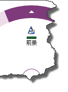

////

|metadata|
{
    "name": "xamradialmenu-configuring-color-items",
    "tags": ["How Do I","Layouts"],
    "controlName": ["xamRadialMenu"],
    "guid": "9cdb6bde-ae67-4cdb-bf68-563472adb3f2",  
    "buildFlags": [],
    "createdOn": "2016-05-25T18:21:57.9053096Z"
}
|metadata|
////

= 色項目の構成 (xamRadialMenu)

== トピックの概要

=== 目的

このトピックでは、 link:{ApiPlatform}controls.menus.xamradialmenu{ApiVersion}~infragistics.controls.menus.xamradialmenu.html[ _xamRadialMenu_  ]™ の色項目について説明します。

=== 前提条件

このトピックをより理解するために、以下のトピックを参照することをお勧めします。

[options="header", cols="a,a"]
|====
|トピック|目的

| link:xamradialmenu-features.html[xamRadialMenu 機能]
|このトピックでは、コントロールでサポートする機能を開発者の観点から説明します。

| link:xamradialmenu-visual-elements.html[xamRadialMenu の視覚要素]
|このトピックでは、コントロールの視覚要素の概要を紹介します。

| link:xamradialmenu-items-sub-items-configuration-overview.html[項目/サブ項目の構成 - 概要]
|このトピックでは、メニュー項目およびその共通構成プロパティの概要を説明します。

| link:xamradialmenu-configuring-button-items.html[ボタン項目の構成]
|このトピックでは、 _xamRadialMenu_ のボタン項目について説明します。

|====

=== このトピックの内容

このトピックは、以下のセクションで構成されます。

* <<_Ref378152597,色項目の構成の概要>>
* <<_Ref378148085,色項目>>
* <<_Ref378148094,カラーウェル>>
* <<_Ref377994940,関連コンテンツ>>

[[_Ref378152597]]
== 色項目の構成の概要

=== 色項目の構成の概要表

_xamRadialMenu_   は、色の値を確認し設定する色項目をサポートします。詳細は、表の後に記載されています。

[options="header", cols="a,a,a"]
|====
|色項目|説明|タイプによる表示

|<<_Ref378148085,色項目>>
|
* ヘッダー テキストの表示 

* アイコンの表示 

* 関連付けられた色の表示 

|
* link:{ApiPlatform}controls.menus.xamradialmenu{ApiVersion}~infragistics.controls.menus.radialmenucoloritem_members.html[RadialMenuColorItem] 

|<<_Ref378148094,カラーウェル>>
|
* 項目領域および外部リングの両方に関連付けられた色の表示 

|
* link:{ApiPlatform}controls.menus.xamradialmenu{ApiVersion}~infragistics.controls.menus.radialmenucolorwell_members.html[RadialMenuColorWell] 

|====

[[_Ref378148085]]
== 色項目

[[_Hlk368069110]]

=== 概要

`RadialMenuColorItem` クラスによる表示の場合、 _xamRadialMenu_   の色項目は、 link:{ApiPlatform}controls.menus.xamradialmenu{ApiVersion}~infragistics.controls.menus.radialmenuitem_members.html[RadialMenuItem] クラスから拡張します。ボタン項目で提供されるヘッダー テキストやアイコンに加え、色項目には関連付けられたカラー矩形があります。

次のスクリーンショットは、緑色に関連付けられた矩形を示します。

=== プロパティ設定

以下の表は、主な構成とそれを管理するプロパティ設定のマップを示します。

[options="header", cols="a,a,a"]
|====
|目的:|使用するプロパティ:|操作:

|項目に関連付けられた色の値の設定/取得
| link:{ApiPlatform}controls.menus.xamradialmenu{ApiVersion}~infragistics.controls.menus.radialmenucoloritembase~color.html[Color]
|値を設定または読み取ります。

|関連付けられた色の値の変更についての通知
| link:{ApiPlatform}controls.menus.xamradialmenu{ApiVersion}~infragistics.controls.menus.radialmenucoloritembase~colorchanged_ev.html[ColorChanged]
|イベント ハンドラーにアタッチします。

|====

[[_Ref378148094]]
== カラーウェル

=== 概要

_xamRadialMenu_   カラーウェルは、`RadialMenuColorWell` クラスによって示され、項目領域と外部リングの両方に関連付けられたカラーを表示します。カラーウェルのサブ項目にナビゲートする場合は、親のカラーウェルおよびその兄弟が中央ボタンと項目領域の間に表示されます。

注:

[NOTE]
====
カラーウェルをクリックすると、`Color` プロパティがクリックされたカラーウェルの色に設定されるように、直接の親のカラーウェルまたは色項目の設定が変更されます。
====

次のスクリーンショットは、さまざまな色で描画されたサブ項目を持つカラーウェルを示しています。

image::images/xamRadialMenu_08.png[]

[start=1]
. さまざまな色のカラーウェル (現在のレベル)
[start=2]
. 矢印は、カラーウェルの下にサブ項目があることを示しています。

次のスクリーンショットは、親の緑色のカラーウェルのサブ項目へのナビゲートを示しています。親の緑色のカラーウェルとその兄弟が、中央ボタンと項目領域の間に表示されています。

image::images/xamRadialMenu_09.png[]

[start=1]
. 現在のレベルのカラーウェル
[start=2]
. 親のカラーウェル

=== プロパティ設定

以下の表は、主な構成とそれを管理するプロパティ設定のマップを示します。

[options="header", cols="a,a,a"]
|====
|目的:|使用するプロパティ:|操作:

|項目に関連付けられた色の値の設定/取得
| link:{ApiPlatform}controls.menus.xamradialmenu{ApiVersion}~infragistics.controls.menus.radialmenucoloritembase~color.html[Color]
|値を設定または読み取ります。

|関連付けられた色の値の変更についての通知
| link:{ApiPlatform}controls.menus.xamradialmenu{ApiVersion}~infragistics.controls.menus.radialmenucoloritembase~colorchanged_ev.html[ColorChanged]
|イベント ハンドラーにアタッチします。

|====

[[_Ref377994940]]
== 関連コンテンツ

このトピックの追加情報については、以下のトピックも合わせてご参照ください。

[options="header", cols="a,a"]
|====
|トピック|目的

| link:xamradialmenu-configuring-numeric-items.html[数値項目の構成]
|このトピックでは、 _xamRadialMenu_ の数値項目について説明します。

| link:xamradialmenu-configuring-list-items.html[リスト項目の構成]
|このトピックでは、 _xamRadialMenu_ のリスト項目について説明します。

|====
