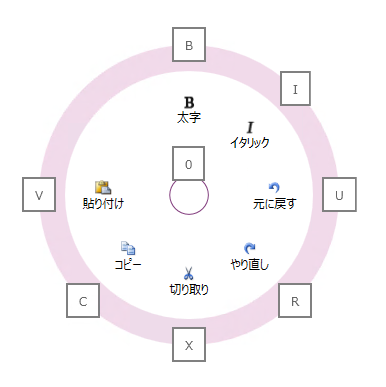

////

|metadata|
{
    "name": "xamradialmenu-configuring-key-tips",
    "tags": ["How Do I"],
    "controlName": ["xamRadialMenu"],
    "guid": "6fd34471-4e76-4f87-b931-f6c19c884aa2",  
    "buildFlags": [],
    "createdOn": "2016-05-25T18:21:57.923311Z"
}
|metadata|
////

= キー チップの構成 (xamRadialMenu)

== トピックの概要

=== 目的

このトピックでは、 link:{ApiPlatform}controls.menus.xamradialmenu{ApiVersion}~infragistics.controls.menus.xamradialmenu.html[ _xamRadialMenu_  ]™ 項目のキー チップを構成する方法を説明します。

=== 前提条件

このトピックをより理解するために、以下のトピックを参照することをお勧めします。

[options="header", cols="a,a"]
|====
|トピック|目的

| link:xamradialmenu-features.html[xamRadialMenu の機能]
|このトピックでは、コントロールでサポートする機能を開発者の観点から説明します。

| link:xamradialmenu-visual-elements.html[xamRadialMenu の視覚要素]
|このトピックでは、コントロールの視覚要素の概要を紹介します。

| link:xamradialmenu-configuring-tooltips.html[ツールチップの構成]
|このトピックでは、項目のツールチップを構成する方法を説明します。

|====

=== このトピックの内容

このトピックは、以下のセクションで構成されます。

* <<_Ref378254351,はじめに>>
* <<_Ref378255599,キー チップの構成の概要>>
* <<_Ref378255604,関連コンテンツ>>

[[_Ref378254351]]
== はじめに

=== キー チップの概要

キー チップはツールチップと同様に、ユーザーが特定の  _xamRadialMenu_   項目をアクティブ化するための 1 つまたは複数の文字を表示する視覚要素です。pick:[wpf,win-rt="Alt"]  +  pick:[sl="F8"]  キーを使用してキー チップの表示/非表示を切り替えます。

表示される場合は、デフォルトで「0」が中央揃えで表示されるキー チップが各項目の外部リングに表示されます。項目のキー チップは、明示的に指定する、または自動生成することができます。サブ項目を持つ任意の項目のキー チップを押すと、項目の外部リング ボタンを 1 回クリックするだけで、子項目が子項目のキー チップに続けて表示されます。

表示されたキー チップを非表示にするには、Escape キーを押します。またキー チップが表示された状態でナビゲーション キーまたはキーボードの矢印キー (上、下、左、右、Home、End、Tab など) を押すと、キー チップが非表示になり、キーボード ナビゲーション モードになります。

注:

[NOTE]
====
キー チップは、非表示の項目の場合表示されませんが、非表示項目に子項目がある場合は、キー チップが表示されることがあります。これは、子項目のナビゲーションが必要なためです。
====

以下のスクリーンショットは、キー チップを表示する  _xamRadialMenu_   を示します。

[[_Ref378255599]]
== キー チップの構成の概要

=== キー チップの構成の概要表

以下の表は、 _xamRadialMenu_   コントロールのキー チップの構成可能な主要な要素を簡単に説明しています。

[options="header", cols="a,a,a"]
|====
|構成可能な項目|詳細|プロパティ

|[[_Hlk356484826]] 

項目のキー チップ
|メニュー項目のキー チップを設定し、 _xamRadialMenu_ でデフォルトに設定されたキー チップ セットを上書きできます。
| link:{ApiPlatform}controls.menus.xamradialmenu{ApiVersion}~infragistics.controls.menus.radialmenuitem~keytip.html[KeyTip]

|中央ボタンのキー チップ
|中央ボタンのキー チップを設定し、 _xamRadialMenu_ でデフォルトに設定されたキー チップ セットを上書きできます。
| link:{ApiPlatform}controls.menus.xamradialmenu{ApiVersion}~infragistics.controls.menus.xamradialmenu~centerbuttonkeytip.html[CenterButtonKeyTip]

|キー チップのテンプレート
|xamRadialMenu キー チップに使用するテンプレートを設定できます。
| link:{ApiPlatform}controls.menus.xamradialmenu{ApiVersion}~infragistics.controls.menus.xamradialmenu~keytiptemplate.html[KeyTipTemplate]

|====

[[_Ref378255604]]
== 関連コンテンツ

このトピックの追加情報については、以下のトピックも合わせてご参照ください。

[options="header", cols="a,a"]
|====
|トピック|目的

| link:xamradialmenu-configuration-overview.html[xamRadialMenu 構成の概要]
|このトピックでは、 _xamRadialMenu_ コントロールを構成する方法を説明します。

| link:xamradialmenu-configuring-center-button.html[中央ボタンの構成]
|このトピックでは、中央ボタンを構成する方法を説明します。

|====
