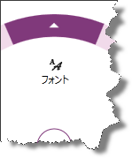

////

|metadata|
{
    "name": "xamradialmenu-configuring-list-items",
    "tags": ["How Do I","Layouts"],
    "controlName": ["xamRadialMenu"],
    "guid": "52edab6e-7dac-4248-942c-706b6791b90e",  
    "buildFlags": [],
    "createdOn": "2016-05-25T18:21:57.9113096Z"
}
|metadata|
////

= リスト項目の構成 (xamRadialMenu)

== トピックの概要

=== 目的

このトピックでは、 link:{ApiPlatform}controls.menus.xamradialmenu{ApiVersion}~infragistics.controls.menus.xamradialmenu.html[ _xamRadialMenu_  ]™ のリスト項目について説明します。

=== 前提条件

このトピックをより理解するために、以下のトピックを参照することをお勧めします。

[options="header", cols="a,a"]
|====
|トピック|目的

| link:xamradialmenu-features.html[xamRadialMenu の機能]
|このトピックでは、コントロールでサポートする機能を開発者の観点から説明します。

| link:xamradialmenu-visual-elements.html[xamRadialMenu の視覚要素]
|このトピックでは、コントロールの視覚要素の概要を紹介します。

| link:xamradialmenu-items-sub-items-configuration-overview.html[項目/サブ項目の構成 - 概要]
|このトピックでは、メニュー項目およびその共通構成プロパティの概要を説明します。

| link:xamradialmenu-configuring-button-items.html[ボタン項目の構成]
|このトピックでは、 _xamRadialMenu_ のボタン項目について説明します。

|====

=== このトピックの内容

このトピックは、以下のセクションで構成されます。

* <<_Ref378083732,リスト項目>>
* <<_Ref377994940,関連コンテンツ>>

[[_Ref378083732]]
== リスト項目

[[_Hlk368069110]]

=== 概要

_xamRadialMenu_   のリスト項目は `RadialMenuList` クラスによって表示され、 link:{ApiPlatform}controls.menus.xamradialmenu{ApiVersion}~infragistics.controls.menus.radialmenuitem_members.html[RadialMenuItem] クラスから拡張します。リスト項目の描画は、ヘッダー テキストとアイコンを持つボタン項目と同じです。唯一の違いはサブ項目の描画方法で、円配置で描画する代わりに垂直に矩形リストが描画されます。リスト項目は、他のラジアル メニューのサブ項目と同様に追加されます (link:{ApiPlatform}controls.menus.xamradialmenu{ApiVersion}~infragistics.controls.menus.radialmenuitem~items.html[Items] コレクションを使用する、または link:{ApiPlatform}controls.menus.xamradialmenu{ApiVersion}~infragistics.controls.menus.radialmenuitem~itemssource.html[ItemsSource] プロパティでバインドします)。

次のスクリーンショットは、ヘッダー テキスト、アイコンおよびサブ項目の垂直リストにアクセスする矢印を持つリスト項目を示しています。

次のスクリーンショットは、リスト項目の外部リングにある矢印をクリックした後に、表示される垂直リストを示しています。

image::images/xamRadialMenu_11.png[]

=== プロパティ設定

以下の表は、主な構成とそれを管理するプロパティ設定のマップを示します。

[options="header", cols="a,a,a"]
|====
|目的:|使用するプロパティ / コレクション / イベント:|操作:

|非バインド サブ項目のリストの編集
| link:{ApiPlatform}controls.menus.xamradialmenu{ApiVersion}~infragistics.controls.menus.radialmenuitem~items.html[Items]
|項目の追加または削除します。

|リストの項目へのバインド
| link:{ApiPlatform}controls.menus.xamradialmenu{ApiVersion}~infragistics.controls.menus.radialmenuitem~itemssource.html[ItemsSource]
|ソース リストにバインドします。

|データ項目の表示メンバーの設定
| link:{ApiPlatform}controls.menus.xamradialmenu{ApiVersion}~infragistics.controls.menus.radialmenulist~displaymemberpath.html[DisplayMemberPath]
|メンバーの名前を提供します。

|選択した項目のインデックスの設定 / 取得
| link:{ApiPlatform}controls.menus.xamradialmenu{ApiVersion}~infragistics.controls.menus.radialmenulist~selectedindex.html[SelectedIndex]
|値を設定または取得します。

|選択した項目の設定 / 取得
| link:{ApiPlatform}controls.menus.xamradialmenu{ApiVersion}~infragistics.controls.menus.radialmenulist~selecteditem.html[SelectedItem]
|選択した項目を設定または取得します。

|セクションの変更についての通知
| link:{ApiPlatform}controls.menus.xamradialmenu{ApiVersion}~infragistics.controls.menus.radialmenulist~selectedvaluechanged_ev.html[SelectedValueChanged]
|イベント ハンドラーにアタッチします。

|サブ項目のテンプレートの設定/取得
| link:{ApiPlatform}controls.menus.xamradialmenu{ApiVersion}~infragistics.controls.menus.radialmenulist~itemtemplate.html[ItemTemplate]
|サブ項目のテンプレートの設定または取得

|====

[[_Ref377994940]]
== 関連コンテンツ

このトピックの追加情報については、以下のトピックも合わせてご参照ください。

[options="header", cols="a,a"]
|====
|トピック|目的

| link:xamradialmenu-configuring-numeric-items.html[数値項目の構成]
|このトピックでは、 _xamRadialMenu_ の数値項目について説明します。

| link:xamradialmenu-configuring-color-items.html[色項目の構成]
|このトピックでは、 _xamRadialMenu_ の色項目について説明します。

|====
