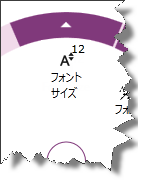

////

|metadata|
{
    "name": "xamradialmenu-configuring-numeric-items",
    "tags": ["How Do I","Layouts"],
    "controlName": ["xamRadialMenu"],
    "guid": "d750ee4f-2385-4850-bfa9-ffcb0a1923d3",  
    "buildFlags": [],
    "createdOn": "2016-05-25T18:21:57.8993085Z"
}
|metadata|
////

= 数値項目の構成 (xamRadialMenu)

== トピックの概要

=== 目的

このトピックでは、 link:{ApiPlatform}controls.menus.xamradialmenu{ApiVersion}~infragistics.controls.menus.xamradialmenu.html[ _xamRadialMenu_  ]™ の数値項目について説明します。

=== 前提条件

このトピックをより理解するために、以下のトピックを参照することをお勧めします。

[options="header", cols="a,a"]
|====
|トピック|目的

| link:xamradialmenu-features.html[xamRadialMenu の機能]
|このトピックでは、コントロールでサポートする機能を開発者の観点から説明します。

| link:xamradialmenu-visual-elements.html[xamRadialMenu の視覚要素]
|このトピックでは、コントロールの視覚要素の概要を紹介します。

| link:xamradialmenu-items-sub-items-configuration-overview.html[項目/サブ項目の構成 - 概要]
|このトピックでは、メニュー項目およびその共通構成プロパティの概要を説明します。

| link:xamradialmenu-configuring-button-items.html[ボタン項目の構成]
|このトピックでは、 _xamRadialMenu_ のボタン項目について説明します。

|====

=== このトピックの内容

このトピックは、以下のセクションで構成されます。

* <<_Ref378083760,数値項目の構成の概要>>
* <<_Ref378083732,数値項目>>
* <<_Ref378083740,数値ゲージ>>
* <<_Ref378083777,関連コンテンツ>>

[[_Ref378083760]]
== 数値項目の構成の概要

=== 数値項目の構成の概要表

_xamRadialMenu_   は、数値を確認し設定する数値項目をサポートします。詳細は、表の後に記載されています。

[options="header", cols="a,a,a"]
|====
|数値項目|説明|タイプによる表示

|<<_Ref378083732,数値項目>>
|
* ヘッダー テキストを表示します。 

* アイコンを表示します。 

* 関連付けられた数値を表示します。 

|
* link:{ApiPlatform}controls.menus.xamradialmenu{ApiVersion}~infragistics.controls.menus.radialmenunumericitem_members.html[RadialMenuNumericItem] 

|<<_Ref378083740,数値ゲージ>>
|
* 許容値を目盛りで表したスケールを表示します。 

* 現在の値を表示します。 

* 保留中の値を表示します。 

|
* link:{ApiPlatform}controls.menus.xamradialmenu{ApiVersion}~infragistics.controls.menus.radialmenunumericgauge_members.html[RadialMenuNumericGauge] 

|====

[[_Ref378083732]]
== 数値項目

[[_Hlk368069110]]

=== 概要

`RadialMenuNumericItem` クラスは、 _xamRadialMenu_   の数値アイテムを表示し、 link:{ApiPlatform}controls.menus.xamradialmenu{ApiVersion}~infragistics.controls.menus.radialmenuitem_members.html[RadialMenuItem] クラスから拡張します。ボタン項目が提供するヘッダー テキストやアイコンに加え、数値項目には関連付けられた値がアイコン内またはアイコン上に表示されます。

以下のスクリーンショットは、関連付けられた値 (12) がアイコン上に表示された数値項目を示します。

=== プロパティ設定

以下の表は、主な構成とそれを管理するプロパティ設定のマップを示します。

[options="header", cols="a,a,a"]
|====
|目的:|使用するプロパティ:|操作:

|項目に関連付けられた数値の設定 / 確認
| link:{ApiPlatform}controls.menus.xamradialmenu{ApiVersion}~infragistics.controls.menus.radialmenunumericitem~value.html[Value]
|値を設定または読み取ります。

|関連付けられた数値の変更についての通知
| link:{ApiPlatform}controls.menus.xamradialmenu{ApiVersion}~infragistics.controls.menus.radialmenunumericitem~valuechanged_ev.html[ValueChanged]
|イベント ハンドラーにアタッチします。

|====

[[_Ref378083740]]
== 数値ゲージ

=== 概要

`RadialMenuNumericGauge` クラスは、 _xamRadialMenu_   の数値ゲージを表示します。この項目は、ユーザーが選択できる値 (目盛り) のある数値ゲージを表示します。現在の値と保留中の値 (マウス カーソルがホバーしている値) を示す針もあります。

以下のスクリーンショットは、数値ゲージを示しています。

image::images/xamRadialMenu_06.png[]

[start=1]
. 目盛り
[start=2]
. 現在の値を示す針
[start=3]
. 保留中の値を示す針

=== プロパティ設定

以下の表は、主な構成とそれを管理するプロパティ設定のマップを示します。

[options="header", cols="a,a,a"]
|====
|目的:|使用するプロパティ:|操作:

|保留中の値の設定 / 取得
| link:{ApiPlatform}controls.menus.xamradialmenu{ApiVersion}~infragistics.controls.menus.radialmenunumericgauge~pendingvalue.html[PendingValue]
|double 型の値に設定します。

|関連付けられた保留中の値の変更についての通知
| link:{ApiPlatform}controls.menus.xamradialmenu{ApiVersion}~infragistics.controls.menus.radialmenunumericgauge~pendingvaluechanged_ev.html[PendingValueChanged]
|イベント ハンドラーにアタッチします。

|目盛りの設定 / 取得
| link:{ApiPlatform}controls.menus.xamradialmenu{ApiVersion}~infragistics.controls.menus.radialmenunumericgauge~ticks.html[Ticks]
|`DoubleCollection` 型の目盛り値を持つコレクションに設定します。

|現在の値の設定 / 取得
| link:{ApiPlatform}controls.menus.xamradialmenu{ApiVersion}~infragistics.controls.menus.radialmenunumericgauge~value.html[Value]
|double 型の値に設定します。

|関連付けられた数値の変更についての通知
| link:{ApiPlatform}controls.menus.xamradialmenu{ApiVersion}~infragistics.controls.menus.radialmenunumericgauge~valuechanged_ev.html[ValueChanged]
|イベント ハンドラーにアタッチします。

|====

[[_Ref378083777]]

== 関連コンテンツ

このトピックの追加情報については、以下のトピックも合わせてご参照ください。

[options="header", cols="a,a"]
|====
|トピック|目的

| link:xamradialmenu-configuring-color-items.html[色項目の構成]
|このトピックでは、 _xamRadialMenu_ の色項目について説明します。

| link:xamradialmenu-configuring-list-items.html[リスト項目の構成]
|このトピックでは、 _xamRadialMenu_ のリスト項目について説明します。

|====
