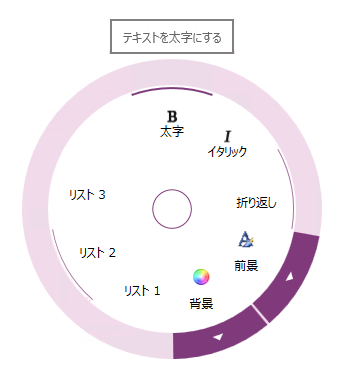

////

|metadata|
{
    "name": "xamradialmenu-configuring-tooltips",
    "tags": ["How Do I"],
    "controlName": ["xamRadialMenu"],
    "guid": "e3885410-c37c-4c43-8e27-87965a2b91ec",  
    "buildFlags": [],
    "createdOn": "2016-05-25T18:21:57.917313Z"
}
|metadata|
////

= ツールチップの構成 (xamRadialMenu)

== トピックの概要

=== 目的

このトピックでは、 link:{ApiPlatform}controls.menus.xamradialmenu{ApiVersion}~infragistics.controls.menus.xamradialmenu.html[ _xamRadialMenu_  ]™ 項目のツールチップを構成する方法を説明します。

=== 前提条件

このトピックをより理解するために、以下のトピックを参照することをお勧めします。

[options="header", cols="a,a"]
|====
|トピック|目的

| link:xamradialmenu-features.html[xamRadialMenu の機能]
|このトピックでは、コントロールでサポートする機能を開発者の観点から説明します。

| link:xamradialmenu-visual-elements.html[xamRadialMenu の視覚要素]
|このトピックでは、コントロールの視覚要素の概要を紹介します。

|====

=== このトピックの内容

このトピックは、以下のセクションで構成されます。

* <<_Ref378254351,はじめに>>
* <<_Ref378255630,ツールチップ構成の概要>>
* <<_Ref378255637,関連コンテンツ>>

[[_Ref378254351]]
== はじめに

=== ツールチップの概要

_XamRadialMenu_   ツールチップは、メニュー項目がホバーされたときにメニューの外側に表示される小さな視覚要素です。通常、ツールチップには`Tooltip`プロパティで指定できる便利な情報が含まれています。ツールチップのメッセージが指定されていない場合は、以下の表に示すようにメニュー項目のタイプに基づき解決されます。

[options="header", cols="a,a"]
|====
|メニュー項目のタイプ|デフォルト ツールチップのコンテンツ

|ボタン項目、数値項目、色項目、リスト項目
| link:{ApiPlatform}controls.menus.xamradialmenu{ApiVersion}~infragistics.controls.menus.radialmenuitem~header.html[Header] プロパティのコンテンツ (要素ではありません)。

|ゲージ項目
|保留中の値

|カラーウェル
|計算されたカラー名

|====

以下のスクリーンショットは、 _xamRadialMenu_   のツールチップを示します。

[[_Ref378255630]]
== ツールチップ構成の概要

=== ツールチップ構成の概要表

以下の表は、 _xamRadialMenu_   ツールチップで構成できる主要な要素を簡単に説明しています。

[options="header", cols="a,a,a"]
|====
|構成可能な項目|詳細|プロパティ

|ツールチップ
|項目ツールチップを有効化または無効化します。
| link:{ApiPlatform}controls.menus.xamradialmenu{ApiVersion}~infragistics.controls.menus.radialmenuitembase~istooltipenabled.html[IsToolTipEnabled]

|項目ツールチップのコンテンツ
|項目ツールチップのコンテンツを設定または取得します。
|`Tooltip`

|項目ツールチップのテンプレート
|_xamRadialMenu_ ツールチップに使用する設定可能なテンプレート 

注: 

[NOTE] 

==== 

このオブジェクトの `DataContext` は、メニュー項目を提供する link:{ApiPlatform}controls.menus.xamradialmenu{ApiVersion}~infragistics.controls.menus.radialmenutooltipcontext.html[RadialMenuTooltipContext] インスタンスになります。 

====
| link:{ApiPlatform}controls.menus.xamradialmenu{ApiVersion}~infragistics.controls.menus.radialmenuitembase~tooltiptemplate.html[TooltipTemplate]

|====

[[_Ref378255637]]
== 関連コンテンツ

=== トピック

このトピックの追加情報については、以下のトピックも合わせてご参照ください。

[options="header", cols="a,a"]
|====
|トピック|目的

| link:xamradialmenu-configuration-overview.html[xamRadialMenu 構成の概要]
|このトピックでは、 _xamRadialMenu_ コントロールを構成する方法を説明します。

| link:xamradialmenu-configuring-center-button.html[中央ボタンの構成]
|このトピックでは、中央ボタンを構成する方法を説明します。

| link:xamradialmenu-configuring-key-tips.html[キー チップの構成]
|このトピックでは、項目のキー チップを構成する方法を説明します。

|====