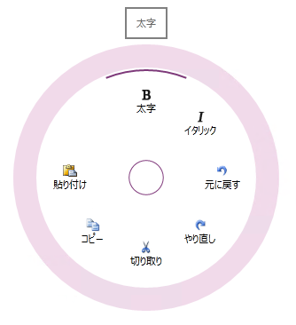

////

|metadata|
{
    "name": "xamradialmenu-features",
    "tags": ["Getting Started"],
    "controlName": ["xamRadialMenu"],
    "guid": "e3b29c3f-8499-4d83-bf9f-5fe221602444",  
    "buildFlags": [],
    "createdOn": "2016-05-25T18:21:57.8203069Z"
}
|metadata|
////

= xamRadialMenu の機能

== トピックの概要

=== 目的

このトピックでは、 link:{ApiPlatform}controls.menus.xamradialmenu{ApiVersion}~infragistics.controls.menus.xamradialmenu.html[ _xamRadialMenu_  ]™ コントロールでサポートする機能を開発者の観点から説明します。

=== このトピックの内容

このトピックは、以下のセクションで構成されます。

* <<_Ref377629345,はじめに>>
* <<_Ref377629353,主要機能>>
* <<_Ref377629366,関連コンテンツ>>

[[_Ref377629345]]
== はじめに

=== XamRadialMenu の概要

_xamRadialMenu_™ コントロールは、中央ボタンの周りに項目を表示するコンテキスト メニューです。項目を円形に配置することで項目をすばやく選択できます。各項目は中央に対して均等に配置されます。_xamRadialMenu_   は、数値、色値、または操作を実行する項目タイプをサポートします。サブ項目もサポートします。

デフォルトで、 _xamRadialMenu_   の中央ボタンのみを表示します。ユーザーが中央ボタンをクリックすると、 _xamRadialMenu_   が開き、ルート レベルのメニュー項目を表示します。ルート レベル項目が表示されたときに中央ボタンをクリックすると、 _xamRadialMenu_   が閉じます。サブ項目に移動するには、外部リングの矢印をクリックし対応するサブ項目グループを表示します。サブ項目グループが表示されたときに中央ボタンをクリックすると、以前のレベルの項目を表示します。

以下のスクリーンショットは、「太字」の項目の上をホバーするマウスと、7つの項目がある  _xamRadialMenu_   が開いた状態を示しています。

[[_Ref377629353]]
== 主要機能

=== 新機能 / 主要機能の概要表

以下の表で、 _xamRadialMenu_   コントロールの主要な機能を簡単に説明します。その他の詳細情報については、以下の要点チャートの後を参照してください。

[options="header", cols="a,a"]
|====
|機能|説明

|<<_Ref377569385,ボタン項目>>
|操作の呼び出しに使用されるプレーンなメニュー項目

|<<_Ref377569394,色項目>>
|色が選択できる色項目

|<<_Ref377569402,数値項目>>
|数値を選択できる数値項目

|<<_Ref377569415,リスト項目>>
|リストから項目を選択できるリスト項目

|<<_Ref377569468,サブ項目>>
|_XamRadialMenu の_ 項目は、複数のレベルにネストできます。

|<<_Ref377569477,ツールチップ>>
|各項目は、項目の上にホバーすると表示されるツールチップをサポートします。

|<<_Ref377569489,キー チップ>>
|各項目は、迅速な起動に使用するキーボードのショートカットをサポートします。

|<<_Ref377569497,メニュー項目の配置>>
|メニュー項目の配置をカスタマイズします。

|====

[[_Ref377569385]]

=== ボタン項目

ボタン項目をクリックして動作を実行できます。また、メニュー項目は、チェックボックス項目 (項目領域の最外部で、円弧によって選択/非選択の状態を表示) またはラジオ ボタン項目 (選択された状態は、ラジオ ボタン グループの他の項目に対し相互に排他的) として動作するように構成できます。

==== 関連トピック:

* link:xamradialmenu-configuring-button-items.html[ボタン項目の構成]

[[_Ref377569394]]

=== 色項目

以下の 2 種類の色項目があります。

* 色項目 - ボタン項目に類似していますが、テキスト、画像および選択された色を表示する長方形を含みます。
* カラーウェル - 項目全体の領域で選択された色を表示します

==== 関連トピック:

* link:xamradialmenu-configuring-color-items.html[色項目の構成]

[[_Ref377569402]]

=== 数値項目

以下の 2 種類の数値項目があります。

* 数値項目 - ボタン項目に類似し、テキスト、画像および現在の値を示す専用の数値領域を含みます。
* 数値ゲージ - 許可される数値を示す目盛りと現在の値と保留中の値を示す針を表示します。

==== 関連トピック:

* link:xamradialmenu-configuring-numeric-items.html[数値項目の構成]

[[_Ref377569415]]

=== リスト項目

_xamRadialMenu の_  リスト項目は、ボタン項目に類似していますが、サブ項目に移動すると、垂直リストで描画されます。

==== 関連トピック:

* link:xamradialmenu-configuring-list-items.html[リスト項目の構成]

[[_Ref377569468]]

=== サブ項目

_xamRadialMenu_   は項目を円形に表示するため、一般的に、表示される数は限定されます (通常、8 スライスまたはウェッジ)。より多くのオプションを選択するには、項目をグループごとに整理します。

==== 関連トピック:

* link:xamradialmenu-items-sub-items-configuration-overview.html[項目/サブ項目の構成 - 概要]

[[_Ref377569477]]

=== ツールチップ

すべての  _xamRadialMenu の_  項目は、項目の上にホバーすると表示されるツールチップをサポートします。

==== 関連トピック:

* link:xamradialmenu-configuring-tooltips.html[ツールチップの構成]

[[_Ref377569489]]

=== キー チップ

_xamRadialMenu_   の各項目は、キー チップの定義をサポートします。それにより、ユーザーはキーボードを使用して、すぐに項目をアクティブ化できます。

==== 関連トピック:

* link:xamradialmenu-configuring-key-tips.html[キー チップの構成]

[[_Ref377569497]]

=== メニュー項目の配置

すべての  _xamRadialMenu_   項目をデフォルトで表示する順序は、コードで指定されますが、異なる順序を明示的に設定することができます。

==== 関連トピック:

* link:xamradialmenu-items-sub-items-configuration-overview.html[項目/サブ項目構成の概要]

[[_Ref377629366]]
== 関連コンテンツ

=== トピック

このトピックの追加情報については、以下のトピックも合わせてご参照ください。

[options="header", cols="a,a"]
|====
|トピック|目的

| link:xamradialmenu-visual-elements.html[xamRadialMenu の視覚要素]
|このトピックでは、コントロールの視覚要素についての概要を紹介します。

| link:xamradialmenu-user-interaction.html[ユーザー相互作用と操作性]
|このトピックでは、ユーザーが実行できる操作を紹介します。

|====