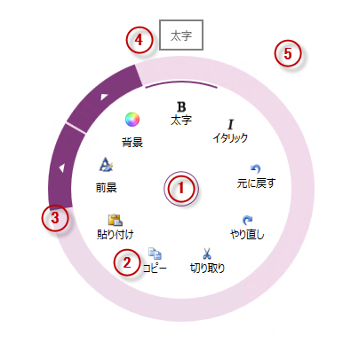
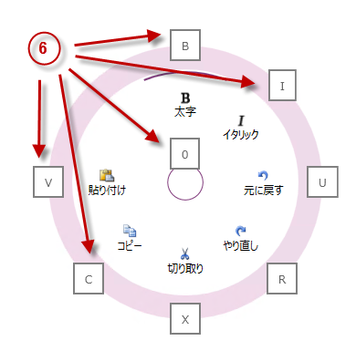

////

|metadata|
{
    "name": "xamradialmenu-visual-elements",
    "tags": ["Getting Started"],
    "controlName": ["xamRadialMenu"],
    "guid": "2e6f576b-8b05-4d5c-9ac7-4be18fdeddcd",  
    "buildFlags": [],
    "createdOn": "2016-05-25T18:21:57.8263068Z"
}
|metadata|
////

= xamRadialMenu の視覚要素

== トピックの概要

=== 目的

このトピックでは、 link:{ApiPlatform}controls.menus.xamradialmenu{ApiVersion}~infragistics.controls.menus.xamradialmenu.html[ _xamRadialMenu_  ]™ コントロールの視覚要素の概要を紹介します。

=== 前提条件

このトピックを理解するためには、以下のトピックを理解しておく必要があります。

[options="header", cols="a,a"]
|====
|トピック|目的

| link:xamradialmenu-features.html[xamRadialMenu の機能]
|このトピックでは、コントロールでサポートする機能を開発者の観点から説明します。

|====

=== このトピックの内容

このトピックは、以下のセクションで構成されます。

* <<_Ref377646161,xamRadialMenu コントロールの視覚要素と関連プロパティ>>
* <<_Ref377646169,関連コンテンツ>>

[[_Ref377646161]]
== _xamRadialMenu_  コントロールの視覚要素と関連プロパティ

=== ビジュアル要素の概要

以下のスクリーンショットは、 _xamRadialMenu_   コントロールの視覚要素を示しています。設定可能な要素を図の後に示します。

*構成可能な視覚要素:*

[start=1]
. 中央ボタン - xamRadialMenu のオープンおよびクローズ、または前のレベルのメニュー項目にアクセスできます。
[start=2]
. 項目領域 - 現在のレベルのメニュー項目を表示します。
[start=3]
. 外部リング - xamRadialMenu の最外部で、サブ項目へのアクセスの矢印が含まれる場合があります。
[start=4]
. ツールチップ - 現在ホバー中のメニュー項目を示します。
[start=5]
. 選択円弧 - 現在選択されているメニュー項目およびそのチェックボックスの状態が強調表示されます。
[start=6]
. キー チップ - 各メニュー項目をアクティブ化するキーボードのショートカットを表示します。

=== 視覚要素と関連プロパティ

以下の表は、 _xamRadialMenu_   コントロールとそれらを構成するプロパティの視覚要素をマップします。

[options="header", cols="a,a"]
|====
|視覚要素|構成できる主な項目

|中央ボタン
| link:{ApiPlatform}controls.menus.xamradialmenu{ApiVersion}~infragistics.controls.menus.xamradialmenu~centerbuttonbacktemplate.html[CenterButtonBackTemplate] 

link:{ApiPlatform}controls.menus.xamradialmenu{ApiVersion}~infragistics.controls.menus.xamradialmenu~centerbuttoncontent.html[CenterButtonContent] 

link:{ApiPlatform}controls.menus.xamradialmenu{ApiVersion}~infragistics.controls.menus.xamradialmenu~centerbuttonfill.html[CenterButtonFill] 

link:{ApiPlatform}controls.menus.xamradialmenu{ApiVersion}~infragistics.controls.menus.xamradialmenu~centerbuttonkeytip.html[CenterButtonKeyTip] 

link:{ApiPlatform}controls.menus.xamradialmenu{ApiVersion}~infragistics.controls.menus.xamradialmenu~centerbuttonstroke.html[CenterButtonStroke]

|項目領域
| link:{ApiPlatform}controls.menus.xamradialmenu{ApiVersion}~infragistics.controls.menus.xamradialmenu~items.html[Items] 

link:{ApiPlatform}controls.menus.xamradialmenu{ApiVersion}~infragistics.controls.menus.xamradialmenu~itemssource.html[ItemsSource] 

link:{ApiPlatform}controls.menus.xamradialmenu{ApiVersion}~infragistics.controls.menus.xamradialmenu~minwedgecount.html[MinWedgeCount] 

link:{ApiPlatform}controls.menus.xamradialmenu{ApiVersion}~infragistics.controls.menus.xamradialmenu~rotationindegrees.html[RotationInDegrees] 

link:{ApiPlatform}controls.menus.xamradialmenu{ApiVersion}~infragistics.controls.menus.radialmenuitembase~wedgeindex.html[WedgeIndex] 

link:{ApiPlatform}controls.menus.xamradialmenu{ApiVersion}~infragistics.controls.menus.radialmenuitembase~wedgespan.html[WedgeSpan]

|外部リング
| link:{ApiPlatform}controls.menus.xamradialmenu{ApiVersion}~infragistics.controls.menus.xamradialmenu~outerringfill.html[OuterRingFill] 

link:{ApiPlatform}controls.menus.xamradialmenu{ApiVersion}~infragistics.controls.menus.xamradialmenu~outerringstroke.html[OuterRingStroke] 

link:{ApiPlatform}controls.menus.xamradialmenu{ApiVersion}~infragistics.controls.menus.xamradialmenu~outerringthickness.html[OuterRingThickness] 

link:{ApiPlatform}controls.menus.xamradialmenu{ApiVersion}~infragistics.controls.menus.xamradialmenu~outerringstrokethickness.html[OuterRingStrokeThickness]

|ツールチップ
| link:{ApiPlatform}controls.menus.xamradialmenu{ApiVersion}~infragistics.controls.menus.radialmenuitembase~istooltipenabled.html[IsToolTipEnabled] 

`ToolTip` 

link:{ApiPlatform}controls.menus.xamradialmenu{ApiVersion}~infragistics.controls.menus.radialmenuitembase~tooltiptemplate.html[ToolTipTemplate]

|選択円弧
| link:{ApiPlatform}controls.menus.xamradialmenu{ApiVersion}~infragistics.controls.menus.radialmenuitem~ischecked.html[IsChecked]

|キー チップ
| link:{ApiPlatform}controls.menus.xamradialmenu{ApiVersion}~infragistics.controls.menus.xamradialmenu~centerbuttonkeytip.html[CenterButtonKeyTip] 

link:{ApiPlatform}controls.menus.xamradialmenu{ApiVersion}~infragistics.controls.menus.radialmenuitem~keytip.html[KeyTip] 

link:{ApiPlatform}controls.menus.xamradialmenu{ApiVersion}~infragistics.controls.menus.xamradialmenu~keytiptemplate.html[KeyTipTemplate]

|====

[[_Ref377646169]]
== 関連コンテンツ

=== トピック

以下のトピックでは、このトピックに関連する追加情報を提供しています。

[options="header", cols="a,a"]
|====
|トピック|目的

| link:xamradialmenu-user-interaction.html[ユーザー相互作用と操作性]
|このトピックでは、ユーザーが実行できる操作を紹介します。

|====