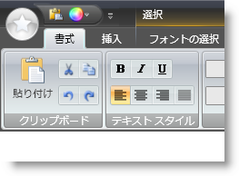
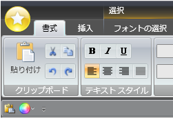
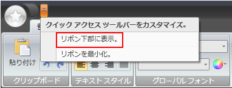
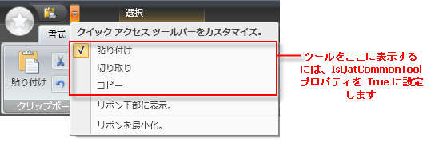
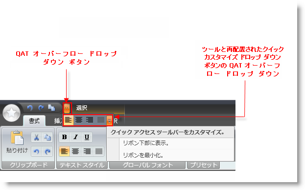

////

|metadata|
{
    "name": "xamribbon-about-quickaccesstoolbar",
    "controlName": ["xamRibbon"],
    "tags": ["Getting Started","How Do I"],
    "guid": "{E3ADB1B9-3352-483D-8B20-6239D9D82550}",  
    "buildFlags": [],
    "createdOn": "2012-01-30T19:39:54.0841699Z"
}
|metadata|
////

= QuickAccessToolbar について

== 概要

Quick Access Toolbar (QAT) は、どのタブが Ribbon で選択されるのかにかかわらず、ユーザーが常に使用できるツールを含む xamRibbon コントロール内の領域です。さらに、これはエンド ユーザーによってカスタマイズできる xamRibbon の領域に限定されます。

QAT は Ribbon の上部および下部に表示することができます。

QAT の場所を変更するにはいくつかの方法があります。

* XamRibbon の QuickAccessToolbarLocation プロパティを設定することでプログラムで (コード ビハインド または XAML) 
* XamRibbon の ToggleQatLocation RoutedCommand を使用することでプログラムで (コード ビハインド または XAML) 
* UI および QAT の QuickCustomizeMenu から

== プログラムで QAT にアクセス

xamRibbon の QuickAccessToolbar プロパティを使用して QAT にプログラム (コード ビハインド または XAML) でアクセスできます。

*XAML の場合:*

----
<igRibbon:XamRibbon.QuickAccessToolbar>
	<igRibbon:QuickAccessToolbar>
		<igRibbon:QatPlaceholderTool TargetId="tbtool1"/>
		<igRibbon:QatPlaceholderTool TargetId="Tab1_Group1" TargetType="RibbonGroup"/>
	</igRibbon:QuickAccessToolbar>
</igRibbon:XamRibbon.QuickAccessToolbar>
----

[NOTE]
====
*注:* QuickAccessToolbar のインスタンスを作成して、このプロパティに指定する必要はありません (xamRibbon でユーザー用に自動的に作成されるインスタンス)。
====

== ツールを QAT に追加

Ribbon の他の場所で定義されたツールへのクイック アクセスを提供する「常に使用可能」な領域としての役割を満たすには、QAT は Ribbon の他の場所で実際に定義されたツールのクローンされたコピーを「一時的」に含んで表示するように設計されています。「他の場所」は以下が可能です。

* RibbonGroup (RibbonGroup に直接、または RibbonGroup に含まれる ToolVerticalWrapPanel または ToolHorizontalWrapPanel 内)。これは Ribbon のツールの最も一般的な場所です。
* Ribbon のどこかにあるメニュー ツール上。
* アプリケーション メニューのフッター ツールバー上。
* XamRibbon の ToolsNotInRibbon コレクションの中。

これらの場所で定義されたツールをいくつかの方法で QAT に追加できますが (つまり、クローンおよびコピー)、どの方法が使用されるかに関係なく、最終的には QAT となって、QatPlaceholderTool と呼ばれる特別なツール内に収められます。ツールが QAT に追加できる方法は以下のとおりです。

* Ribbon のどこかにあるツールを右クリックし (上に定義された有効な場所)、[クイック アクセス ツールバーに追加] を選択します。シーンの背後で以下が発生します。

** ツールがクローンされます (プロパティおよびイベント ハンドラ)。
** オリジナルのツール インスタンスにバインドされる重要な状態に関連するプロパティ。
** QatPlaceholderTool が作成され、その TargetId プロパティが追加されるツールの ID に設定されます。
** QatPlaceholderTool が QAT に追加されます。

* QatPlaceholderTool を作成し (XAML またはコードでプログラム的に)、その TargetId プロパティを追加されるツールの ID に設定し、QatPlaceholderTool を QAT Items コレクションに追加します。

*XAML の場合:*

----
<igRibbon:XamRibbon.QuickAccessToolbar>
	<igRibbon:QuickAccessToolbar>
		<igRibbon:QatPlaceholderTool TargetId="tbtool1"/>
	</igRibbon:QuickAccessToolbar>
</igRibbon:XamRibbon.QuickAccessToolbar>
----

* QAT の QuickCustomizeMenu をドロップダウンして、メニューの [クイック アクセス ツールバーをカスタマイズ] セクションでツールを選択します。これらのツールのいずれかをチェック/チェック解除すると、QAT からツールが追加/削除されます。

[NOTE]
====
*注:* QAT の QuickCustomizeMenu でこのリストにツールを追加するには、ツールの IsQatCommonTool プロパティを True に設定します。
====

== クイック アクセス ツールバーに Ribbon Groups を追加

RibbonGroups を QAT に追加することもできます。RibbonGroup を QAT に追加するには 2 つの方法があります。

* RibbonGroup を右クリックし、[クイック アクセス ツールバーに追加] を選択します。シーンの背後で以下が発生します。

** Ribbon Group および Ribbon Group に含まれるすべてのツールがクローンされます (すべてのツール プロパティおよびイベント ハンドラを含む)。
** 重要な状態に関連するプロパティは、オリジナルの Ribbon Group インスタンスのオリジナルのツール インスタンスにバインドされます。
** QatPlaceholderTool が作成され、その TargetId プロパティが追加される RibbonGroup の ID に設定され、そして TargetType プロパティが "RibbonGroup" に設定されます。
** QatPlaceholderTool が QAT に追加されます。

* QatPlaceholderTool を作成し (XAML またはコードでプログラム的に)、その TargetId プロパティを追加される RibbonGrop の ID に設定します。その TargetType プロパティを "RibbonGroup" に設定します。QatPlaceholderTool を QAT Items コレクションに追加します。

*XAML の場合:*

----
<igRibbon:XamRibbon.QuickAccessToolbar>
	<igRibbon:QuickAccessToolbar>
		<igRibbon:QatPlaceholderTool TargetId="Tab1_Group1" TargetType="RibbonGroup"/>
	</igRibbon:QuickAccessToolbar>
</igRibbon:XamRibbon.QuickAccessToolbar>
----

== クイック アクセス ツールバーのサイズ変更

xamRibbon コントロールが水平方向に小さくサイズ変更され、QAT に使用できるスペースが QAT で必要となるスペースよりも少なくなると、ツールは自動的に QAT から QAT オーバーフロー ドロップダウン リストにバンプされます。

この機能を有効にするためにコーディングを行う必要はなく、この動作を変更するための方法はありません。

== クイック アクセス ツールバーのツールの動作

QAT に配置されたツールは、重要な状態に関連するプロパティがオリジナルのインスタンスにバインドされたオリジナルのツール インスタンスのクローンであるので、オリジナルのツールのように動作し (ほぼすべてについて)、オリジナルのツールと同期を保持します。

例外がありますが -- ツールの QAT コピーのすべての状態に関連するプロパティがオリジナルのツール インスタンスにある対応するプロパティにバインドされるわけではありません。これが適切でないケースがいくつかあります。

自動的にバインドされ、同期が保持される状態に関連するプロパティの例：

* トグル ボタン ツールの IsChecked プロパティ -- いずれかのボタンがチェックされると、他のボタンもチェックされます。
* Text Editor ツールの Value プロパティ -- テキストがツールのひとつのインスタンスで入力されると、他のインスタンスは修正されたテキストを表示します。

自動的にバインドされず、同期が保持される状態に関連するプロパティの例：

* Button ツールの IsPressed プロパティ。
* Text Editor ツールの IsInEditMode プロパティ。

前述した状態プロパティの同期の結果、QAT に存在するツールによって起動される状態に関連するイベントが 2 度 (1 度は QAT インスタンスでオリジナル インスタンスでもう 1 度) 起動されることに注意してください。これは、状態プロパティが前述の自動バインディングに基づいて両方のインスタンスで実際に変更されるからです。2 つのイベントとそれが発生したインスタンスを区別する支援をするため、2 つの静的メソッドが XamRibbon で提供されます：

* パブリック静的 GetOriginalTool (FrameworkElement ツール)  -- 'tool' がクローンされたオリジナル ツール インスタンスを返すか、オリジナルのツール インスタンスの場合は 'tool'。
* パブリック静的 GetToolInEditMode (ValueEditor valueEditor)  -- 現在編集モードである指定されたツールの論理インスタンスを返し、それ以外は null (Nothing) を返します。

== 関連トピック

link:xamribbon-add-a-tool-or-ribbongroup-to-the-quick-access-toolbar.html[クイック アクセス ツールバーにツールまたは RibbonGroup を追加]

link:xamribbon-adding-and-removing-common-tools.html[共通のツールを追加および削除]