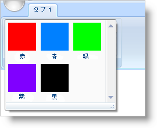

////

|metadata|
{
    "name": "xamribbon-add-a-gallerytool-to-a-ribbongroup",
    "controlName": ["xamRibbon"],
    "tags": ["Data Presentation","Getting Started","How Do I","Layouts","Navigation","Selection"],
    "guid": "{FE33C392-AA3F-4D4E-AE0F-83E8E3E02059}",  
    "buildFlags": [],
    "createdOn": "2012-01-30T19:39:54.1051741Z"
}
|metadata|
////

= GalleryTool を RibbonGroup に追加

link:{ApiPlatform}ribbon{ApiVersion}~infragistics.windows.ribbon.gallerytool.html[GalleryTool] は、エンド ユーザーに視覚的に魅力的な方法で項目を表示できる特別なドロップダウンリストです。テキスト説明が付いた項目の単純なリストの代わりに、GalleryTool は項目が実行するアプリケーション固有のタスクを説明するためのテキストが付いた画像を表示できます。GalleryTool の視覚的な魅力に加えて、GalleryTool は Items コレクションに追加する項目のプレビューを表示できます。これによって、エンドユーザーは単にプレビューを見ることで GalleryTool が提供するオプションを識別できます。プレビュー領域にエンドユーザーが希望するオプションが表示されなければ、ドロップダウン矢印をクリックして、使用できるすべてのオプションのリストを表示するか、ドロップダウン矢印の右上のスクロール矢印のつまみをクリックして前の行をスクロールできます。

GalleryTool を link:{ApiPlatform}ribbon{ApiVersion}~infragistics.windows.ribbon.ribbongroup.html[RibbonGroup] に直接追加できません。link:{ApiPlatform}ribbon{ApiVersion}~infragistics.windows.ribbon.menutool.html[MenuTool] に追加する必要があります。ただし、GalleryTool のひとつのインスタンスを MenuTool の Items コレクションに追加することだけが可能です。GalleryItems のプレビューを表示したい場合、MenuTool の link:{ApiPlatform}ribbon{ApiVersion}~infragistics.windows.ribbon.menutool~shoulddisplaygallerypreview.html[ShouldDisplayGalleryPreview] プロパティを True に設定できます。

GalleryTool は、 link:{ApiPlatform}ribbon{ApiVersion}~infragistics.windows.ribbon.gallerytool~itemsettings.html[GalleryItemSettings] オブジェクトのインスタンスに設定できる link:{ApiPlatform}ribbon{ApiVersion}~infragistics.windows.ribbon.galleryitemsettings.html[ItemSettings] プロパティを公開します。GalleryTool レベルで指定する設定は、GalleryTool のすべての GalleryItems の動作を制御します。GalleryItemSettings オブジェクトを個々の link:{ApiPlatform}ribbon{ApiVersion}~infragistics.windows.ribbon.galleryitem.html[GalleryItem] に追加することで、GalleryTool レベルでユーザーが設定した設定をオーバーライドできます。

以下のコード例は、GalleryTool を RibbonGroup に追加する方法を示します。

image::images/xamRibbon_Add_a_GalleryItem_to_a_GalleryTool.png[gallerytool を xamribbon 内の ribbongroup に追加]

*XAML の場合:*

----
...
<igRibbon:MenuTool Name="menuTool1" ShouldDisplayGalleryPreview="True">
        <igRibbon:GalleryTool Id="galleryTool1" ItemBehavior="StateButton">
        <!--TODO: GalleryItems を GalleryTool に追加します -->
        </igRibbon:GalleryTool>
</igRibbon:MenuTool>
...
----

*Visual Basic の場合:*

----
Imports Infragistics.Windows.Ribbon
...
Dim galleryTool1 as New GalleryTool()
galleryTool1.Id = "galleryTool1"
galleryTool1.ItemBehavior = GalleryToolItemBehavior.StateButton
Me.menuTool1.Items.Add(galleryTool1)
'TODO: GalleryItems を GalleryTool に追加します
…
----

*C# の場合:*

----
using Infragistics.Windows.Ribbon;
...
GalleryTool galleryTool1 = new GalleryTool();
galleryTool1.Id = "galleryTool1";
galleryTool1.ItemBehavior = GalleryToolItemBehavior.StateButton;
this.menuTool1.Items.Add(galleryTool1);
//TODO: GalleryItems を GalleryTool に追加します
...
----

== 関連トピック

link:xamribbon-add-a-gallerytool-to-a-ribbongroup.html[GalleryTool を RibbonGroup に追加]

link:xamribbon-create-groups-of-galleryitems.html[GalleryItems のグループを作成]

link:xamribbon-creating-a-live-preview.html[ライブ プレビューを作成]