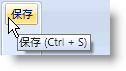

////

|metadata|
{
    "name": "xamribbon-add-a-simple-tooltip-to-a-ribbon-tool",
    "controlName": ["xamRibbon"],
    "tags": ["Getting Started","How Do I","Styling"],
    "guid": "{CD900D07-9376-4A2F-901C-E0E070E7197B}",  
    "buildFlags": [],
    "createdOn": "2012-01-30T19:39:54.1101751Z"
}
|metadata|
////

= 単純なツールチップをリボン ツールに追加

エンドユーザーに単純なツールチップを表示するために Microsoft® Windows® Presentation Foundation ToolTip コントロールを使用できます。このタイプのツールチップは、Microsoft Word™ の保存ボタンにあるツールチップに似ています。ただし、ToolTip コントロールのスタイルと xamRibbon™ コントロールのテーマの整合性を保つためには、ToolTip コントロールの Style プロパティを xamRibbon によって公開されている静的な link:{ApiPlatform}ribbon{ApiVersion}~infragistics.windows.ribbon.xamribbon~tooltipstylekey.html[ToolTipStyleKey] プロパティに設定します。

以下のコード例は、単純なツールチップを xamRibbon ツールに追加する方法を示します。

*XAML の場合:*

----
...
<igRibbon:ButtonTool Caption="Save" Name="btnToolSave">
    <igRibbon:ButtonTool.ToolTip>
        <ToolTip 
            Content="Save (Ctrl + S)" 
            Style="{DynamicResource {x:Static igRibbon:XamRibbon.ToolTipStyleKey}}" />
    </igRibbon:ButtonTool.ToolTip>
</igRibbon:ButtonTool>
...
----

*Visual Basic の場合:*

----
Imports Infragistics.Windows.Ribbon
...
Dim saveBtnToolTip As New ToolTip With {.Content = "Save (Ctrl + S)"}
saveBtnToolTip.SetResourceReference(StyleProperty, XamRibbon.ToolTipStyleKey)
Me.btnToolSave.ToolTip = saveBtnToolTip
...
----

*C# の場合:*

----
using Infragistics.Windows.Ribbon;
...
ToolTip saveBtnToolTip = new ToolTip { Content = "Save (Ctrl + S)" };
saveBtnToolTip.SetResourceReference(StyleProperty, XamRibbon.ToolTipStyleKey);
this.btnToolSave.ToolTip = saveBtnToolTip;
...
----

== 関連トピック

link:xamribbon-about-xamribbonscreentip.html[xamRibbonScreenTip について]

link:xamribbon-add-a-xamribbonscreentip-to-a-ribbon-tool.html[xamRibbonScreenTip を Ribbon ツールに追加]