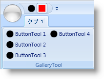

////

|metadata|
{
    "name": "xamribbon-add-a-tool-or-ribbongroup-to-the-quick-access-toolbar",
    "controlName": ["xamRibbon"],
    "tags": ["Data Presentation","Grouping","How Do I","Layouts","Navigation","Selection"],
    "guid": "{41909644-14A8-423C-B427-FBFBDAEF37A5}",  
    "buildFlags": [],
    "createdOn": "2012-01-30T19:39:54.1181767Z"
}
|metadata|
////

= クイック アクセス ツールバーにツールまたは RibbonGroup を追加

Quick Access Toolbar (QAT) は、プレファレンスに基づきランタイムにエンド ユーザーがカスタマイズできるツールバーです。QAT へのツールの追加は、エンドユーザーが簡単に使用できる直感的かつコンテキスト依存のメニュー駆動型プロセスです。ユーザーカスタマイズと共に、アプリケーションを初めて実行する時に QAT にツールのデフォルト設定を示したい場合があります。Extensible Application Markup Language (XAML) で宣言的またはコードビハインドで手続き的にこの要件を実装できます。

特に、リボン グループやアプリケーション メニューにツールを追加することに馴染みのある人にとっては、QAT にリボン ツールを追加することは最初は奇妙に見えるかもしれません。リボン ツールを QAT の Items コレクションに直接追加することはできません。QAT の Items コレクションに追加できるオブジェクトの唯一のタイプは、 link:{ApiPlatform}ribbon{ApiVersion}~infragistics.windows.ribbon.qatplaceholdertool.html[QatPlaceholderTool] です。ツールの名前が意味するように、QatPlaceholderTool は他のリボン ツールやグループのプレースホルダに過ぎません。既存の Ribbon ツール ID に QatPlaceholderTool の link:{ApiPlatform}ribbon{ApiVersion}~infragistics.windows.ribbon.qatplaceholdertool~targetid.html[TargetId] プロパティを設定すれば、リボンツールのクローンが QAT に表示されます。リボン グループを QAT に追加したい場合、QatPlaceholderTool の TargetId プロパティに加えて、 link:{ApiPlatform}ribbon{ApiVersion}~infragistics.windows.ribbon.qatplaceholdertool~targettype.html[TargetType] プロパティを 'RibbonGroup' に設定する必要があります。リボン ツールを QAT に追加する時に TargetType プロパティを明示的に設定する必要がなかったことに気づいたと思います。これは、設定しなければ TargetType プロパティが 'Tool' のデフォルト値を使用するからです。

以下のコード例は、ツールおよびリボン グループを QAT に追加する方法を示します。コード例は、Id プロパティが 'Tab1_Group1' に設定された link:{ApiPlatform}ribbon{ApiVersion}~infragistics.windows.ribbon.ribbongroup.html[RibbonGroup] のインスタンスと、Id プロパティが 'btnToolBold' に設定された link:{ApiPlatform}ribbon{ApiVersion}~infragistics.windows.ribbon.buttontool.html[ButtonTool] のインスタンスがあることを前提とします。

*XAML の場合:*

----
...
<igRibbon:QuickAccessToolbar>
    <igRibbon:QatPlaceholderTool TargetId="btnToolBold" />
    <igRibbon:QatPlaceholderTool TargetId="Tab1_Group1" TargetType="RibbonGroup" />
</igRibbon:QuickAccessToolbar>
...
----

*Visual Basic の場合:*

----
Imports Infragistics.Windows.Ribbon
...
Dim btnBoldPH As New QatPlaceholderTool("btnBold") 
'RibbonGroup を QAT に追加する必要がある場合、TargetType を RibbonGroup に設定する必要があります。
Dim tab1_group1PH As New QatPlaceholderTool("Tab1_Group1", QatPlaceholderToolType.RibbonGroup) 
'xamRibbon1 を xamRibbon のインスタンス変数で置き換えます。
Me.xamRibbon1.QuickAccessToolbar.Items.Add(btnBoldPH) 
Me.xamRibbon1.QuickAccessToolbar.Items.Add(tab1_group1PH)
...
----

*C# の場合:*

----
using Infragistics.Windows.Ribbon;
...
QatPlaceholderTool btnBoldPH = new QatPlaceholderTool("btnBold");
//RibbonGroup を QAT に追加する必要がある場合、TargetType を RibbonGroup に設定する必要があります。
QatPlaceholderTool tab1_group1PH = new QatPlaceholderTool("Tab1_Group1", QatPlaceholderToolType.RibbonGroup);
//xamRibbon1 を xamRibbon のインスタンス変数で置き換えます。
this.xamRibbon1.QuickAccessToolbar.Items.Add(btnBoldPH);
this.xamRibbon1.QuickAccessToolbar.Items.Add(tab1_group1PH);
...
----

== 関連トピック

link:xamribbon-about-quickaccesstoolbar.html[QuickAccessToolbar について]

link:xamribbon-adding-and-removing-common-tools.html[共通のツールを追加および削除]