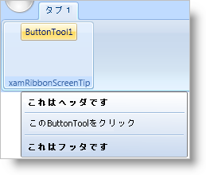

////

|metadata|
{
    "name": "xamribbon-add-a-xamribbonscreentip-to-a-ribbon-tool",
    "controlName": ["xamRibbon"],
    "tags": ["Data Presentation","How Do I"],
    "guid": "{A74AF8E9-AE58-4750-A6C5-2299945BDA1F}",  
    "buildFlags": [],
    "createdOn": "2012-01-30T19:39:54.1231777Z"
}
|metadata|
////

= xamRibbonScreenTip を Ribbon ツールに追加

ToolTip プロパティを link:{ApiPlatform}ribbon{ApiVersion}~infragistics.windows.ribbon.xamribbonscreentip.html[xamRibbonScreenTip] のインスタンスに設定することで、xamRibbon 画面ヒントをリボン ツールに追加できます。エンド ユーザーがリボン ツールにマウスを置いた時に表示される役立つメッセージに xamRibbon 画面ヒントの link:{ApiPlatform}ribbon{ApiVersion}~infragistics.windows.ribbon.xamribbonscreentip.html[Content] プロパティを設定できます。xamRibbon 画面ヒントの上側/下側に何かを表示するために link:{RootAssembly}{ApiVersion}~infragistics.windows.controls.xamscreentip~header.html[Header] プロパティや link:{RootAssembly}{ApiVersion}~infragistics.windows.controls.xamscreentip~footer.html[Footer] プロパティをそれぞれ設定することもできます。ヘッダーまたはフッターのテキストは、xamRibbon 画面ヒントのコンテンツと区別するために自動的に太字のテキストで表示されます。xamRibbonScreenTip のコンテンツをヘッダーやフッターとさらに区別したい場合、ヘッダーの下やフッターの上にセパレータ (細い水平線) を表示できます。

以下のコード例は、xamRibbon 画面ヒントを link:{ApiPlatform}ribbon{ApiVersion}~infragistics.windows.ribbon.buttontool.html[ButtonTool] に追加する方法を示します。このコード例では、ButtonTool が 'ButtonTool1' という名前であることを前提とします。

*XAML の場合:*

----
...
<igRibbon:ButtonTool Id="ButtonTool1" Caption="ButtonTool1">
        <igRibbon:ButtonTool.ToolTip>
                <igRibbon:XamRibbonScreenTip 
                        Header="This is a Header" 
                        Footer="This is a Footer" 
                        Content="Click the ButtonTool" 
                        FooterSeparatorVisibility="Visible" 
                        HeaderSeparatorVisibility="Visible" />
                </igRibbon:ButtonTool.ToolTip>
</igRibbon:ButtonTool>
...
----

*Visual Basic の場合:*

----
Imports Infragistics.Windows.Ribbon
...
Dim tip as New XamRibbonScreenTip()
tip.Header = "This is a Header"
tip.Footer = "This is a Footer"
tip.Content = "Click the ButtonTool"
tip.FooterSeparatorVisibility = Visibility.Visible
tip.HeaderSeparatorVisibility = Visibility.Visible
'ButtonTool1 をアプリケーションの ButtonTool コントロールの名前で置き換えます。
Me.ButtonTool1.ToolTip = tip
...
----

*C# の場合:*

----
using Infragistics.Windows.Ribbon;
...
XamRibbonScreenTip tip = new XamRibbonScreenTip();
tip.Header = "This is a Header";
tip.Footer = "This is a Footer";
tip.Content = "Click the ButtonTool";
tip.FooterSeparatorVisibility = Visibility.Visible;
tip.HeaderSeparatorVisibility = Visibility.Visible;
//ButtonTool1 をアプリケーションの ButtonTool コントロールの名前で置き換えます。
this.ButtonTool1.ToolTip = tip;
...
----

== 関連トピック

link:xamribbon-about-xamribbonscreentip.html[xamRibbonScreenTip について]

link:xamribbon-add-a-simple-tooltip-to-a-ribbon-tool.html[単純なツールチップをリボン ツールに追加]