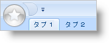

////

|metadata|
{
    "name": "xamribbon-add-an-image-to-the-application-menu",
    "controlName": ["xamRibbon"],
    "tags": ["Getting Started","How Do I","Styling"],
    "guid": "{0D687A5D-B180-4897-BBEE-03157C80C718}",  
    "buildFlags": [],
    "createdOn": "2012-01-30T19:39:54.1261783Z"
}
|metadata|
////

= 画像をアプリケーション メニューに追加

Extensible Application Markup Language (XAML) を使用して基本的な xamRibbon を作成する場合、アプリケーション メニューは、デフォルトで常に表示可能な複数の xamRibbon™ コンポーネントのひとつとなります。アプリケーションメニューボタン内に画像を表示することで xamRibbon のこの領域を拡張したい場合があります。一般的に、この画像は会社のロゴやアプリケーション アイコンです。

以下のコード例は、画像をアプリケーション メニューに追加する方法を示します。

[NOTE]
====
*注:* CompanyLogo.gif 画像は、本トピックに含まれません。CompanyLogo.gif を自分の画像ファイルの URI に置き換える必要があります。
====

*XAML の場合:*

----
...
<igRibbon:XamRibbon Name="xamRibbon1">
        <igRibbon:XamRibbon.ApplicationMenu>
                <!--CompanyLogo.gif は、本トピックに含まれません。 
                「CompanyLogo.gif」を自分の画像ファイルの URI に置き換えます。-->
                <igRibbon:ApplicationMenu Image="CompanyLogo.png" />
        </igRibbon:XamRibbon.ApplicationMenu>
</igRibbon:XamRibbon>
...
----

*Visual Basic の場合:*

----
...
Me.xamRibbon1.ApplicationMenu.Image = New BitmapImage(New Uri("pack://application:,,,/CompanyLogo.png"))
...
----

*C# の場合:*

----
...
this.xamRibbon1.ApplicationMenu.Image = new BitmapImage(new Uri("pack://application:,,,/CompanyLogo.png"));
...
----

== 関連トピック

link:xamribbon-add-tools-to-the-application-menu.html[ツールをアプリケーション メニューに追加]

link:xamribbon-add-tools-to-the-footer-toolbar.html[ツールをフッター ツールバーに追加]

link:xamribbon-display-a-most-recently-used-items-list.html[最近使用した項目リストを表示]