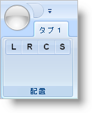

////

|metadata|
{
    "name": "xamribbon-add-tools-to-a-buttongroup",
    "controlName": ["xamRibbon"],
    "tags": ["How Do I"],
    "guid": "{A91F8F64-A377-4A34-AD3C-3D8FC239D646}",  
    "buildFlags": [],
    "createdOn": "2012-01-30T19:39:54.1291789Z"
}
|metadata|
////

= ツールを ButtonGroup に追加

機能に関連するツールを link:{ApiPlatform}ribbon{ApiVersion}~infragistics.windows.ribbon.ribbongroup.html[ButtonGroup] パネルに追加することで link:{ApiPlatform}ribbon{ApiVersion}~infragistics.windows.ribbon.buttongroup.html[RibbonGroup] 内でそれらのツールのサブセットにツールをグループ化することができます。ButtonGroup パネルは、ツールを配列するために以下の規則に従います。

* ButtonGroup パネルはすべてのツールを 1 行に配列します。
* ButtonGroup パネルは、すべてのツールの SizingMode プロパティを link:{ApiPlatform}ribbon{ApiVersion}~infragistics.windows.ribbon.ribbontoolsizingmode.html[ImageOnly] に設定します。
* ButtonGroup パネルは、RibbonGroup がサイズ変更される時にパネルに追加される同じ順序ですべてのツールを一緒に保持します。

ワープロ アプリケーションなどで一般的なテキスト揃えのツールのグループを作成する場合、テキスト揃えの設定あたりひとつ、4 つの link:{ApiPlatform}ribbon{ApiVersion}~infragistics.windows.ribbon.buttontool.html[ButtonTools] を RibbonGroup に追加できます。ただし、エンドユーザーがアプリケーションのサイズ変更を行った結果、RibbonGroup がツールを配列し直す場合、RibbonGroup は ButtonTools を分離して、それらを別の行に配置します。RibbonGroup に ButtonTools を分離させたくない場合、ButtonGroup パネルを RibbonGroup に追加し、次に ButtonTools を ButtonGroup パネルに追加できます。

[NOTE]
====
*注:* コード例の画像は、本トピックには含まれません。画像を自分の画像ファイルの URI に置き換えてください。
====

以下のコードは、ツールを ButtonGroup レイアウト パネルに追加する方法を示します。

*XAML の場合:*

----
...
<igRibbon:RibbonGroup Name="grpAlignment" Caption="Alignment">
        <igRibbon:ButtonGroup>
                <!--TODO: SmallImage プロパティを自分の画像ファイルの URI に設定します。-->
                <igRibbon:ButtonTool Id="btnLeft" SmallImage="left.png" />
                <igRibbon:ButtonTool Id="btnRight" SmallImage="right.png" />
                <igRibbon:ButtonTool Id="btnCenter" SmallImage="center.png"  />
                <igRibbon:ButtonTool Id="btnStretch" SmallImage="stretch.png"  />
        </igRibbon:ButtonGroup>
</igRibbon:RibbonGroup>
...
----

*Visual Basic の場合:*

----
Imports Infragistics.Windows.Ribbon
...
Dim buttonGroup1 As New ButtonGroup() 
Me.grpAlignment.Items.Add(buttonGroup1) 
Dim btnLeft As New ButtonTool() 
btnLeft.Id = "btnLeft" 
btnLeft.SmallImage = New BitmapImage(New Uri("pack://application:,,,/left.png")) 
buttonGroup1.Children.Add(btnLeft) 
Dim btnRight As New ButtonTool() 
btnRight.Id = "btnRight" 
btnRight.SmallImage = New BitmapImage(New Uri("pack://application:,,,/right.png")) 
buttonGroup1.Children.Add(btnRight) 
Dim btnCenter As New ButtonTool() 
btnCenter.Id = "btnCenter" 
btnCenter.SmallImage = New BitmapImage(New Uri("pack://application:,,,/center.png")) 
buttonGroup1.Children.Add(btnCenter) 
Dim btnStretch As New ButtonTool() 
btnStretch.Id = "btnStretch" 
btnStretch.SmallImage = New BitmapImage(New Uri("pack://application:,,,/stretch.png")) 
buttonGroup1.Children.Add(btnStretch) 
...
----

*C# の場合:*

----
using Infragistics.Windows.Ribbon;
...
ButtonGroup buttonGroup1 = new ButtonGroup();
this.grpAlignment.Items.Add(buttonGroup1);
ButtonTool btnLeft = new ButtonTool();
btnLeft.Id = "btnLeft";
btnLeft.SmallImage = new BitmapImage(new Uri("pack://application:,,,/left.png"));
buttonGroup1.Children.Add(btnLeft);
ButtonTool btnRight = new ButtonTool();
btnRight.Id = "btnRight";
btnRight.SmallImage = new BitmapImage(new Uri("pack://application:,,,/right.png"));
buttonGroup1.Children.Add(btnRight);
ButtonTool btnCenter = new ButtonTool();
btnCenter.Id = "btnCenter";
btnCenter.SmallImage = new BitmapImage(new Uri("pack://application:,,,/center.png"));
buttonGroup1.Children.Add(btnCenter);
ButtonTool btnStretch = new ButtonTool();
btnStretch.Id = "btnStretch";
btnStretch.SmallImage = new BitmapImage(new Uri("pack://application:,,,/stretch.png"));
buttonGroup1.Children.Add(btnStretch);
...
----

== 関連トピック

link:xamribbon-add-a-toolhorizontalwrappanel-to-a-ribbongroup.html[ToolHorizontalWrapPanel を RibbonGroup に追加]

link:xamribbon-specify-a-sortorder-for-tools-in-a-toolhorizontalwrappanel.html[ツールの SortOrder を ToolHorizontalWrapPanel で指定]