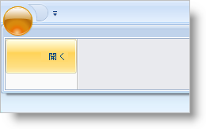

////

|metadata|
{
    "name": "xamribbon-add-tools-to-the-application-menu",
    "controlName": ["xamRibbon"],
    "tags": ["Data Presentation","Getting Started","How Do I","Layouts","Navigation","Selection"],
    "guid": "{3F8DC03E-EED5-4BB0-99F3-015237A50C38}",  
    "buildFlags": [],
    "createdOn": "2012-01-30T19:39:54.1341799Z"
}
|metadata|
////

= ツールをアプリケーション メニューに追加

操作するツールがなければ、アプリケーション メニューはエンドユーザーにとって意味がありません。事実、アプリケーション メニューの Items コレクションにツールが含まれていなければ、フッター ツールバーや link:{ApiPlatform}ribbon{ApiVersion}~infragistics.windows.ribbon.applicationmenu~recentitems.html[RecentItems] コレクションにツールがあったとしてもアプリケーションメニューは表示することさえしません。Microsoft® Windows® Presentation Foundation の ItemsControl 派生コントロールと同じように、明示的な Items コレクションの宣言なしでオブジェクトをアプリケーションメニューに追加できます。

慣習として、アプリケーション メニューに Button、Menu、Label、または Separator ツールを配置します。他のツールを同様にアプリケーション メニューに追加できます。ただし、他のツールはアプリケーション レベルのメニューにうまく関連しない場合があります。

以下のコード例は、 link:{ApiPlatform}ribbon{ApiVersion}~infragistics.windows.ribbon.buttontool.html[ButtonTool] をアプリケーション メニューに追加する方法を示します。

*XAML の場合:*

----
...
<igRibbon:XamRibbon Name="xamRibbon1">
    <igRibbon:XamRibbon.ApplicationMenu>
        <igRibbon:ApplicationMenu>
            <igRibbon:ApplicationMenu.Items>
                <igRibbon:ButtonTool Caption="Open" Id="btnOpen" />
            </igRibbon:ApplicationMenu.Items>
        </igRibbon:ApplicationMenu>
    </igRibbon:XamRibbon.ApplicationMenu>
</igRibbon:XamRibbon>
...
----

*Visual Basic の場合:*

----
'Window の Loaded イベント ハンドラに以下のコードを配置できます。 
Dim bt As New ButtonTool()
bt.Caption = "Open"
bt.Id = "btnOpen"
Me.xamRibbon1.ApplicationMenu.Items.Add(bt)
----

*C# の場合:*

----
//Window の Loaded イベント ハンドラに以下のコードを配置できます。
ButtonTool bt = new ButtonTool();
bt.Caption = "Open";
bt.Id = "btnOpen";
this.xamRibbon1.ApplicationMenu.Items.Add(bt);
----

== 関連トピック

link:xamribbon-add-an-image-to-the-application-menu.html[画像をアプリケーション メニューに追加]

link:xamribbon-add-tools-to-the-footer-toolbar.html[ツールをフッター ツールバーに追加]

link:xamribbon-display-a-most-recently-used-items-list.html[最近使用した項目リストを表示]