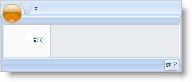

////

|metadata|
{
    "name": "xamribbon-add-tools-to-the-footer-toolbar",
    "controlName": ["xamRibbon"],
    "tags": ["Data Presentation","Getting Started","How Do I","Navigation"],
    "guid": "{285F87E3-553A-4FE7-8904-3D5A04995526}",  
    "buildFlags": [],
    "createdOn": "2012-01-30T19:39:54.1371805Z"
}
|metadata|
////

= ツールをフッター ツールバーに追加

フッタ ツールバーはアプリケーション メニューの下側に配置され、アプリケーションの [閉じる] または [オプション] ボタンなど重要性が高いツールを含むように設計されています。フッター ツールバーにツールを配置したにも関わらず、Items コレクションにツールがなければ、アプリケーションメニューは表示しません。

以下のコード例は、ButtonTool を link:{ApiPlatform}ribbon{ApiVersion}~infragistics.windows.ribbon.applicationmenufootertoolbar.html[ApplicationMenuFooterToolbar] に追加する方法を示します。

*XAML の場合:*

----
...
<igRibbon:XamRibbon Name="xamRibbon1">
    <igRibbon:XamRibbon.ApplicationMenu>
        <igRibbon:ApplicationMenu>
        <!--アプリケーション メニューの Items コレクションには少なくともひとつのツールがなければなりません。-->
            <igRibbon:ApplicationMenu.Items>
                <igRibbon:ButtonTool Caption="Open" Id="btnOpen" />
            </igRibbon:ApplicationMenu.Items>
            <igRibbon:ApplicationMenu.FooterToolbar>
                <igRibbon:ApplicationMenuFooterToolbar>
                    <igRibbon:ButtonTool Caption="Exit" Id="btnExit" />
                </igRibbon:ApplicationMenuFooterToolbar>
            </igRibbon:ApplicationMenu.FooterToolbar>
        </igRibbon:ApplicationMenu>
    </igRibbon:XamRibbon.ApplicationMenu>
</igRibbon:XamRibbon>
...
----

*Visual Basic の場合:*

----
Imports Infragistics.Windows.Ribbon
...
'Window の Loaded イベント ハンドラに以下のコードを配置できます。
Dim bt As New ButtonTool()
bt.Caption = "Open"
bt.Id = "btnOpen"
'アプリケーション メニューの Items コレクションには少なくともひとつのツールがなければなりません。 
Me.xamRibbon1.ApplicationMenu.Items.Add(bt)
'自動的に初期化されないため、ApplicationMenu の FooterToolbar を ApplicationMenuFooterToolbar に設定する必要があります。 
Me.xamRibbon1.ApplicationMenu.FooterToolbar = New ApplicationMenuFooterToolbar()
Dim footerbt As New ButtonTool() 
footerbt.Caption = "Exit"
footerbt.Id = "btnExit"
Me.xamRibbon1.ApplicationMenu.FooterToolbar.Items.Add(footerbt)
----

*C# の場合:*

----
using Infragistics.Windows.Ribbon;
...
//Window の Loaded イベント ハンドラに以下のコードを配置できます。
ButtonTool bt = new ButtonTool();
bt.Caption = "Open";
bt.Id = "btnOpen";
//アプリケーション メニューの Items コレクションには少なくともひとつのツールがなければなりません。
this.xamRibbon1.ApplicationMenu.Items.Add(bt);
//自動的に初期化されないため、ApplicationMenu の FooterToolbar を ApplicationMenuFooterToolbar に設定する必要があります。
this.xamRibbon1.ApplicationMenu.FooterToolbar = new ApplicationMenuFooterToolbar();
ButtonTool footerbt = new ButtonTool();
footerbt.Caption = "Exit";
footerbt.Id = "btnExit";
this.xamRibbon1.ApplicationMenu.FooterToolbar.Items.Add(footerbt);
----

== 関連トピック

link:xamribbon-add-an-image-to-the-application-menu.html[画像をアプリケーション メニューに追加]

link:xamribbon-add-tools-to-the-application-menu.html[ツールをアプリケーション メニューに追加]

link:xamribbon-display-a-most-recently-used-items-list.html[最近使用した項目リストを表示]