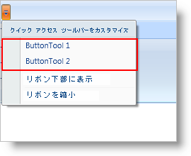

////

|metadata|
{
    "name": "xamribbon-adding-and-removing-common-tools",
    "controlName": ["xamRibbon"],
    "tags": ["Data Presentation","Editing","Getting Started","How Do I","Selection"],
    "guid": "{4BD21264-6734-4883-BB0A-E9C69D0C5DA5}",  
    "buildFlags": [],
    "createdOn": "2012-01-30T19:39:54.1401811Z"
}
|metadata|
////

= 共通のツールを追加および削除

Quick Access Toolbar (QAT) は、エンド ユーザーがランタイムに頻繁に使用されるツールを追加できるカスタマイズ可能なツールバーです。通常、エンド ユーザーは link:{ApiPlatform}ribbon{ApiVersion}~infragistics.windows.ribbon.ribbongroup.html[RibbonGroup] に、またはアプリケーション メニューにツールを配置してからでなければ、QAT に追加できません。ただし、QAT のクイック カスタマイズ メニューにより重要なツールを追加することによって検索プロセスを軽減できます。クイック カスタマイズ メニューは、QAT 位置オプションおよび一般的に使用されるツール (共通ツールとも呼ばれる) のリストを表示する QAT のドロップダウン メニューです。エンドユーザーは、クイック カスタマイズ メニューの共通ツールのセクションのツールをクリックするだけで、QAT にツールを追加または削除できます。

エンド ユーザーはクイック カスタマイズ メニューの共通ツール リストにツールを追加できなくなります。その代わりに、エンド ユーザーが QAT に追加できる共通ツールのリストの定義を担当するのは開発者です。クイック カスタマイズ メニューで共通ツールのリストを作成することは、リボンツール上のひとつのプロパティを伴う単純なプロセスです。共通ツール リストにリボン ツールを表示するには、リボン ツールの IsQatCommonTool プロパティを True に設定します。IsQatCommonTool を False に設定することでリストから共通ツールを削除することもできます。ひとつの注意点は、共通ツール リストそして最終的には QAT へのユーザー操作をサポートするリボン ツールだけを追加できることです。

== 関連トピック

link:xamribbon-about-quickaccesstoolbar.html[QuickAccessToolbar について]

link:xamribbon-add-a-tool-or-ribbongroup-to-the-quick-access-toolbar.html[クイック アクセス ツールバーにツールまたは RibbonGroup を追加]