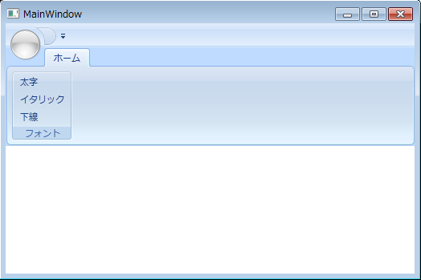

////
|metadata|
{
    "name": "xamribbon-adding-xamribbon-to-your-application ",
    "controlName": ["xamRibbon"],
    "tags": ["Getting Started","Grouping","How Do I"],
    "guid": "641031c2-9084-46c8-aec0-f845d3a2df62",
    "buildFlags": [],
    "createdOn": "2012-01-30T19:39:54.2311993Z"
}
|metadata|
////

= xamRibbon をアプリケーションに追加

このトピックではユーザーができるだけ早く操作に慣れることができるよう、Microsoft® Visual Studio® を使用して、xamRibbon™ コントロールを Window に追加するために最低限必要な基本手順について説明します。

[start=1]
. Microsoft® Windows® Presentation Foundation Window プロジェクトを作成します。
[start=2]
. 以下の NuGet パッケージをプロジェクトに追加します。

** Infragistics.WPF.Ribbon

+
NuGet フィードのセットアップと NuGet パッケージの追加の詳細については、link:nuget-feeds.html[NuGet フィード] ドキュメントを参照してください。

[start=3]
. 開いているウィンドウ タグ内で xamRibbon の名前空間宣言を追加します。コード ビハインドでは、using/Imports のディレクティブが必要です。そうすると、メンバーの完全修飾名を入力する必要がなくなります。

*XAML の場合:*

----
<Window ...
   xmlns:igRibbon="http://infragistics.com/Ribbon"
   ... >
----

*Visual Basic の場合:*

----
Imports Infragistics.Windows.Ribbon
----

*C# の場合:*

----
using Infragistics.Windows.Ribbon;
----

[start=4]
. xamRibbon のインスタンスを作成し、名前を付け、その配置を設定します。デフォルトでは、Visual Studio は Grid レイアウト コンテナを新しい Window に追加し、それに「layoutRoot」という名前を付けます。xamRibbon をこの Grid レイアウト コンテナに追加すると、コンテナを埋めるために自動的に拡張されます。xamRibbon の拡張を防止するには、VerticalAlignment プロパティを Top に設定するか、DockPanel などの他のレイアウト コンテナを使用します。

*XAML の場合:*

----
<Grid Name="layoutRoot">
    <igRibbon:XamRibbon Name="xamRibbon1" VerticalAlignment="Top">
        <!-- TODO: ここでタブを追加します -->
    </igRibbon:XamRibbon>
</Grid>
----

InitializeComponent メソッドの後に Window コンストラクターで xamRibbon コントロールのインスタンスを作成し、それをグリッドの子コレクションに追加します。

*Visual Basic の場合:*

----
Dim xamRibbon1 As New XamRibbon()
xamRibbon1.VerticalAlignment = VerticalAlignment.Top
Me.layoutRoot.Children.Add(xamRibbon1)
----

*C# の場合:*

----
XamRibbon xamRibbon1 = new XamRibbon(); 
xamRibbon1.VerticalAlignment = VerticalAlignment.Top;
this.layoutRoot.Children.Add(xamRibbon1);
----

[start=5]
. xamRibbon コントロール タブ内で Tabs コレクションを宣言します。
[start=6]
. Tabs コレクションに RibbonTabItem を追加します。RibbonTabItem のヘッダーにテキストを表示するために Header プロパティを設定します。
[start=7]
. RibbonGroup を RibbonTabItem に追加します。RibbonGroup のキャプション領域にテキストを表示するために RibbonGroup の Caption プロパティを設定します。

*XAML の場合:*

----
...
<igRibbon:XamRibbon.Tabs>
    <igRibbon:RibbonTabItem Header="Home">
        <igRibbon:RibbonGroup Caption="Font">
            <!-- TODO: ツールをここに追加します -->
        </igRibbon:RibbonGroup>
    </igRibbon:RibbonTabItem>
</igRibbon:XamRibbon.Tabs>
...
----

*Visual Basic の場合:*

----
Dim tabItem As New RibbonTabItem()
tabItem.Header = "Home"
Dim group As New RibbonGroup()
group.Caption = "Font"
tabItem.RibbonGroups.Add(group)
xamRibbon1.Tabs.Add(tabItem)
----

*C# の場合:*

----
RibbonTabItem tabItem = new RibbonTabItem
{
    Header = "Home"
};
RibbonGroup group = new RibbonGroup
{
    Caption = "Font"
};
tabItem.RibbonGroups.Add(group);
xamRibbon1.Tabs.Add(tabItem);
----

[start=8]
. 3 つの ButtonTools を ButtonGroup に追加します。各 ButtonTool のキャプションおよび Id プロパティを設定し、イベント ハンドラーを各 ButtonTool のクリック イベントに接続します。

*XAML の場合:*

----
...
<igRibbon:ButtonGroup>
    <igRibbon:ButtonTool Caption="Bold" Id="btnBold" Click="buttonTool_Click" />
    <igRibbon:ButtonTool Caption="Italic" Id="btnItalic" Click="buttonTool_Click" />
    <igRibbon:ButtonTool Caption="Underline" Id="btnUnderline" 
              Click="buttonTool_Click" />
</igRibbon:ButtonGroup>
...
----

*Visual Basic の場合:*

----
Dim buttonGroup As New ButtonGroup()
Dim buttonTool1 As New ButtonTool()
buttonTool1.Caption = "Bold"
buttonTool1.Id = "btnBold"
buttonTool1.Click += New RoutedEventHandler(buttonTool_Click)
Dim buttonTool2 As New ButtonTool()
buttonTool2.Caption = "Italic"
buttonTool2.Id = "btnItalic"
buttonTool2.Click += New RoutedEventHandler(buttonTool_Click)
Dim buttonTool3 As New ButtonTool()
buttonTool3.Caption = "Underline"
buttonTool3.Id = "btnUnderline"
buttonTool3.Click += New RoutedEventHandler(buttonTool_Click)
buttonGroup.Children.Add(buttonTool1)
buttonGroup.Children.Add(buttonTool2)
buttonGroup.Children.Add(buttonTool3)
group.Items.Add(buttonGroup)
...
----

*C# の場合:*

----
ButtonGroup buttonGroup = new ButtonGroup();
ButtonTool buttonTool1 = new ButtonTool();
buttonTool1.Caption = "Bold";
buttonTool1.Id = "btnBold";
buttonTool1.Click += new RoutedEventHandler(buttonTool_Click);
ButtonTool buttonTool2 = new ButtonTool();
buttonTool2.Caption = "Italic";
buttonTool2.Id = "btnItalic";
buttonTool2.Click += new RoutedEventHandler(buttonTool_Click);
ButtonTool buttonTool3 = new ButtonTool();
buttonTool3.Caption = "Underline";
buttonTool3.Id = "btnUnderline";
buttonTool3.Click += new RoutedEventHandler(buttonTool_Click);
buttonGroup.Children.Add(buttonTool1);
buttonGroup.Children.Add(buttonTool2);
buttonGroup.Children.Add(buttonTool3);
group.Items.Add(buttonGroup);
...
----

[start=9]
. コード ビハインドで、ButtonTools の Click イベントを処理するメソッドを作成します。

*Visual Basic の場合:*

----
Private Sub buttonTool_Click(ByVal sender As System.Object, _
  ByVal e As System.Windows.RoutedEventArgs)
        Dim bt as ButtonTool = DirectCast(e.OriginalSource, ButtonTool)
        Select Case bt.Id
                Case "btnBold"
                        MessageBox.Show("Bold Button")
                        Exit Select
                Case "btnItalic"
                        MessageBox.Show("Italic Button")
                        Exit Select
                Case "btnUnderline"
                        MessageBox.Show("Underline Button")
                        Exit Select
        End Select
End Sub
----

*C# の場合:*

----
private void buttonTool_Click(object sender, RoutedEventArgs e)
{
        ButtonTool bt = (ButtonTool)e.OriginalSource;
        switch (bt.Id)
        {
                case "btnBold":
                        MessageBox.Show("Bold Button");
                        break;
                case "btnItalic":
                        MessageBox.Show("Italic Button");
                        break;
                case "btnUnderline":
                        MessageBox.Show("Underline Button");
                        break;
        }
}
----

[start=10]
. プロジェクトを実行し、ボタンをクリックして MessageBox を表示します。

== 関連トピック

link:xamribbon-about-xamribbon.html[xamRibbon について]

link:xamribbon-using-xamribbon.html[xamRibbon の使用]