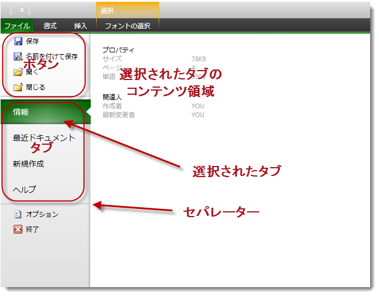

////

|metadata|
{
    "name": "xamribbon-applicationmenu2010-overview",
    "controlName": ["xamRibbon"],
    "tags": ["Application Scenarios","Getting Started"],
    "guid": "cb92a71b-9660-4189-95a2-d8ea916e57fc",  
    "buildFlags": [],
    "createdOn": "2013-03-04T07:13:00.3274069Z"
}
|metadata|
////

= ApplicationMenu2010 の概要 (xamRibbon)

== トピックの概要

=== 目的

このトピックは、アプリケーション メニュー 2010 およびその動作の概要について説明します。

=== 前提条件

このトピックを理解するためには、以下のトピックを理解しておく必要があります。

[options="header", cols="a,a"]
|====
|トピック|目的

| link:xamribbon-about-xamribbon.html[xamRibbon について]
|xamRibbon コントロールの概要

| link:xamribbon-adding-xamribbon-to-your-application-.html[xamRibbon をアプリケーションに追加]
|このトピックは、コントロールをアプリケーションに追加し、タブやグループを定義する方法を手順に従って示します。

|====

=== このトピックの内容

このトピックは、以下のセクションで構成されます。

* <<_Ref348518601, はじめに >>
* <<_Ref348518613, アプリケーション メニュー 2010 の概要 >>
* <<_Ref348518622, Backstage コンテンツ >>
* <<_Ref348518634, Backstage を閉じる >>
* <<_Ref348518647, 関連コンテンツ >>

[[_Ref348518601]]
== はじめに

[[_Ref348518613]]

=== アプリケーション メニュー 2010 の概要

有効な場合、アプリケーション メニュー 2010 機能は、 _xamRibbon_   コントロールの他のすべてのタブの前にファイル タブを描画します。このタブを押すと Backstage が開きます。_xamRibbon_   をカバーして  _xamRibbon_   を含むウィンドウのサイズを拡張します。

以下のスクリーンショットは、 _xamRibbon_   コントロール内のアプリケーション メニュー 2010 ファイル タブの位置と開かれた Backstage を示します。

image::images/xamRibbon_AM2010_Overview_1.png[]

_xamRibbon_   で Backstage が表示され、ユーザーはインタラクティブに操作できます。タブをクリックすると Backstage が非表示になり、 _xamRibbon_   の特定のタブを示します。Backstage は、ユーザーがウィンドウのサイズを変更または移動した場合も表示されたままです。

[[_Ref348518622]]

=== Backstage コンテンツ

Backstage の左側には、ボタン、タブ、セパレーターの列を含みます。常にいずれか 1 つのタブが選択されます。どのタブが初期で選択されるかを指定できます。選択されたタブのコンテンツは、開かれた Backstage 領域の右側に表示されます。

以下のスクリーンショットは、開いた Backstage のコンテンツ部分を示します。

注:

[NOTE]
====
アプリケーション メニュー 2010 は、以下でアクセント カラーをサポートします。

* アプリケーション メニュー 2010 ファイル タブでグラデーション描画
* Backstage の一番上の部分の描画 ( _xamRibbon_   タブの下)。
* Backstage 左部分で選択したタブを強調表示
* ホバーされたボタンまたはタブを強調表示

====

[[_Ref348518634]]

=== Backstage を閉じる

Backstage は以下の場合、閉じられます。

* ユーザーが Esc キーを押した場合
* ユーザーがアプリケーション メニュー 2010 ファイル タブをクリックした場合
* ユーザーが xamRibbon でタブをクリックした場合
* ユーザーが Backstage の左側のボタンをクリックした場合。

Backstage は以下の方法でプログラミングによって非表示にできます。

* link:{ApiPlatform}ribbon{ApiVersion}~infragistics.windows.ribbon.ribboncommands~closeapplicationmenu.html[CloseApplicationMenu2010] コマンドを呼び出す
* 添付プロパティ link:{ApiPlatform}ribbon{ApiVersion}~infragistics.windows.ribbon.applicationmenu2010item~setclosewhenclicked.html[ApplicationMenu2010Item.CloseWhenClicked] を `MenuItem`、`ButtonBase`、`Hyperlink` に設定する
* link:{ApiPlatform}ribbon{ApiVersion}~infragistics.windows.ribbon.applicationmenu2010~isopen.html[ApplicationMenu2010.IsOpen] プロパティを false に設定する

[[_Ref348518647]]
== 関連コンテンツ

このトピックにの追加情報については、以下のトピックも合わせてご参照ください。

[options="header", cols="a,a"]
|====
|トピック|目的

| link:xamribbon-defininganapplicationmenu2010.html[アプリケーション メニュー 2010 の定義]
|このトピックは、アプリケーション メニュー 2010 を定義する方法を手順に従って説明します。

| link:xamribbon-applicationmenu2010keytips.html[アプリケーション メニュー 2010 の KeyTips]
|このトピックは、アプリケーション メニュー 2010 の KeyTip 機能を説明します。

|====
