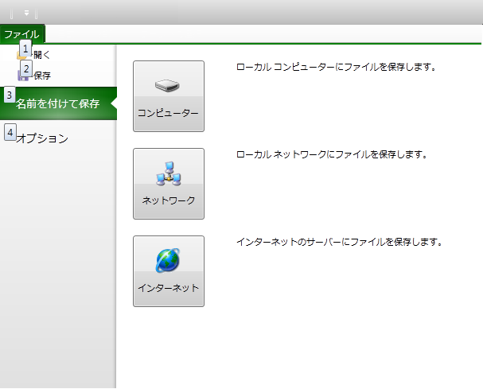
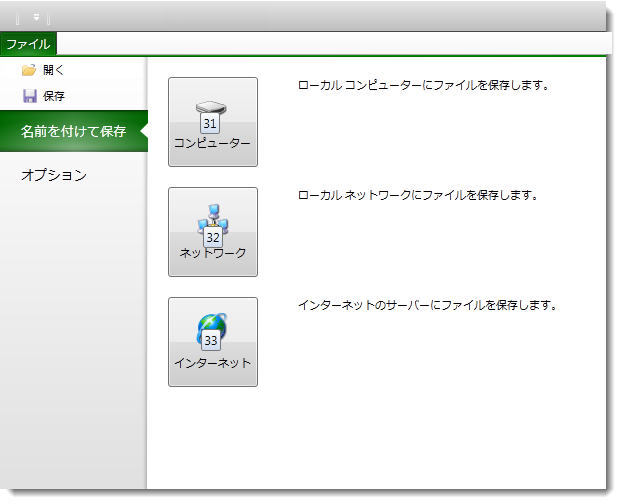
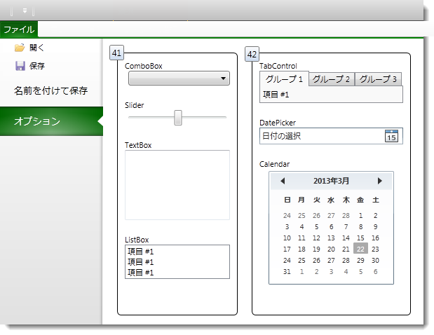

////

|metadata|
{
    "name": "xamribbon-applicationmenu2010keytips",
    "controlName": ["xamRibbon"],
    "tags": ["How Do I"],
    "guid": "1b8faf27-820b-4658-951b-cbb6329a021c",  
    "buildFlags": [],
    "createdOn": "2013-03-04T07:14:38.5184069Z"
}
|metadata|
////

= アプリケーション メニュー KeyTip 2010 (xamRibbon)

== トピックの概要

=== 目的

このトピックは、アプリケーション メニュー 2010 の KeyTip 機能を説明します。

=== 前提条件

このトピックを理解するためには、以下のトピックを理解しておく必要があります。

[options="header", cols="a,a"]
|====
|トピック|目的

| link:xamribbon-about-xamribbon.html[xamRibbon について]
|xamRibbon コントロールの概要

| link:xamribbon-adding-xamribbon-to-your-application-.html[xamRibbon をアプリケーションに追加]
|このトピックは、コントロールをアプリケーションに追加し、タブやグループを定義する方法を手順に従って示します。

| link:xamribbon-applicationmenu2010-overview.html[アプリケーション メニュー 2010 の概要]
|このトピックは、アプリケーション メニュー 2010 およびその動作の概要について説明します。

|====

=== このトピックの内容

このトピックは、以下のセクションで構成されます。

* <<_Ref348630437, はじめに >>
* <<_Ref348630443, KeyTip 概要 >>
* <<_Ref348630449, Backstage 左側の KeyTip >>
* <<_Ref348630457, Backstage 右側の KeyTip >>
* <<_Ref345935957, コード例 >>
* <<_Ref348629806, コード例: KeyTip を ApplicationMenu2010Item に割り当てる >>
* <<_Ref348629811, コード例: ボタンを KeyTip に割り当てる >>
* <<_Ref348630482, 関連コンテンツ >>

[[_Ref348630437]]
== はじめに

[[_Ref348630443]]

=== KeyTip 概要

KeyTip は、 _xamRibbon_   やアプリケーション メニュー 2010 にあるユーザーが情報やコントロールを移動する際の視覚的な合図になります。_xamRibbon_   コントロールが KeyTips の一部を自動的に割り当てた場合もカスタマイズ可能です。ただし、他コントロールで自動 KeyTip をサポートしないものがあり、それらは構成する必要があります。KeyTips は ALT キーを押して表示し、ユーザーは KeyTip に表示されたキー (キー コンビネーションの場合もあります) を押して特定の機能をアクティブにできます。KeyTip は、コントロールがグループ化されるコンテナーに基づいてグループ化されます。グループに割り当てられた KeyTip のキーを押し、現在のグループ コントロールのすべての KeyTip を非表示、または次のグループの KeyTip を表示します。Esc キーを押すと現在のグループ KeyTip を非表示にし、親グループの KeyTip を表示します。

以下のスクリーンショットは、Backstage の左側に表示されたアプリケーション メニュー 2010 と KeyTip を示します。

以下のスクリーンショットは、前のスクリーンショットで KeyTip “3” を押した場合のアプリケーション メニュー 2010 を示します。

[[_Ref348630449]]

=== Backstage 左側の KeyTip

_xamRibbon_   コントロールは、自動的に Backstage の左側に KeyTip を追加します。デフォルト値を上書きするには、 link:{ApiPlatform}ribbon{ApiVersion}~infragistics.windows.ribbon.applicationmenu2010item.html[ApplicationMenu2010Item] クラスの link:{ApiPlatform}ribbon{ApiVersion}~infragistics.windows.ribbon.applicationmenu2010item~keytip.html[KeyTip] プロパティを設定します。

<<_Ref348629806,コード例: KeyTip を ApplicationMenu2010Item に割り当てる>>

[[_Ref348630457]]

=== Backstage 右側の KeyTip

_xamRibbon_   コントロールは、自動的に Backstage の右側に KeyTip を追加します。KeyTip を割り当てるには、 link:{ApiPlatform}ribbon{ApiVersion}~infragistics.windows.ribbon.elementkeytipprovider.html[ElementKeyTipProvider] タイプである、`ApplicationMenu2010Item` クラスの添付プロパティ link:{ApiPlatform}ribbon{ApiVersion}~infragistics.windows.ribbon.applicationmenu2010item~setkeytipprovider.html[KeyTipProvider] を使用します。`ElementKeyTipProvider` クラスの link:{ApiPlatform}ribbon{ApiVersion}~infragistics.windows.ribbon.elementkeytipprovider~keytip.html[KeyTip] プロパティを任意の値に設定することもできます。または  _xamRibbon_   が自動的に生成した未使用の KeyTip を使用できます。

<<_Ref348629811,コード例: ボタンを KeyTip に割り当てる>>

コントロールがネストされたコンテナーに基づいて Backstage の右側の KeyTip へアクセスします。

以下のスクリーンショットは、2 番目のタブを選択した後の KeyTip と Application Menu 2010 を示します。

この場合、Backstage の右側のコントロールが 2 本の罫線コンテナーでグループ化されています。両罫線コンテナーに KeyTip が割り当てられており、KeyTip は “41” および “42” を示します。

以下のスクリーンショットは、左罫線が選択 (KeyTip で値 41 を使用) され、左罫線でネストされたすべてのコントロールで KeyTip が表示されている画面を示します。

[[_Ref345935957]]
== コード例

=== コード例の概要

以下の表は、このトピックで使用したコード例をまとめたものです。

[options="header", cols="a,a"]
|====
|例|説明

|<<_Ref348629806,コード例: KeyTip を ApplicationMenu2010Item に割り当てる>>
|この例は、ApplicationMenu2010Item オブジェクトに KeyTip を割り当てる方法を示します。

|<<_Ref348629811,コード例: ボタンを KeyTip に割り当てる>>
|この例は、Botton オブジェクトに KeyTip を割り当てる方法を示します。

|====

[[_Ref348628296]]

[[_Ref348629806]]
== コード例: KeyTip を ApplicationMenu2010Item に割り当てる

=== 説明

この例は、`ApplicationMenu2010Item` オブジェクトに KeyTip で値 1 を割り当てます。

=== コード

*XAML の場合:*

[source,xaml]
----
<igRibbon:ApplicationMenu2010Item KeyTip="1">
    <igRibbon:ApplicationMenu2010Item.Header>
        <TextBlock Text="Open" />
    </igRibbon:ApplicationMenu2010Item.Header>
</igRibbon:ApplicationMenu2010Item>
----

[[_Ref348629811]]
== コード例: ボタンを KeyTip に割り当てる

=== 説明

この例は、Button オブジェクトに KeyTip で値 B1 を割り当てます。ユーザーは、ボタンをアクティブ化するために B と 1 を続けて押す必要があります。

=== コード

*XAML の場合:*

[source,xaml]
----
<Button Content="Press Me">
    <igRibbon:ApplicationMenu2010Item.KeyTipProvider>
        <igRibbon:ElementKeyTipProvider KeyTip="B1" />
    </igRibbon:ApplicationMenu2010Item.KeyTipProvider>
</Button>
----

[[_Ref348630482]]
== 関連コンテンツ

このトピックにの追加情報については、以下のトピックも合わせてご参照ください。

[options="header", cols="a,a"]
|====
|トピック|目的

| link:xamribbon-applicationmenu2010-overview.html[アプリケーション メニュー 2010 の概要]
|このトピックは、アプリケーション メニュー 2010 およびその動作の概要について説明します。

| link:xamribbon-defininganapplicationmenu2010.html[アプリケーション メニュー 2010 の定義]
|このトピックは、アプリケーション メニュー 2010 を定義する方法を手順に従って説明します。

|====
