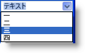

////

|metadata|
{
    "name": "xamribbon-combo-editor",
    "controlName": ["xamRibbon"],
    "tags": ["Data Presentation","Getting Started","How Do I","Navigation","Selection"],
    "guid": "{3B596FBF-0B54-46F7-BDF6-D2FFDFE0E772}",  
    "buildFlags": [],
    "createdOn": "2012-01-30T19:39:54.1531837Z"
}
|metadata|
////

= コンボ エディター

== 概要

Combo Editor ツールは、エンドユーザーがひとつの項目を選択できる項目を含むドロップダウン リストを表示するエディター ツールです。エンドユーザーは、Combo Editor の編集部分内に任意のテキストを入力することもできます。IsEditable プロパティを設定することでこの動作を有効にできます。Combo Editor ツールは、.NET Framework ComboBox コントロールに似ています。ただし、Combo Editor ツールは xamComboEditor エディタから派生します。これは最終的には ValueEditor から派生するので、ValueEditor クラスによって公開されるオブジェクト モデルと機能を共有します。

ComboEditorTool のドロップダウン リストを移植する方法は、ItemsProvider プロパティを ComboBoxItemsProvider オブジェクトのインスタンスに設定することです。ComboBoxItemsProvider オブジェクトは、同じ名前を持つ ItemsControl のプロパティのように動作する Items および ItemSource プロパティを公開します。ComboBoxItemsProvider オブジェクトに項目を移植するには、両方ではなく、これらのプロパティのひとつだけを使用することが必要となります。これらの項目は、ComboEditorTool のドロップダウンリストで表示されます。

[NOTE]
====
*注:* ComboBoxItemsProvider オブジェクトの概念の主な利点は、ひとつの ComboBoxItemsProvider を複数の ComboEditorTool および XamComboEditor インスタンスで共有できるということです。これによって、コンテンツを表示するために同じフィールドから複数のセルが xamComboEditors を使用している xamDataGrid フィールドのように、これらのエディターの複数のインスタンスが同じ項目を使用する場合にオーバーヘッドを大幅に削減します。そのようなケースでは、ひとつの ComboBoxItemsProvider は、フィールドのセルに関連付けられたすべての xamComboEditor インスタンスによって共有されます。
====

== ComboEditorTool を使用するための一般的な手順：

[start=1]
. ComboBoxItemsProvider オブジェクトを作成します。
[start=2]
. ドロップダウンに表示される項目を ComboBoxItemsProvider に移植します。ItemsSource プロパティをデータ ソースに設定するか、その Items コレクションを移植できます。カスタム オブジェクトを Items コレクションに追加できます。ComboEditorTool オブジェクト モデルは、ComboBoxDataItem オブジェクトも公開し、各インスタンスは表示テキスト、データ値、およびオプション画像を含むことができます。ComboBoxDataItem オブジェクトを使用して、データを簡単に割り当ててテキストを表示したり項目にオプションで画像を表示するために ComboBoxItemsProvider の Items プロパティを移植できます。
[start=3]
. ComboBoxItemsProvider の ValuePath および DisplayMemberPath プロパティを必要に応じて設定します。ValuePath および DisplayMemberPath は一般的に、データ値および表示テキストをそれぞれ含む項目プロバイダが移植されるオブジェクトのプロパティの名前に設定されます。
[start=4]
. ComboEditorTool インスタンスを作成します。ComboEditorTool の ItemsProvider を上記で作成した ComboBoxItemsProvider に設定します。

== プロパティ

前述したように、ComboEditorTool は xamComboEditor から派生し、これは最終的には ValueEditor クラスから派生します。したがって、ComboEditorTool は、他の Value Editors が公開する一貫したオブジェクト モデルおよび機能を共有します。

* IsEditable - テキスト部分を編集可能にするには、このプロパティを True に設定します。これによってユーザーは、ツールの編集部分内で任意の値を入力できます。
* ItemsProvider - このプロパティは、ドロップダウンに表示するための項目を指定します。それを実際に項目を含み管理するオブジェクトである ComboBoxItemsProvider のインスタンスに設定します。
* エディター ツールの現在の値は何ですか？

** SelectedItem - 現在選択されているリストの項目を取得または設定します。
** SelectedIndex - 現在選択されている項目のインデックス。
** Value - SelectedItem に関連付けられた ComboBoxItemsProvider の ValuePath プロパティによって指定されたプロパティの値またはパス。Value が設定されなければ、SelectedItem はこのプロパティから返されます。
** 例: ValuePath が「Name」に設定され、SelectedItem が Customer オブジェクトであれば、Value プロパティは Customer オブジェクトの Name プロパティの値を返します。SelectedItem プロパティは Customer オブジェクト自体を返します。
** Text - 編集部分内に表示されるテキスト。

* DropDownButtonDisplayMode - エディター ツールがドロップダウン ボタンを表示する時をコントロールできます。オプションは、Always、MouseOver、Focused、および OnlyInEditMode です。
* EditAreaWidth - 他のツールと同様に、XamRibbon オブジェクト モデルを介して ComboEditorTool のラベルを指定できます。このラベルはエディター ツールの編集部分の隣りに表示されます。EditAreaWidth プロパティは編集部分の幅を制御します。ラベルは固定され、幅は自動的に計算されます。
* SelectionStart、SelectionLength、および SelectedText - これらのプロパティは、エディター ツールの編集部分内の現在のテキスト選択を示します。このプロパティは、IsEditable プロパティが True に設定されている場合のみ使用できます。
* DropDownResizeMode - ユーザーが水平/垂直方向にドロップダウン リストをサイズ変更できるかどうかを決定します。デフォルトは、水平および垂直の両方にサイズ変更可能です。このプロパティを None に設定して、この機能を無効にすることができます。以下のスクリーンショットは、ドロップダウン リストの下側にリサイズ バーを表示します。エンドユーザーはこのリサイズ バーを使用してドロップダウン リストのサイズを変更できます。

image::images/xamRibbon_About_ComboEditorTool_02.png[xamRibbon のコンボ エディター ツールの実例]

* MinDropDownWidth、MaxDropDownWidth、および MaxDropDownHeight - これらの 3 つのプロパティは、ドロップダウン リスト部分の制約を指定します。

== イベント

* ValueChanged - 基本 ValueEditor から継承されます。これは、編集部分内にユーザーが値を入力する時、IsEditable プロパティが True に設定されている時を含み、エディターの値が変更すると必ず発生します。
* SelectedItemChanged- 項目がドロップダウン リストから選択される時、またはドロップダウン リストで項目のひとつと一致する値が入力される時に必ず発生します。SelectedItem プロパティは現在選択される項目を反映します。