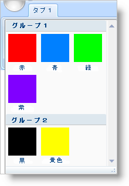

////

|metadata|
{
    "name": "xamribbon-create-groups-of-galleryitems",
    "controlName": ["xamRibbon"],
    "tags": ["Data Presentation","Getting Started","Grouping","How Do I"],
    "guid": "{1D464C70-5B3B-46FA-8419-054C90C35C8A}",  
    "buildFlags": [],
    "createdOn": "2012-01-30T19:39:54.1551841Z"
}
|metadata|
////

= GalleryItems のグループを作成

link:{ApiPlatform}ribbon{ApiVersion}~infragistics.windows.ribbon.gallerytool.html[GalleryTool] に多数の link:{ApiPlatform}ribbon{ApiVersion}~infragistics.windows.ribbon.galleryitem.html[GalleryItems] がある場合、エンドユーザーが興味がある項目を見つけることが難しい場合があります。エンドユーザーの検索プロセスを容易にするには、GalleryItems をより小さい機能のサブセットにグループ化するために link:{ApiPlatform}ribbon{ApiVersion}~infragistics.windows.ribbon.galleryitemgroup.html[GalleryItemGroup] オブジェクトを作成できます。機能を GalleryItems のグループに分類することで、エンドユーザーは GalleryItems のドロップダウン リスト全体をスキャニングする代わりに GalleryItems のグループをナビゲートすることができます。

GalleryTool に追加するすべての GalleryItems は一意のキーを持つ必要があります。特定の GalleryItem を検索したり GalleryItem を GalleryItemGroup に追加するために、このキーを使用することができます。GalleryItem を GalleryItemGroup に直接追加しません。代わりに、GalleryItem のキーを GalleryItemGroup に追加します。ひとつ以上のグループで GalleryItem を表示したい場合、複数の GalleryItemGroups にキーを追加することもできます。グループを使用する時に留意しなければならないことは、プレビューにすべての GalleryItems が表示されることです。ただし、ドロップダウン リストは GalleryItemGroups に属する GalleryItems のみを表示します。たとえば、GalleryTool に 20 の GalleryItems があり、18 の GalleryItems を GalleryItemGroup に追加する場合があるとします。GalleryTool はプレビュー領域にすべての 20 の GalleryItems を表示しますが、GalleryTool のドロップダウンリストに表示されるのは、18 の GalleryItems だけです。

以下のコード例は、GalleryItems のグループの作成方法を示します。ユーザー自身の画像を使用してコード例で参照されているすべての画像を置き換える必要があります。

*XAML の場合:*

----
...
<!--sys: プレフィックスは 'clr-namespace:System;assembly=mscorlib' にマップされます。-->
<igRibbon:GalleryTool Name="galleryTool1" ItemBehavior="StateButton">
        <igRibbon:GalleryTool.Items>
                <igRibbon:GalleryItem 
                        Key="Item1" 
                        Text="Red" 
                        Image="GalleryItemImages/Red.png" />
                <igRibbon:GalleryItem 
                        Key="Item2" 
                        Text="Blue" 
                        Image="GalleryItemImages/Blue.png" />
                <igRibbon:GalleryItem 
                        Key="Item3" 
                        Text="Green" 
                        Image="GalleryItemImages/Green.png" />
                <igRibbon:GalleryItem 
                        Key="Item4" 
                        Text="Purple" 
                        Image="GalleryItemImages/Purple.png" />
                <igRibbon:GalleryItem 
                        Key="Item5" 
                        Text="Black" 
                        Image="GalleryItemImages/Black.png" />
                <igRibbon:GalleryItem 
                        Key="Item6" 
                        Text="Yellow" 
                        Image="GalleryItemImages/Yellow.png" />
        </igRibbon:GalleryTool.Items>
        <igRibbon:GalleryTool.Groups>
                <igRibbon:GalleryItemGroup Title="Group 1">
                        <sys:String>Item1</sys:String>
                        <sys:String>Item2</sys:String>
                        <sys:String>Item3</sys:String>
                        <sys:String>Item4</sys:String>
                </igRibbon:GalleryItemGroup>
                <igRibbon:GalleryItemGroup Title="Group 2">
                        <sys:String>Item5</sys:String>
                        <sys:String>Item6</sys:String>
                </igRibbon:GalleryItemGroup>
        </igRibbon:GalleryTool.Groups>
</igRibbon:GalleryTool>
...
----

*Visual Basic の場合:*

----
Imports Infragistics.Windows.Ribbon;
...
Dim itemGroup1 As New GalleryItemGroup()
Dim itemGroup2 As New GalleryItemGroup()
itemGroup1.Title = "Group 1"
itemGroup2.Title = "Group 2"
Me.galleryTool1.Groups.Add(itemGroup1)
Me.galleryTool1.Groups.Add(itemGroup2)
itemGroup1.ItemKeys.Add("Item1")
itemGroup1.ItemKeys.Add("Item2")
itemGroup1.ItemKeys.Add("Item3")
itemGroup1.ItemKeys.Add("Item4")
itemGroup2.ItemKeys.Add("Item5")
itemGroup2.ItemKeys.Add("Item6")
...
----

*C# の場合:*

----
using Infragistics.Windows.Ribbon;
...
GalleryItemGroup itemGroup1 = new GalleryItemGroup();
GalleryItemGroup itemGroup2 = new GalleryItemGroup();
itemGroup1.Title = "Group 1";
itemGroup2.Title = "Group 2";
this.galleryTool1.Groups.Add(itemGroup1);
this.galleryTool1.Groups.Add(itemGroup2);
itemGroup1.ItemKeys.Add("Item1");
itemGroup1.ItemKeys.Add("Item2");
itemGroup1.ItemKeys.Add("Item3");
itemGroup1.ItemKeys.Add("Item4");
itemGroup2.ItemKeys.Add("Item5");
itemGroup2.ItemKeys.Add("Item6");
...
----

== 関連トピック

link:xamribbon-add-a-galleryitem-to-a-gallerytool.html[GalleryItem を GalleryTool に追加]

link:xamribbon-add-a-gallerytool-to-a-ribbongroup.html[GalleryTool を RibbonGroup に追加]

link:xamribbon-creating-a-live-preview.html[ライブ プレビューを作成]