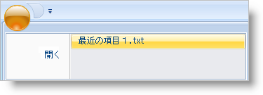

////

|metadata|
{
    "name": "xamribbon-display-a-most-recently-used-items-list",
    "controlName": ["xamRibbon"],
    "tags": ["Application Blocks","Data Presentation","How Do I"],
    "guid": "{D32663F1-AC00-405B-BBFD-1E448D4B06A1}",  
    "buildFlags": [],
    "createdOn": "2012-01-30T19:39:54.1611853Z"
}
|metadata|
////

= 最近使用した項目リストを表示

xamRibbon コントロールのアプリケーション メニューには、最近使用された項目リストを表示するために使用できるセクションがあります。Extensible Application Markup Language (XAML) を使用してデザインタイムに、またはランタイムにプログラムでリストに項目を追加できます。ただし、最近使用された項目リストの動的な性質のためにプロシージャー コードを使用してリストに項目を追加するのが通常です。

たとえば、メディア ファイルを管理するためのアプリケーションを作成している場合、最近使用した項目リストを実装したい場合があります。エンドユーザーがメディアファイルを開くと、その項目をリストに追加できます。最近の項目リストに追加する項目は、ユーザーが開くファイルに依存します。この機能を実装する場合、非常に動的な性質のためプロシージャー コードを書く必要があります。

最近使用した項目リストを実装するための選択ツールは、 link:{ApiPlatform}ribbon{ApiVersion}~infragistics.windows.ribbon.buttontool.html[ButtonTool] になります。link:xamribbon-add-tools-to-a-ribbon-group.html[リボン グループにツールを追加]するのと同じ方法で、ButtonTool を link:{ApiPlatform}ribbon{ApiVersion}~infragistics.windows.ribbon.applicationmenu~recentitems.html[RecentItems] コレクションに追加します。ファイル名を表示して、開いているファイルのアプリケーション ロジックを実行するために link:{ApiPlatform}ribbon{ApiVersion}~infragistics.windows.ribbon.buttontool~caption.html[Click] イベントにイベント ハンドラを接続するために、 link:{ApiPlatform}ribbon{ApiVersion}~infragistics.windows.ribbon.gallerytool~itemclicked_ev.html[Caption] プロパティを設定することもできます。

以下のコード例は、アプリケーション メニューで最近使用された項目リストを表示する方法を示します。

*XAML の場合:*

----
<igRibbon:XamRibbon Name="xamRibbon1">
        <igRibbon:XamRibbon.ApplicationMenu>
                <igRibbon:ApplicationMenu>
<!--アプリケーション メニューの Items コレクションには少なくともひとつのツールがなければなりません-->
                        <igRibbon:ApplicationMenu.Items>
                                <igRibbon:ButtonTool 
                                        Caption="Open" 
                                        Id="btnOpen" />
                        </igRibbon:ApplicationMenu.Items>
                        <igRibbon:ApplicationMenu.RecentItems>
                                <igRibbon:ButtonTool 
                                        Caption="Recent Item 1.txt" 
                                        Id="btnRecent1" />
                        </igRibbon:ApplicationMenu.RecentItems>
                </igRibbon:ApplicationMenu>
        </igRibbon:XamRibbon.ApplicationMenu>
</igRibbon:XamRibbon>
----

*Visual Basic の場合:*

----
Imports Infragistics.Windows.Ribbon
...
Dim bt As New ButtonTool()
bt.Caption = "Open"
bt.Id = "btnOpen"
Me.xamRibbon1.ApplicationMenu.Items.Add(bt)
Dim btnRecent As New ButtonTool()
btnRecent.Caption = "Recent Item 1.txt"
btnRecent.Id = "btnRecent1"
Me.xamRibbon1.ApplicationMenu.RecentItems.Add(btnRecent)
----

*C# の場合:*

----
using Infragistics.Windows.Ribbon;
...
ButtonTool bt = new ButtonTool();
bt.Caption = "Open";
bt.Id = "btnOpen";
this.xamRibbon1.ApplicationMenu.Items.Add(bt);
ButtonTool btnRecent = new ButtonTool();
btnRecent.Caption = "Recent Item 1.txt";
btnRecent.Id = "btnRecent1";
this.xamRibbon1.ApplicationMenu.RecentItems.Add(btnRecent);
----

== 関連トピック

link:xamribbon-add-an-image-to-the-application-menu.html[画像をアプリケーション メニューに追加]

link:xamribbon-add-tools-to-the-application-menu.html[ツールをアプリケーション メニューに追加]

link:xamribbon-add-tools-to-the-footer-toolbar.html[ツールをフッター ツールバーに追加]