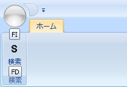

////

|metadata|
{
    "name": "xamribbon-display-a-segmented-key-tip-on-a-menu-tool",
    "controlName": ["xamRibbon"],
    "tags": ["Data Presentation","How Do I"],
    "guid": "{1DB37BC0-A1B9-4326-9B5A-512B01A93071}",  
    "buildFlags": [],
    "createdOn": "2012-01-30T19:39:54.1631857Z"
}
|metadata|
////

= メニュー ツールでセグメント化されたキーチップを表示

単純なドロップダウン メニューまたはドロップダウン ボタンとしてメニュー ツールを使用できます。ドロップダウン ボタンとして、メニュー ツールのドロップダウン部分そしてメニュー ツールのボタン部分の両方に KeyTip を指定できます。メニューツールのドロップダウンとボタン部分の両方に個別のキーチップを表示するには、Segmented または SegmentedState のいずれかに MenuTool の ButtonType プロパティを設定する必要があります。

[NOTE]
====
*注:* Items コレクションに少なくともひとつのツールがなければ、メニュー ツールが無効にされます。
====

以下のコード例は、メニュー ツールでセグメント化されたボタン キーチップを表示する方法を示します。ユーザー自身の画像でコード例の画像を置き換える必要があります。

*XAML の場合:*

----
...
<igRibbon:XamRibbon Name="xamRibbon1">
    <igRibbon:XamRibbon.Tabs>
        <igRibbon:RibbonTabItem Header="Home" KeyTip="H">
            <igRibbon:RibbonGroup Caption="Search" Id="grpSearch">
                <igRibbon:MenuTool 
                                        Caption="Find" 
                                        ButtonType="SegmentedState"
                                        KeyTip="FD" 
                                        KeyTipForSegmentedButton="FI"
                                        Id="mnuSearch">
                    <igRibbon:ButtonTool Caption="Find…" Id="btnFind" />
                    <igRibbon:ButtonTool Caption="Go To…" Id="btnGoTo" />
                </igRibbon:MenuTool>
            </igRibbon:RibbonGroup>
        </igRibbon:RibbonTabItem>
    </igRibbon:XamRibbon.Tabs>
</igRibbon:XamRibbon>
...
----

*Visual Basic の場合:*

----
Imports Infragistics.Windows.Ribbon
...
Dim tab As New RibbonTabItem() 
tab.Header = "Home" 
tab.KeyTip = "H" 
Me.xamRibbon1.Tabs.Add(tab) 
Dim group As New RibbonGroup() 
group.Caption = "Search" 
group.Id = "grpSearch" 
tab.RibbonGroups.Add(group) 
Dim menu As New MenuTool() 
menu.Caption = "Find" 
menu.ButtonType = MenuToolButtonType.SegmentedState 
menu.KeyTip = "FD" 
menu.KeyTipForSegmentedButton = "FI" 
menu.Id = "mnuSearch" 
group.Items.Add(menu) 
Dim bt As ButtonTool 
bt = New ButtonTool() 
bt.Caption = "Find..." 
bt.Id = "btnFind" 
menu.Items.Add(bt) 
bt = New ButtonTool() 
bt.Caption = "Go To..." 
bt.Id = "btnGoTo" 
menu.Items.Add(bt)
----

*C# の場合:*

----
using Infragistics.Windows.Ribbon;
...
RibbonTabItem tab = new RibbonTabItem();
tab.Header = "Home";
tab.KeyTip = "H";
this.xamRibbon1.Tabs.Add(tab);
RibbonGroup group = new RibbonGroup();
group.Caption = "Search";
group.Id = "grpSearch";
tab.RibbonGroups.Add(group);
MenuTool menu = new MenuTool();
menu.Caption = "Find";
menu.ButtonType = MenuToolButtonType.SegmentedState;
menu.KeyTip = "FD";
menu.KeyTipForSegmentedButton = "FI";
menu.Id = "mnuSearch";
group.Items.Add(menu);
ButtonTool bt;
bt = new ButtonTool();
bt.Caption = "Find...";
bt.Id = "btnFind";
menu.Items.Add(bt);
bt = new ButtonTool();
bt.Caption = "Go To...";
bt.Id = "btnGoTo";
menu.Items.Add(bt);
----

== 関連トピック

link:xamribbon-display-custom-key-tips.html[カスタム キーチップを表示]