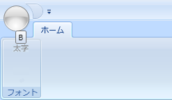

////

|metadata|
{
    "name": "xamribbon-display-custom-key-tips",
    "controlName": ["xamRibbon"],
    "tags": ["Data Presentation","How Do I","Selection"],
    "guid": "{FC9B19D5-4005-4BD8-AE63-3DA6F620AF15}",  
    "buildFlags": [],
    "createdOn": "2012-01-30T19:39:54.1661863Z"
}
|metadata|
////

= カスタム キーチップを表示

ユーザー操作をサポートするアプリケーション メニュー、リボン タブ、およびさまざまなリボン ツールにユーザー独自のキーチップを表示できます。たとえば、エンド ユーザーは、Button、Menu、および Toggle Button ツールを介して主にアプリケーションを操作し、それぞれが独自のキーチップを表示します。一方、Label および Separator ツールなどのツールは表示のために設計されており、KeyTip プロパティが設定されていてもキーチップを表示しません。

Quick Access Toolbar (QAT) のキーチップは常に自動的に生成されます。QAT KeyTips を設定することはできません。QAT ツール コレクションの最初のツールは、1 の KeyTip を持ちます。コレクションの次のツールは 2 となります。

以下のコード例は、リボン タブおよび Button ツールのキーチップをカスタマイズする方法を示します。

*XAML の場合:*

----
...
<igRibbon:XamRibbon Name="xamRibbon1">
        <igRibbon:XamRibbon.Tabs>
                <igRibbon:RibbonTabItem Header="Home" KeyTip="H">
                        <igRibbon:RibbonGroup Caption="Font" Id="grpFonts">
                                <igRibbon:ButtonTool 
                                        Caption="Bold" 
                                        KeyTip="B" 
                                        Id="btnBold" />
                        </igRibbon:RibbonGroup>
                </igRibbon:RibbonTabItem>
        </igRibbon:XamRibbon.Tabs>
</igRibbon:XamRibbon>
...
----

*Visual Basic の場合:*

----
Imports Infragistics.Windows.Ribbon
...
Dim tab As New RibbonTabItem()
tab.Header = "Home"
tab.KeyTip = "H"
Me.xamRibbon1.Tabs.Add(tab)
Dim group As New RibbonGroup()
group.Caption = "Font"
group.Id = "grpFont"
tab.RibbonGroups.Add(group)
Dim bt As New ButtonTool()
bt.Caption = "Bold"
bt.KeyTip = "B"
bt.Id = "btnBold"
group.Items.Add(bt)
----

*C# の場合:*

----
using Infragistics.Windows.Ribbon;
...
RibbonTabItem tab = new RibbonTabItem();
tab.Header = "Home";
tab.KeyTip = "H";
this.xamRibbon1.Tabs.Add(tab);
RibbonGroup group = new RibbonGroup();
group.Caption = "Font";
group.Id = "grpFont";
tab.RibbonGroups.Add(group);
ButtonTool bt = new ButtonTool();
bt.Caption = "Bold";
bt.KeyTip = "B";
bt.Id = "btnBold";
group.Items.Add(bt);
----

== 関連トピック

link:xamribbon-display-a-segmented-key-tip-on-a-menu-tool.html[メニュー ツールでセグメント化されたキーチップを表示]